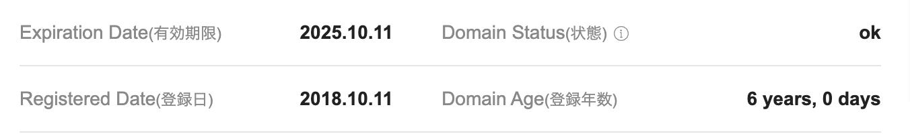

偶然、少しだけ物を書いているこのwebサイトを見ようとふと思い、なぜか開けないことに気づき、そしてドメインの有効期限が切れており、慌てて更新したものである。今日の前は1年以上前に書いたきりだったらしい。実質ほぼ使えていない。  

ところで、顔を知らない相手に何を曝け出してもどうでもいいのだが、知っている範囲の人間に行動を把握されているのがどうも苦手なのである。おそらく携帯の中まで父に見られていたせいだろうが、知られていることそのものに息苦しさを感じる。知っている人は私の日常をあまり知らないでほしいし、知っても覚えていないでほしいし、知らない人は私のことをそれ以上知ろうとはしないだろう、という温度感の中で、長いことハンドルネームを使いながら、記録するのには便利な140字を使い倒していた。しかし、ちょうどこのドメインを使い始めたころから、インターネッツの海で彷徨う自分と実名が近付き、今やほぼ同化している。  

極め付けに、実名で登録しているから仕方ないのだが、Twitter（意地でもXとは言わない）を同僚にフォローされており、いよいよ転職後の難しさを感じている中でのドメインの更新には、少し迷いがあった。  

そもそも別に誰かに届けたくてやっていたのではなく、あくまで内省と行動の記録のためであり、あるいは過去の自分を知るための手立てであった。あるいは、そのような発信の中での偶然の出会いが、時々匿名の延長線のままリアルに跳ねるのは面白かった。ハンドルネームを使っていた時代は、同じ趣味の人との繋がりも目的としてあったものの、あの頃は暇だったなぁと思うくらいには今や心が引きこもっており、プライベートで知らない人と交流するためのエネルギーを持ち合わせていない。  

<blockquote class="twitter-tweet">
インターネッツ内の匿名人格を復活させたほうがいい気がしてきた
&mdash; もえまる (@moemarusan) <a href="https://twitter.com/moemarusan/status/1711291441199407148?ref_src=twsrc%5Etfw">October 9, 2023</a></blockquote>

何をしているのか知られるのが苦手なのであり、別に思考を覗かれるのはどうでもいいのだから、アカウントを分ければいいじゃないかという視点も無きにしも非ずだが、アカウントを分けるとかいう面倒なことができずに、いずれのアカウントも殺したままなのである。ここ2年の履歴が存在しないことにそろそろ危機感を覚え始めた。リアルでよく使われるニックネームがあるからこそ、そのまま使えるのは自分が自分を認識しやすく気に入っていたが、きっと匿名に戻すのが簡単なのだろうな。

---

PS  
フォローさせておきながら、例えばツイートしていた内容より「〇〇に行ったんだってね？」みたいな話を振られることに気持ち悪さを覚えるのは、我ながら本当に理不尽極まりなかったなと謝罪の気持ちisある　フォローされていても見られてないと思っていたさisある  

これは、どこかの誰かのどうでもいい藻屑でありたいということ。どこかの誰かのどうでもいい日記を読むのが好きだからこそ、海に放流したい気持ちはある。でもそれは、町内掲示板ではなくボトルメッセージであってほしい。別にボトルメッセージの主が今日カレーを食べていることに、誰も興味はないだろう。  

ここはアクセス数的にボトルメッセージにしやすいと思うが、ここに例えば放浪記を書くのはエネルギーが必要なんだよな。チェックインするだけで行動が記録できる便利さには勝てない。  