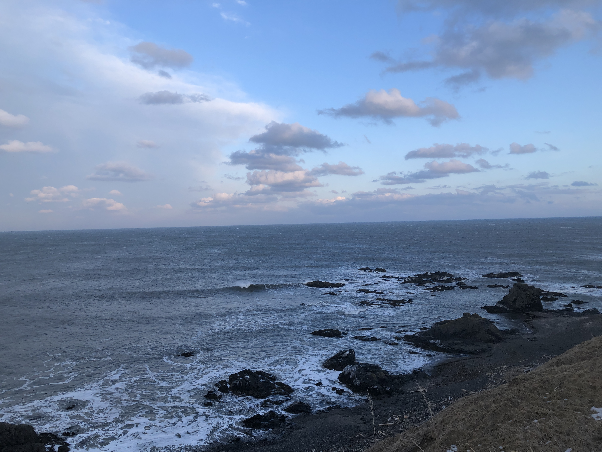
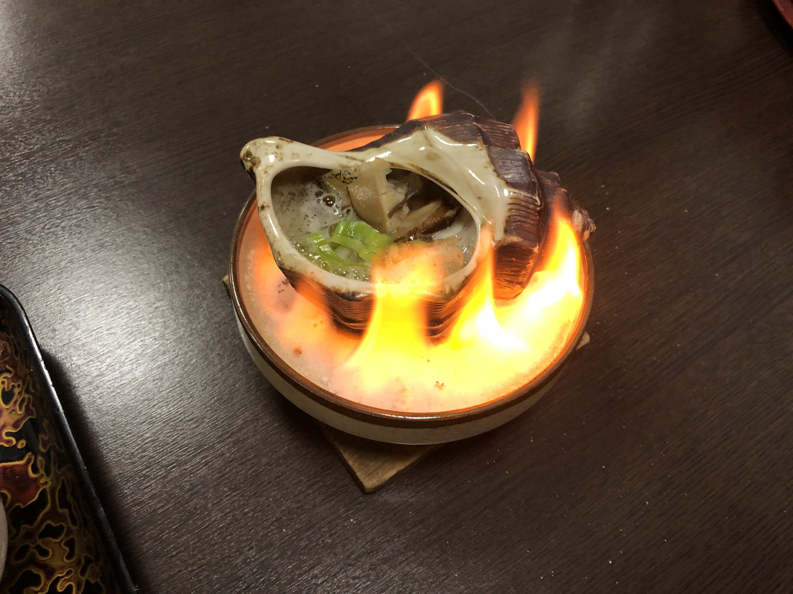

後に電話でアンケートなどが実施され、関係者の方に届くような気がするんだけど、取り急ぎ忘れないうちに滞在期間を終えてみての率直な感想を書いておこうと思う。  
※ なお、この内容はモニターで参加したものなので、本実施されることがあれば、内容が異なるかもしれません。読まれる際はご注意を。  

## 率直な感想というやつ
楽しかった！！！！！！！！！！！！！！！！！！！！！  
が、滞在期間、短かすぎた！！！！！！！！！！！！！！！！！！！！！  
せめて土日挟んどくべきだった！！！！！！！！！！！！！！！！！！！！！  

## なぜ応募したのか
新聞社の方が取材にいらした際、忘れましたって言っちゃったんだけど(´>ω∂`)、ふと思い出したので……  
（私はエンジニアではないが）エンジニアが多く参加しているSlackワークスペースの旅行関係のチャンネルで誰かが下記の記事を共有していたのを目にしたのが、このワーケーションツアーを知ったきっかけだった。  
[【夢旅】北海道えりも町が旅費出してくれるぞ！ 実質全額負担？ ワーケーションモニターツアー / 職種問わず「ユーチューバー可能」 | 世界を旅するガイドブック Photrip フォトリップ](https://photrip-guide.com/2021/01/05/hokkaido-erimo-work-vacation/)  

もともと11月には2/11〜14を4連休として北海道に滞在することを決めていたので、ちょうどいいタイミングでは？　あ、でも5日宿泊しないと道外交通費が出ない？　2/20には東京帰ってこなきゃいけないから厳しい？　どうしよう？　などと悩んでいる間に道外交通費は予算終了になっていたwwwww  

そもそもの話として私は放浪に出るのが好きで、その理由として（その地の）日常に（自分の）日常をぶつけていくことで生じる差が非日常になってわくわくするからなので、実際のところ場所にこだわりはないのだ。だいたい1時間以上電車に乗れば、そこには面白さが眠っていると思っている。だから、えりも町だから決めたという話ではないのは、これからアンケートに答えていく上でも申し訳ない気分ではあるのだが、反面襟裳岬さえ知らなかった私にとって、完全に知らない土地というのはそれだけで行く動機になったりする。  

というか、何かきっかけがないと、なかなか完全に知らない土地に行くことは難しいから、いいきっかけだなと思った。

## アクセス的なおはなし
上記の通り、もともと北海道にはいたため、札幌から高速えりも号というバスに乗って、えりも町へ辿り着いた。  
ちなみに高速えりも号が予約制であることをすっかり見落としていたため、当日泣きながらチケットセンターへ連絡したのはここだけの話……  
特に駅近くの宿に宿泊しない限り、町内の移動は車必須だし、駅近くの宿から岬へは遠いので観光しようと思ったらやっぱり車必要じゃないかしら。  
車がないと昼食も食べに行けないので、都内住みペーパードライバーには些か、過酷な環境でございました（その分、地域おこし協力隊のSさんに、大変お世話になりました🙇‍♂️）  

## 滞在期間について
高速えりも号でそれぞれ、2/15（月）20:30着〜2/18（木）5:20発。  
なので3泊してはいるものの、実質2日間の滞在だった。2/15は着いてもうほぼ寝るだけ、2/18は早起きして帰るだけだったので。  
で、今回爆弾低気圧が北海道を襲い、特に2/16（火）は自分の感覚だと都内で台風に遭遇したときよりひどい風が（最高44.9m/sだったらしい）吹いていたのもあって、まず外に出るのがしんどすぎる状況だったので、宿に引きこもっていた。つまり、外に出て何かをする機会があったのは、実質2/17（水）の1日だけだった。  
ということで、滞在期間、短かすぎた！！！！！！！！！！！！！！！！！！！！！  

## 期間中に何をしたのか
第一に、仕事である。そりゃそう。宿に宿泊する関係上、夕食の時間が決まっていたので、その点普段と異なるペースで仕事をすることになって少し苦戦したが、それもまたいい経験だった。  
第二に、自然体験（笑）。偶然宿泊した宿が、食事処と客室が別の建物という構造だったため、食事する際に外に一度出なきゃいけなかったんだけど、おかげで爆弾低気圧下のとんでもない風を生身で経験できてよかった。しかも、それに伴って停電が起きたりなどして、私からしたらそんなことは非日常なので慌てまくっていたんだが、なんというかとても日常の延長線上な感じのテンションで対応いただいたことによるギャップに一人ウケていた……  
第三に、海を見た！。そんなこんなで車を運転するのが怖かったので、行動に制限がでがちではあったものの、唯一外に出られた2/17（水）に岬のほうへ連れて行ってもらったり、スーパーに連れて行ってもらったり（笑）して、仕事の合間だったので短い時間だったけど、外を満喫できて楽しかった！岬に行くときに、強風で屋根が飛んだという某旅館の横を通ったので、風で屋根が飛ぶとどういう断面になるのか学びました（おい  

<small>↑ひどい風の次の日とはいえ、結構風強かった襟裳岬（からたぶんちょっと内側に入ったところ）</small>

## 参加してよかったこと
一番は、誰も彼も関わってくださった方がとても親切だったこと。離れるのが寂しくなるくらいには親切にしていただいたなと。  
今後のモニターじゃないツアーに支障が出ると困るので具体的に何とは書かないですが、結局自然だろうと神社仏閣だろうとそういう分かりやすい資産よりも、あちこち放浪してきて印象に残っているのはどこまでもその地での人との交流だったりするので、そういう意味で来る前、えりも町は名前も知らなかった場所だけど、今後もこの経験は自分の中で残り続けるなと思っている。（ていうか、分かりやすい資産は割とGoogle先生で検索すれば出てくるからなぁ）  
あとはこの滞在時間の短さで、書けるほど何かを体験したわけでもないような気もしつつ、強いていえば魚が苦手なのにおいしく食べられたり、肉が苦手なのにおいしく食べられたり、日頃野菜と卵で生きている身としては新鮮な経験だった。正直、参加する前一番心配していたのは食の部分だったけど、それは杞憂だった。  

<small>↑2/16（火）の夕食で出た、貝 on fire📛</small>

## 逆に参加して困ったこと
PCカタカタ系職種には向いていないかもしれない？  
たまたま滞在した宿がそうだったというのもあるのかもしれないが、机椅子がPCカタカタするのにはあまり向いていない感じだった。Wi-Fiもあまり安定しておらず（ビジネスユースでなければ困らない程度には安定していた）、今回は爆弾低気圧で特殊案件だった可能性が高いが、結構停電して宿のWi-Fiは使えなくなった。しかもコワーキングスペース的な場所もないので、現状PCカタカタ系職種が仕事をしながら滞在するのには、あまり向いていないのかもしれない。  
これは宿で仕事をしながらという観点だけの話であって、仕事なんか関係ない状態で滞在していればとても魅力的な滞在であったことは念のため付記しておく。  

## 心残りと次回への申し送り
まず、冬はやめておこう（笑）  
コンブボートに乗りたかったし、アザラシに遭遇できなかったし、車を運転していると飛び出してくるというシカにも遭遇していない（それは安全だしいいかw） 
この時期じゃなければ温泉がある説も見たので気になっている…… 
そのくらいかなぁ、あとは地元の人何してるんだろうは気になった。このへんの学生、どこで遊ぶんだろう🤔  
滞在期間の割に、そして丸1日強風で引きこもってた割に、充実感が大きくてあんまり心残りらしい心残りが残らなかった、いい時間だった。  

## おわりに
5:20発に乗るために4:20に起きたので、眠くて自分が何を書いているかよく分かりません（真顔）