最近まぁまぁな頻度でギターを弾いているが、まぁまぁな頻度でギターを弾いているがゆえに忘れそうになっていた。そうだ、別にギターが弾けるようになりたかったわけじゃない。音を分かるようになりたい、そして、あわよくば相対音感がつけばなぁという意図で始めたのだった。その第一歩としてこれが適切であるかは分からないが、コードの構成音について指板上で理解を深めるため、そのコードを弾くとき、いったい何を弾いているのか分解したメモである。  

とりあえず、根音がCのコード。  

## C　（根音C - 長3度E - 完全5度G）: 長三和音

ローコードのC

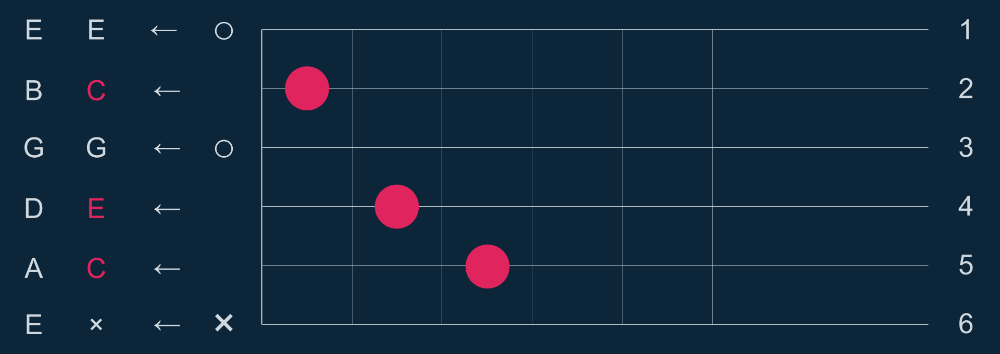

6弦をミュートしなくても構成音的には問題ない（根音がEに変わって、C/Eになる）  

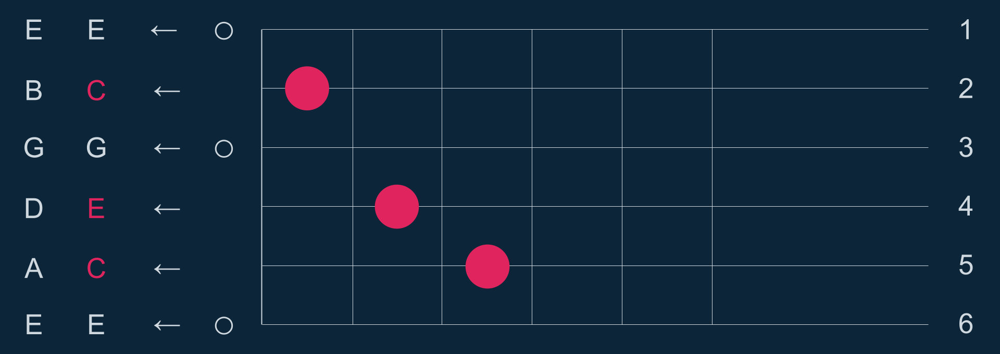

1弦3フレットを追加すると最高音がGになって少し煌びやかな感じがする  

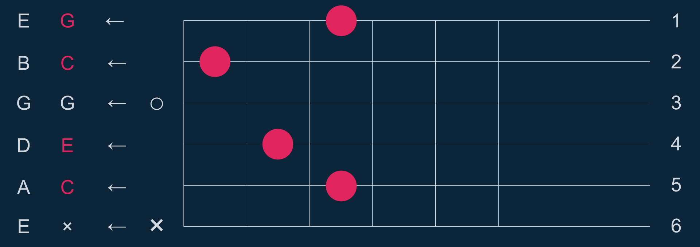

## C7（根音C - 長3度E - 完全5度G - 短7度B♭）: 属七の和音

長三和音＋短7度なのでCコードにB♭足してこれ

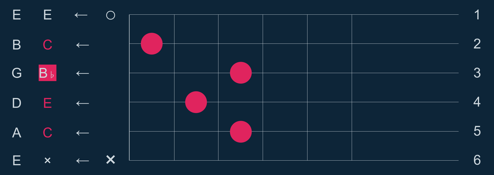

## CM7 / Cmaj7（根音C - 長3度E - 完全5度G - 長7度B）: 長七の和音

長三和音＋長7度なので、Cコードからわざわざ押さえてCにしていた2弦を開放してこれ

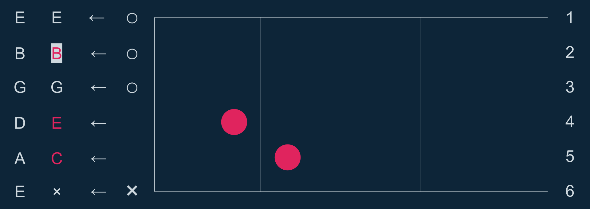

## Cm（根音C - 短3度E♭ - 完全5度G）: 短三和音

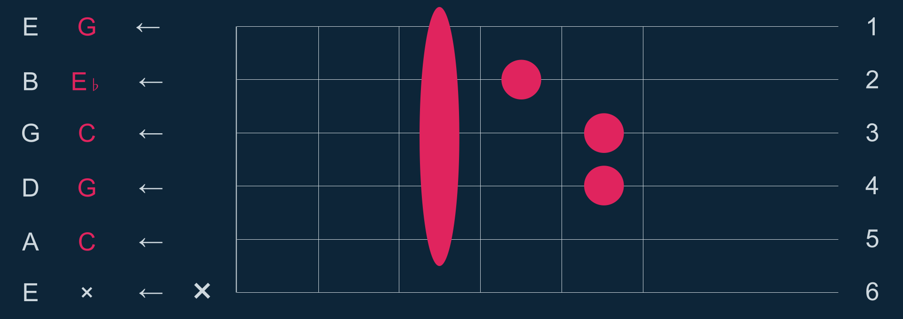

Cmとして成り立たせているのは2弦4フレットのE♭だけなので、1フレット右に移動するとコードがCに変わる。これがハイコードのC  

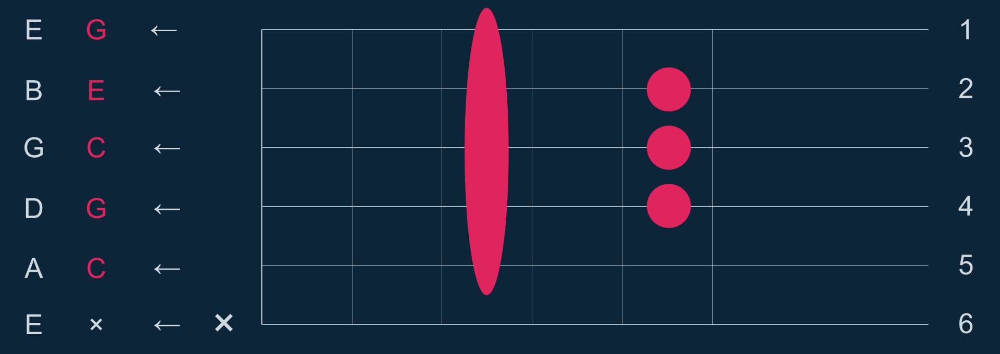

ローコードでCmを無理やり作ろうとするならこうなるけど、手が攣りそうだったのでもはや使えないw

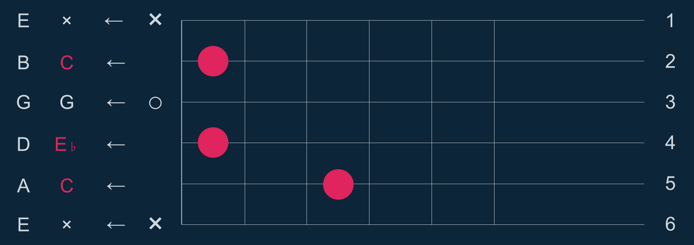

3〜1弦だけ使ってこういうのもできそうだけど音が軽い

根音Cを起点にこれはありかもと思ったけど4〜3弦は実質同じ音なのでもったいないな

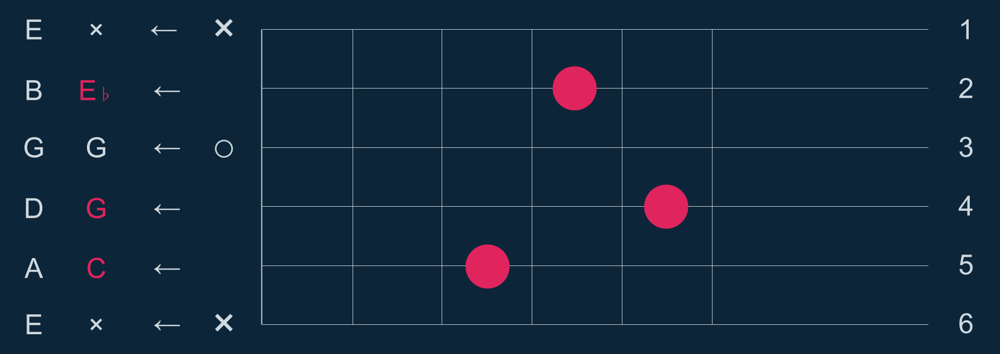

## Cm7（根音C - 短3度E♭ - 完全5度G - 短7度B♭）: 短七の和音

短三和音＋短7度なので、Cmコードの3弦をセーハだけにしてこれ

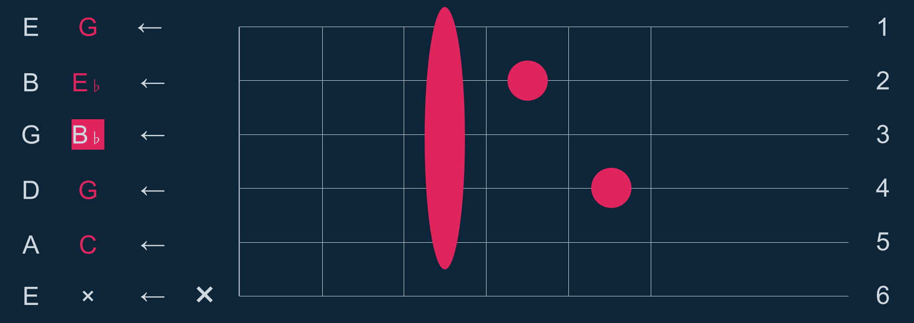

## CmM7（根音C - 短3度E♭ - 完全5度G - 長7度B）

短三和音＋長7度だがあんまり見かけないので省略

## Cdim / Cm-5（根音C - 短3度E♭ - 減5度G♭）: 減三和音

diminish自体、半音下げるという意味があり、dimコードは根音以外半音下げとなる  
Cm-5はCmの5度の音を半音下げるので、結果的にCdimとCm-5の構成音は同じになる  

Cmで押さえているのは要はここ  

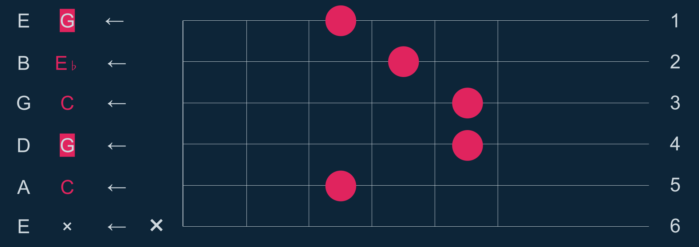

Gを半音下げればいいので、Cdim / Cm-5にするにはこう  

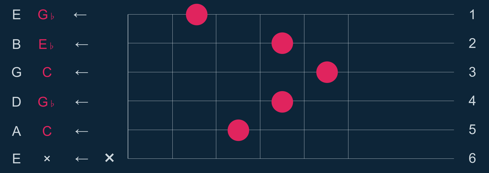

全部押さえるのは現実的ではないので、4・3・1弦のうちの2つの弦を選ぶ。まずは1弦を消す 

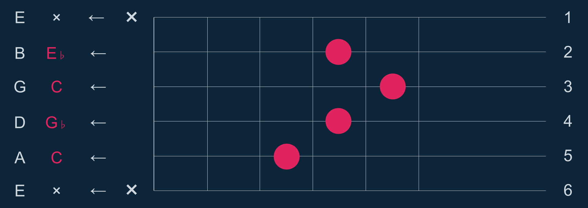

それか3弦を消すか

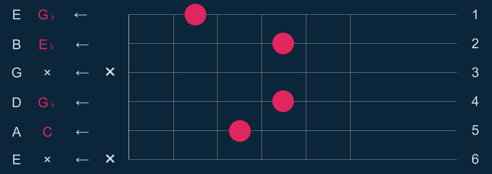

もしくは4弦を消す選択肢もあるけどやってみたら中指と小指の開き具合的に限界だったのでやりたくない

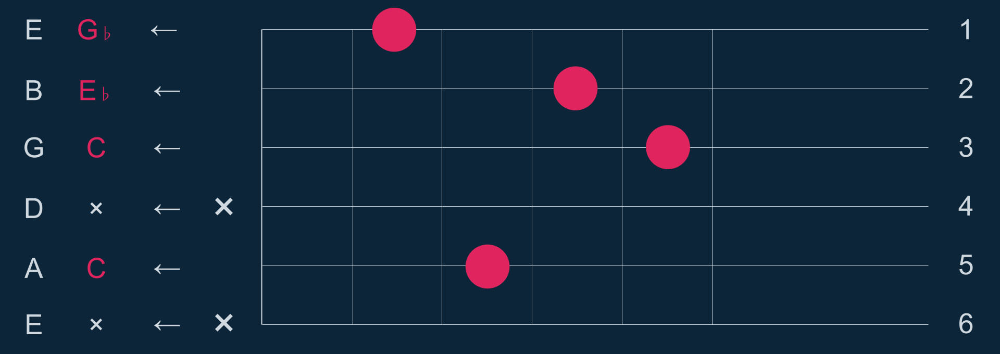

指をフル活用しないなら、3音選べばいいのでこれも

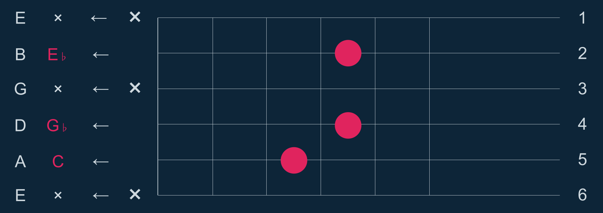

音軽いけどこれもできる

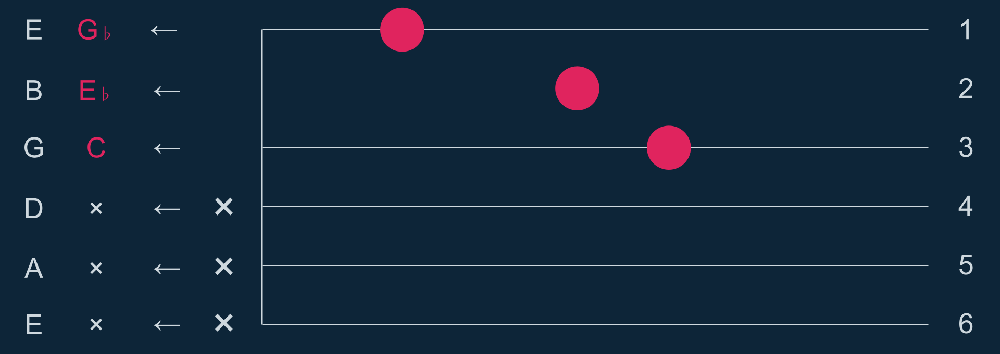

## Cdim7 （根音C - 短3度E♭ - 減5度G♭ - 減7度B♭♭ = A）: 減七の和音

基本セブンスといったら短7度（根音がCならB♭）だがCdim7の7度の音は減7度となる  
ということでCdimに減7度であるAを足せばよいので、Cdimの1弦消すこれ  

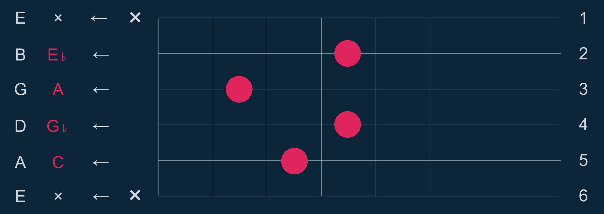

それか、Cdim7だと3弦は消せないのでこう  

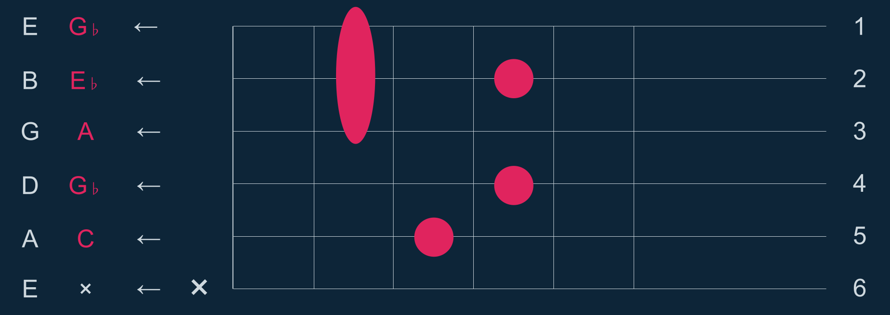

## Cm7-5（根音C - 短3度E♭ - 減5度G♭ - 短7度B♭）: 導七の和音

m7の5度の音を半音下げたものと同じになるため、dimコードに短7度を加えたいときはm7-5コードになる  
マイナーセブンス・フラット・ファイブ、別名ハーフ・ディミニッシュとは何とも厨二病ホイホイな感じだが  

Cdim7のAの音を半音あげればいいのでこう

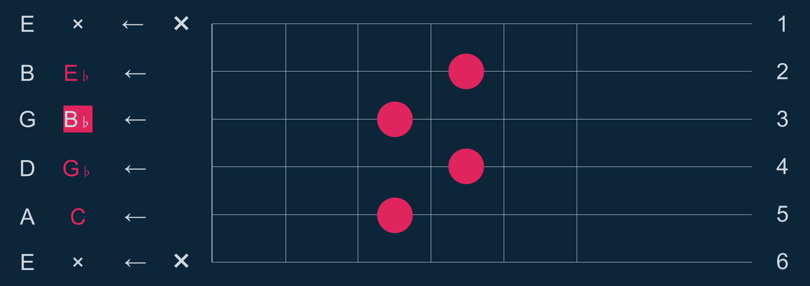

## Caug（根音C - 長3度E - 増5度G#）: 増三和音

Cコードの5度の音を半音上げた和音。  
Cのローコードを元に考えると、3弦のGを半音上げる必要がある

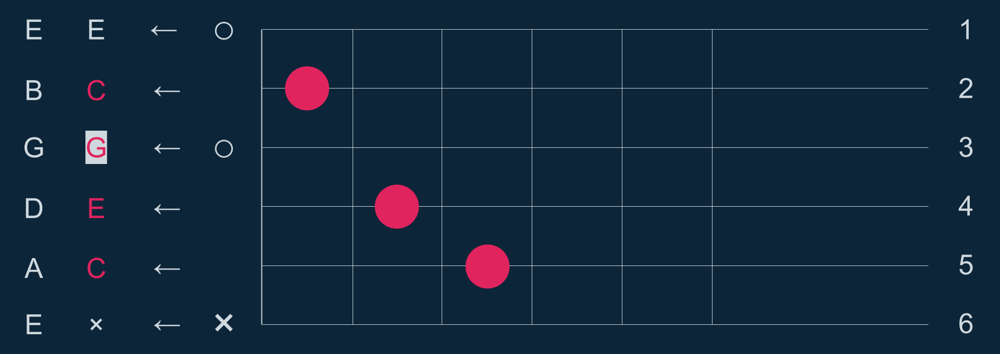

のでこうなる

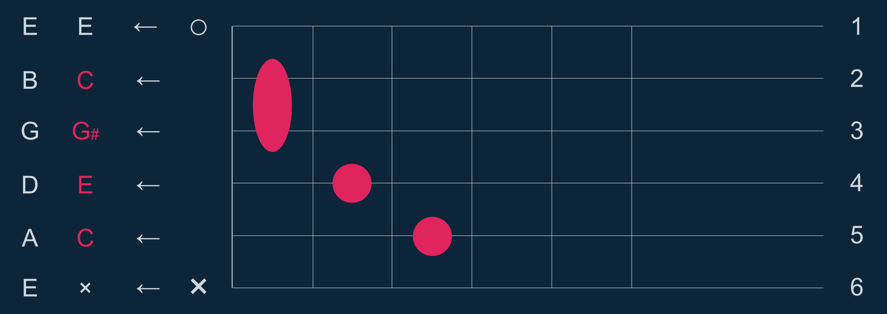

ハイコードを元に考えると4弦と1弦のGを半音上げる必要がある

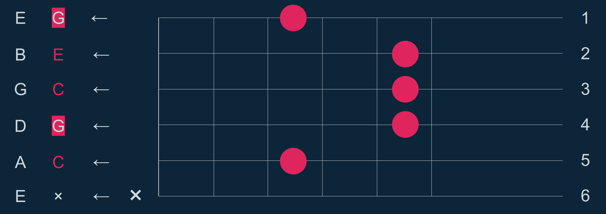

けど、4弦を上げるとちょっと遠くなるのでこうかね

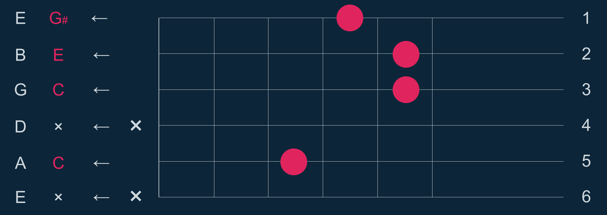

## Caug7（根音C - 長3度E - 増5度G# - 短7度B♭）

今のところ見たことないので省略  

## Csus4　（根音C - 完全4度F - 完全5度G）

suspendedは吊るされた→3度の音が半音分吊るし上げられて完全4度になる

基本はCコードのEを半音上げてこれ

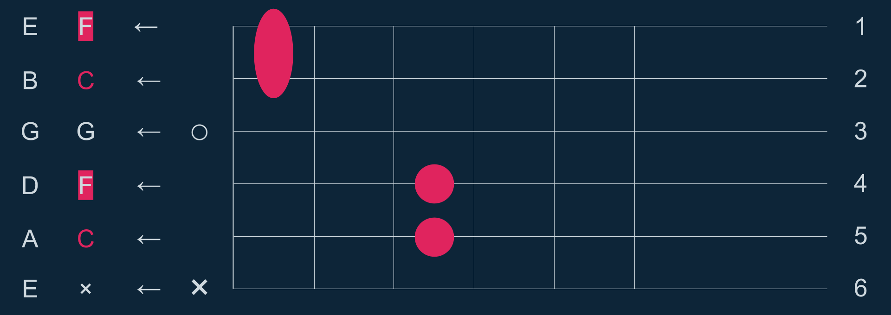

構成音的にはこれでもいけるけどFが目立つほうがsus4の特殊性が出る気がした  
こっちだとなんか濁る

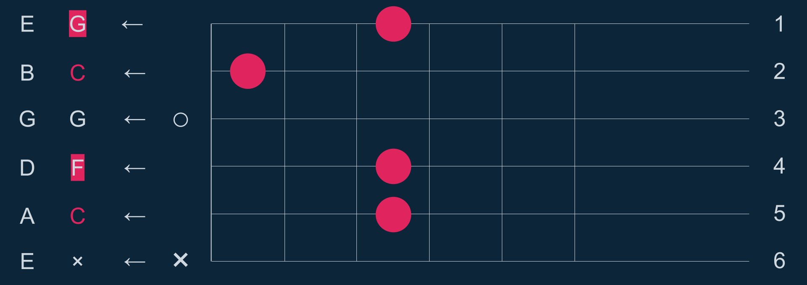

## Cadd9（根音C - 長3度E - 完全5度G - 長9度D）

CコードにDを加えるのでこれ

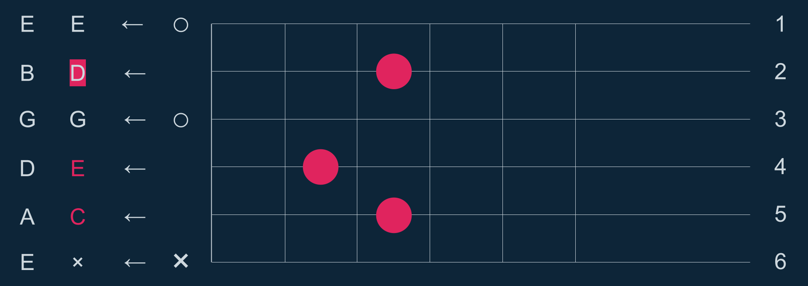

1弦のGをつけるなら

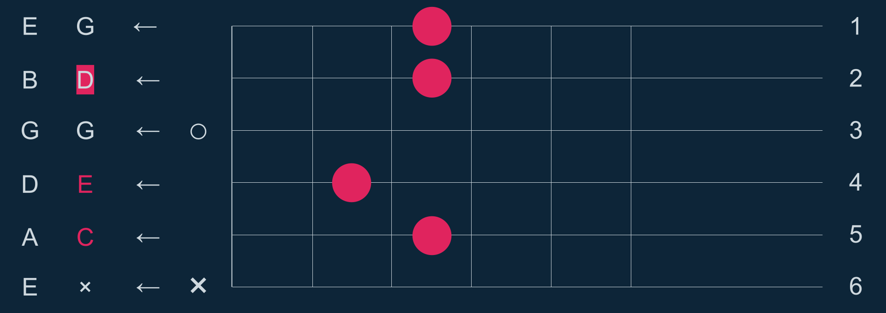

そもそも4弦開放にしたらよくない？と思ったら構成音的には合ってるんだが、なんか綺麗じゃなかった

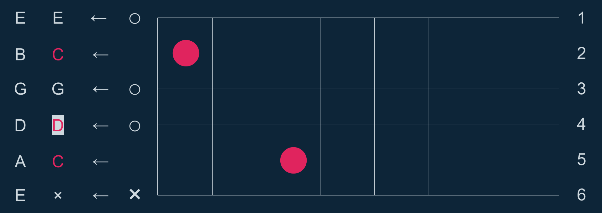

ので、こうするといい感じ。add9するときの9度の音はなるべく高いほうがいいのかな

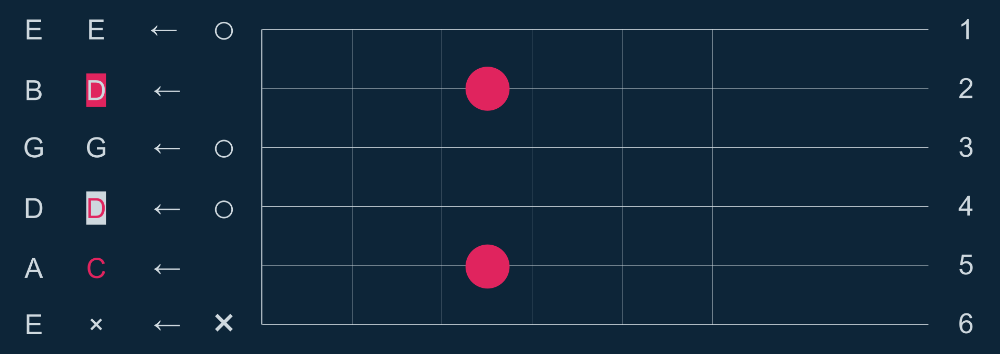