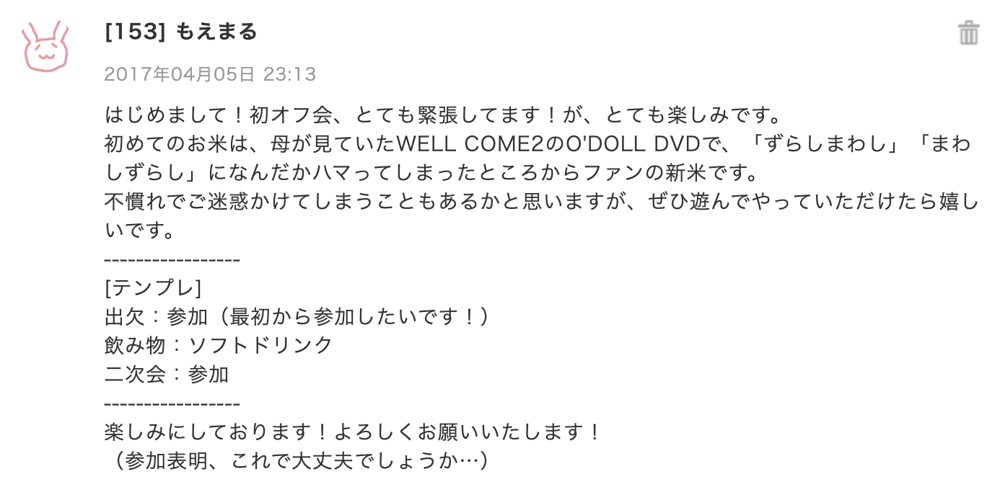

米米が好きだって言うと、だいたい決まった反応が返ってくる。  

**パターン①「どの曲が好きなの？」**  
これは難しい質問ですねぇ、米米って「聴く」ものじゃなくて「見る」ものだと思っているから。  
曲がどうこうっていうよりは、パフォーマンスの面白さを話したくなってしまうんだよねぇ。  

**パターン②「誰が好きなの？」**  
考えたことも無かった。強いて言えば箱推しとでも言えばいいんですかねぇ。  
米米CLUBという集団が好きなのであって、特定の誰かが好きで見ているわけでもないんだよなぁ。  

この2パターンもよく聞かれては、世間話の範疇だというのに真面目に答えて、引かれてしまうという失敗を幾度となく繰り返している（反省）。  
けれど、ぶっちぎりでよく聞かれる質問はこれだ。  

**パターン③「どうして？」「どこで知るの？」「世代じゃないよね」**  
そうですねぇ。解散時、まだ1歳にもなってないですからねぇ。  

---

1985年にデビューした米米CLUBが今日で35周年ということで、便乗してよく聞かれる質問に答えるべく、約15年前に初めて米米を認識した瞬間からいままでを、だらだらと振り返ってみようと思います。それはそれは長い、自分語りマシマシな文章なので、もし万が一お暇でしたらよかったらどうぞ。というか、こんな記事を読むくらいだったら、米米を見て欲しいと内心思っている。特に同世代ねぇ、いつになったら同世代の米米好きなおともだちに出会えるのでしょうね……いるだろうよ絶対……  

読む際は、下記のプレイリストをBGMにしてください（笑）  
それでは長ったらしい文章ですが、お時間あれば、最後までよろしくお願い申し上げましょうー！  

<iframe src="https://open.spotify.com/embed/playlist/2dfAcjgKy2B7YOtPf48R9J" width="300" height="150" frameborder="0" allowtransparency="true" allow="encrypted-media"></iframe>

※ 長いです（このあと、7,000字くらいある）  
※ もう既に記憶が怪しいので、この物語はフィクションです。  
※ 解散前から米米を見ている諸兄諸姉におかれましては、正確性に欠ける記述を発見するかもしれませんが、ご放念ください。  

---

## my第一次米米ブーム（米米に触れてしまったきっかけと、そのあとしばらく続く熱と）

車がないと生きていけない田舎に住んでいる中でも、とびきり車に乗る時間が長かった母に育てられた私にとって、少なくとも小学生時代、音楽を聴く時間というのは、車に乗っている時間とほぼ同義でした。あの頃聴いていた曲の大半は、いまでも私のiTunesに入っていて、なんだかんだで聴き続けているのだから、母からの音楽的影響は計り知れません。  

その頃はいつだって、母が娘に教養のために聴かせておきたい曲と、母の趣味とがごちゃ混ぜシャッフルで流れ続けていました。ただ当時は、例え「聴かせておきたい」曲だったとしても特に解説なんかなくて、結果として「なんとなく聴いたことはあるけど、曲名もアーティスト名もよく知らない」曲が多かった。だから、いまでも聴き続けている曲というのは、無意識に入り込んでいた無数の音楽の中から、意識的に能動的に聴こうと思うきっかけがどこかにあったのです。  

さて、正確には今から14年と少し前、2006年の夏のある日。いつもは音楽を聴いている車内で、母が突然何かのDVDを再生し始めました。  

「予習のために今日はDVD見るけどいい？」  
『予習？何の？DVD見て予習できるん？』  
「今度米米CLUBのライブに行くから、その予習。みんな踊るの」  
『ふーん』

ライブに行くから踊る予習って、何それどういうこと？　ライブってそういうものなの？　ていうか予習が必要なの？  
なんだかさっぱり分からないうちに始まったのが、再結成後初めてリリースされたシングル「WELL COME 2」に付属していた、表題曲のMV＋両面の踊りの教則DVDでした。そもそも解散前に存在していたファンクラブでは、会員限定で踊りをレクチャーするビデオが売られていたらしく、踊りを予習していくという文化は以前からあったものだと、そのときには知らなかったけれど。  

箱から出て踊る"永遠の27歳"な2人のお姉さん、箱に収まりながら独特な口調で話す"ギターのべーさん"。子供部屋の中にさらに狭い家のようなものを建ててはその中に生息していた当時、それがそのまま成長して最近だと某高松のドミトリーの箱っぷりに興奮していたりして、箱の中に収まっている大人も、大人が中に入れるような箱も、なんだかわくわくしながら見進めてなんかしまったから、米米にハマることになるんですよ。   

米米の踊り子たるSUE CREAM SUEの2人の踊りを前から後ろから再生したりスローで再生したりしながら、ギターのBEさんが解説という名の一言をちょこちょこ挟んでくるという構成で進んでいく踊りのレクチャー。B面「イッショウケンメ・ソング」の間奏で、Choo Choo TRAINの最初みたいな動きに合わせて、BEさんが言った「ずらしまわし」「まわしずらし」。ここまでお読みの方がもしいれば、たぶん文章じゃ何も伝わっていない気がするのですが、とかくこの言い方といい、言葉遊び的な部分に、国語辞典を読むのを趣味とし、暇があれば母にしりとりを吹っかける小学生だった私は、心を奪われてしまったのです。もう母の予習とか関係なく、私が間奏の部分を見たくて「イッショウケンメ・ソング」だけをリピート再生してもらいまくった。まさか母だって、この一枚のDVDを娘のいる前で見たからって、娘がその後15年近く米米を聴き続けようとは思いもしなかったでしょう。ここで、私の価値観のベースとなった、いい年した大人が全力で大真面目に馬鹿なことをする、をかっこいいと思ってしまう感覚を得たように思います。  

車内でベストアルバム「米 〜Best of Best〜」は流れていたから、それまでも聴いたことはあったはずの米米を、きちんと認識できたのはそのときでした。当時は「JUST U」の「ギター！BE！」を一緒に叫ぶのが好きだった。「ぎたー！べー！」って、なんか響きが面白くて。それから、いま考えるとなんとも教育に悪いのですが、「ホテルくちびる」に合わせて、最初の「はとこちゃん！」を言うのも好きだったなぁ。無邪気に毎回、ゲラゲラ笑ってた。あー、「なんではとこちゃんは、ぽっぽぽっぽしているの」なんて聞いてごめんなさい。なんて答えにくい質問なのでしょう。あぁ、鳩だからか！と合点したのは、それから15分後のことでしたねぇ（なんか違う）。  

ところで、この年の10月に「再会感激祭 アトノマツリ編」なるライブがあって、そのために母は予習していたのですが、このときのライブ連れてく詐欺を私は未だに忘れておりません（笑）。「そんなに米米に興味があるなら、一緒にライブ行く？」と言ってたのに、割と直前になって「ごめんチケット余らなかった」と母に言われた当時の私の絶望よ。そして、帰ってきた母に、お土産と言われながらツアーグッズであり、「MATA©TANA」を踊る時に使ったものだと推測できる扇子を渡されたときの悲しみよ。このとき、行く機会を得られなかった悲しみを、このあと10年以上、なんとなく頭の片隅で抱え続けることになります。  

この頃、iPod nanoを買ってもらったので、嬉々としてTSUTAYAで、まずはベスト盤かと何故か「HARVEST SINGLES」を借りてきて聴いたら、「Co-Conga」が入ってないことにショックを受けたという。なぜHARVESTのほうを借りたのか、今となってはさっぱり理由が分からないのですが、とりあえずそのあとすぐにもう一度TSUTAYAでBest of Bestのほうを借り直して、「Co-Conga」を聴いて安心したのを思い出しました（笑）  

ところで、田舎の小学校に通い、小6の修学旅行まで本とリコーダーが友達だった私は、「義務教育の義務は、教育を受ける義務じゃなくて、教育を受けさせる義務だから、私に義務はないよ」などと理屈をこねくり回してほざきながら、中学に行かない選択肢を取ろうとしていたのですが、残念ながら家庭の事情でその道は選べないということで、3ヶ月前というギリギリのタイミングで中学受験を決めました。そこまで塾に行ったこともなかったため、さすがに一人では厳しいんじゃないかと、あちこち母が塾を探してくれたのですが、お受験ってやつはそんな直前に決めるものではないらしく、塾にさえ入塾を断られるという貴重な経験をします。塾に入れないなんてこと、ある？　

結局、入れてくれる別の塾を見つけ、事なきを得たのですが、受験前にいつも聴いていたのは「浪漫飛行」でした。入塾を断られて以降、自分のやろうとしていたことがいかに無謀なことか認識できたので、夢をみないと何も始まらないって、いつもこの曲に救われていた。米米の曲は愛だの恋だの言ってることが多く、またこの曲もそうなんだけど、それでもこの時以降、他人に止められるような無茶をしようって時に、個人的な応援歌としていつでも聴いているような気がします。あぁ、そういえば高校時代に書道ででっかい紙に書き殴ったな、この歌詞。  

合格した志望校は、当時宇都宮市内に住んでいないと入学できないという規定があり、入学するにあたって実家を離れ、市内で父と二人暮らしを始めました。その頃、字を書くのが好きだったから学校帰りによく、Biglobeのショールームみたいな場所に寄って、1日30分だけPCを借りて、米米の曲の歌詞を調べてノートに書いていました。件の「WELL COME 2」のCDに入っていた、アルバム「komedia.jp」の予告編で中途半端に聴いた「スゴクおいしい」のフレーズを思い出して、調べて真面目にノートに書き写したこともあるんだけど、高校生になってノートを見返して、このとき書いた歌詞のえげつなさに腹抱えて笑ったよね。正直、まだ米米のアレな歌詞の意味を認識できていなかったのでした。  

実家を離れたことで、母からの音楽の影響を受けることが少なくなり、代わりに周囲の友人やネットの影響を受けるようになって、結果として私の第一次米米ブームは、中2の頃には収まっていたように思います。しかし、いったん冷めた熱は、高校生になって実家に戻ることで再び戻ってくるのです。

## my第二次米米ブーム（帰ってきた米米マイブーム、そして、やっと曲を全部聴いた）

実家を離れていたために、中学生の頃から携帯を持たせてもらっていたものの、そのまま高校生になっても持ち続けていたために、周囲が高校生になってスマホを買ってもらっていた中で、相変わらずガラケーを使い続けていました。スマホ的なものには興味はあったものの言い出せなかったところ、高2の秋の修学旅行前にスマホのような形のiPod touch 5Gを手にすることになりまして。このiPodに入れるために、「いつも車で聴いているやつ」をTSUTAYAで借りるついでに、「いつも車で聴いているやつ」ではなかったけれど、思い出したように米米のアルバムをすべて借りてきたところから、私の第二次米米ブームが始まります。  

米米のアルバムの何がいいって、このアルバム全部レンタルのときに知ったのですが、タイトルがすべて言葉遊びなんですよね。特にタイトル的に好きなのは、4th「GO FUNK（＝ご飯食う）」と5th「5 1/2（＝ご飯）」あたりか。解散前のラストアルバム「PUSHED RICE（＝押された米＝押米＝おしまい）」も最高ですね。アルバム全部並べて、自分が何を好きになったのか、よく噛み締めていたことを思い出します。米だけに。  

このとき一度に解散前、全てのアルバムの音源を手に入れた私は、ついでにCDを車に持ち込み、「いつも車で聴いているやつ」に大量に米米を追加しました。それでようやく、リアルタイムに母が聴いていたものを、共有してもらうことができた。ちなみに、このときに一番好きだった曲が、1stアルバムに収録されている「エクスクラメーション・マーク」なんだけど、最初に入っているケチャの音を「なんかウホウホ言ってるやつ」って言って、母に叱られました（笑）。母も一番好きな曲がこれだったから、親子ってすごいなぁと思います。それとね、「愛はつづいてる」もいいよね〜って当時母と言ってた記憶がある。母はどちらかといえば、二枚目な米米が好きなのではないかと、この時から思っています。私？　そりゃあ両面あっての米米でしょう、ということで。  

「一番最初に買ったCDは？」なんて質問をどこかで誰かにしたことがありますが、私の一番最初に買ったCDは、ヤフオクで落とした「米 〜Best of Best〜」の初回限定版でした。どうやら初回限定版には昔のライブ映像を収録したDVDが付いているらしいとどこかで知って、ヤフオクで落としてみまして、そこで往年のライブの力強さを、エネルギーの強さを知ることになりました。米米を知ったきっかけとして「見る」米米から入ったはずなのに、見る機会がなくてここまでずっと「聴く」米米になっていたのが、8年ぶりに「見る」米米に戻った瞬間でした。あぁ、やっぱり米米CLUBは、聴いているより見ているほうがずっと面白い。  

そういえば、このときにはもうなぜか、母は「WELL COME 2」を手放してしまっていたので、原点に帰ろうと思って自分で「WELL COME 2」を買いまして、改めて見たけど、やっぱり「ずらしまわし」「まわしずらし」の独特な喋りは相変わらず好きでした。ただ、同じタイミングで買った、同じくCD＋DVD構成の「MATA©TANA」のDVDで、なぜか踊るドラムのRyo-Jさんの踊りが上手すぎて、そっちに気を取られまくってしまいまして。あとになって知ったのは、母が行った「アトノマツリ」で、Ryo-Jさん踊ってたらしいですね、私の目に狂いはなかった（笑）  

このあたりで時間のある限り、まずはWikipedia、それから過去のライブに言及しているブログ記事をめちゃくちゃ読み漁っていました。私が体験することのできなかった時代に、生で米米を体験している方の話はそれだけで面白くて、まだまだ知らないことがたくさんあるなと勉強になりました。このとき読んでいたあんな記事やこんな記事の書き手に、後々会うことになるとは知らずに……。あぁ、そういえば具体的にCDやライブのリリース・開催年を意識し始めたのもこのときで、そしていまに続く「STYLISH WOMAN」と同い年なんですネタよ。最初知ったときめちゃくちゃ驚いたんですけど、STYLISH WOMANリリース日から1ヶ月足らずで生まれてるんですよね、生年までは同じという（笑）。  

2015年9月からゆるやかに働き始めて、最初の給料で「米盛Ⅰ」というDVD BOXを買いました。そうだ、これが本格的に米米のライブをだいたい通しで見たときですね。やっぱり米米は面白いし、大真面目で大馬鹿で、それがかっこいいなと改めて思ってました。米盛はⅤまで出ているんだけど、Ⅱがねぇ、未だにうまいこと手に入らない。綺麗なものを手に入れようとすると、定価の3倍くらいするという。昔のものを後から追いかけるには、体力と精神力とお金がかかるものです（でもバブリーな時代の米米が見たい）。  

2016年3月に実家を離れることになり、やっぱり近くに米米の話をする相手がいないと冷めるらしく、またここで一度落ち着きます。  

## my第三次米米ブーム（やっと！やっと、生米を食す、そしていまに続く……）

それから1年、2017年の誕生日翌日という素敵なタイミングに、突如重大ニュースがやってきた。  

**[“約4年半ぶりの全国ツアー「a K2C ENTERTAINMENT TOUR 2017 ~おせきはん~」開催決定！”](https://www.komekomeclub.net/artist/Komekome/info/480211)**  

えぇええええええええええええええええええええ！！！！！！！！！  
やっとライブに行ける！　10年間心待ちにしていたよこの日を！　このときの興奮を書き表し切れるほどの文才がないのを悲しむくらいには、まぁそれはそれは嬉しかった。いてもたってもいられず、誰かとこの気持ちを共有したくて、でも身の回りに誰もいなくて。私が中学生の頃に全盛期だったのであろうmixiなら、きっと米米ファンがいるに違いないと思い、mixiに慌てて登録したところ、あるじゃないか、米米カラオケオフ会なんてものが……！　すげぇ！  

  

<small>↑ これは即、参加申請を出したもえまるさんの図。ちなみにこのあと母の話をしていたら、「お父さん」が発生してましたwww ありがたい話ですwww</small>

そのあとすぐ、別の米米オフ会にも参加申請を出し、5月の頭に初めて米米のオフ会というものに実際に参加してみたんだけど、米米が「いい年した大人が大真面目に大馬鹿をやる集団」だとしたら、まさかファンまでそうだと思ってなくて。カラオケオフ会ってこんなになんでもありなんだ……って驚きました。ギャラリーは「ギャラの出ないメンバー」っていうのも、本当にそうだなと実感。「ライブでは踊るし、シュークみたいな人とかJOみたいな人がいっぱいいる」と母に聞いて早10年、ファンもやべぇよ米米CLUB。  

2017年は、9月に袖ヶ浦で開催された氣志團万博のトリを、米米が飾るというものっそい年でして、それが私にとって初めての、念願の、米米CLUBを初めて生で体験した日でした。台風じゃないのに台風みたいな日で、風も雨も強くて、びっしょびしょになりながら前のほうに徐々に移動して、なんとか米粒よりは大きいサイズで見られた米米。またセトリがよすぎてなぁ、Shake Hip!の頃にはもう、視界を遮るのは汗だか涙だか、はたまた雨だか全く分からず。米米CLUBは、生で体験するものだってしっかり実感して帰ってきました。  

この頃だったと思うんだよな、米米に限らず割と歌詞を聞いていないがゆえに起きた悲劇よ……  
氣志團万博行って、当時の同居人に米米CLUBというものを共有できて嬉しかった私は、調子に乗ってカラオケで「あたいのレディーキラー」を歌ってしまい、そして歌詞の内容に引かれるという……本当、米米の曲をファン以外の前で歌う時は、歌う前に歌詞をもう一度見返したほうがよいですね（反省）。  

そういえば、ライブというものに縁遠すぎて、しばらく「おせきはん」のチケットを手に入れられず、というかどうやってチケット買えばいいの？一般？てか、いつ買えばいいんだ？みたいな、典型的段取り組めないマンが発動してしまい、非常に困り切っていたところ、5月に参加した米米オフ会に参加されていた方が、同行者が都合悪くなってしまった関係で、プレミアムチケットを譲ってくださるという、とんでもない奇跡が発生しまして。初めての米米ライブを前から2列目で見られた私、運がよすぎでしたね。場所は台風の広島だったけれど（笑）。そして、第二部始まる前からずっと泣きっぱなしで、疲れすぎて記憶が怪しいです（笑）。  

「おせきはん」ではさらに、2枚分のチケットを別のオフ会の方に譲っていただいたので、NHKホールで10年前には叶わなかった、母とライブ参戦しました。でもね、やってみて気付くけどある程度の年齢になって、ド下ネタを母と聞くのはめちゃくちゃ恥ずかしかった。例えるならきっとエロ本が見つかった男子高校生の気持ちに近いのだろうけれど、もう気恥ずかしすぎてこのあと、母とくらいしか行けないのに、母と行くのは気まずいというダブルバインドを食らうことになります。まぁ、私が盛り上がりすぎてかえって母は引いてしまい、結局このあと一緒にライブに行ってくれなくなるので、杞憂でしたけどね。あぁ、本当に米米好きな同世代って、どこにいるのでしょう？　私とライブに行ってくれ（笑）    

「おせきはん」以降、先日の「OMUSUBI」まで、なんとなく毎年何かしらのニュースが入ってきて、本当にありがたいなと思いながら、今日も「OMUSUBI」の見逃し配信をもう一度見ています。でも、やっぱり生米がおいしいよね、ということで、また会場で and you! の you! になれる日が来ることを全力で願っています。  

私のだいたい15年くらい、これにて押米。米米CLUB35周年、おめでとうございます。そして、自分でチケットを買えるようになったいまも活動してくださって、本当に本当にありがとうございます（特にリアルタイムで見られてないからね！余計そう思うのでしょうね）。