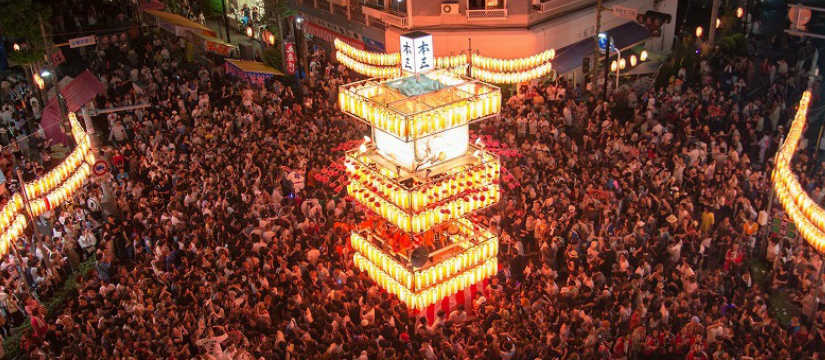

米米CLUBデビュー36周年（？）、おめでとうございます！  

昨年のこの日、米米CLUB35周年記念を祝うべく私は僭越ながら、「[私と米米CLUBのだいたい15年間](https://kuromimi.moemarusan.com/k2c-35th-anniversary/)」と題して、クソ長い自分語りマシマシな文章をネットの海へ放流してしまいました。  
そして今年の夏で、米米と明確に出会ってから本当に15年経ちました。当時小学校5年生だった私はいまや25歳になり、母にライブに連れて行ってもらえずに泣いていた小学生は、働き始めて自分のお金でライブのチケットを買えるようになりました。大真面目にふざける大人こそかっこいいのだという価値観を抱え続けながら、自分が成人の歳になってからもう5年も経ってしまった。時の流れは早いものです。  

昨年のように今までのことを書いたとしても昨年との差分を取ると、複数回のライブに参加し、念願の米盛Ⅱをヤフオクで定価より34,000円高い値段で落札し（手に入れたのは嬉しいけど、本人たちに還元されないのはかなしい）、久々のオフラインライブの日を待っているくらいしか追加で書けることがないので、今年は米米CLUBの何が好きで15年間、熱量が揺れつつも何だかんだで触れ続けてきたのか言語化を試みることで、昨年とは異なる形で「米米と私の15年間」を書いてみようと思います。

ライブでめっちゃ盛り上がって、そして内なる熱を消化しながらひとりで帰路につくという、テンションの寒暖差が激しすぎて毎度風邪をひきそうなので、願わくば、同世代に届いてくれたら嬉しいです。そしてあわよくば、一緒にライブに行ける友人が欲しい……😇  

※ 解散前から米米を見ている諸兄諸姉におかれましては、正確性に欠ける記述を発見するかもしれませんが、どうぞご放念くださいませ。  
※ 5,000字くらいなので昨年より長さ的にはマシですが、昨年より意味不明な文章書いてると思います……

---

## はじめに: 米米CLUBという「場」が好きだ

ずっと昔であれば小学生の頃に流行っていたプロフ帳だろうか、次に前略プロフィール。ついでにmixiですか。時代を感じますね。  
これらの中でよく質問として存在する「好きなアーティストは？」「好きな歌手は？」に対して、その度に米米を書くか悩んできました。便宜上そう書いておいたほうが、コミュニケーションを取る上で楽だと判断して書くこともありますが、どうしても米米に対して、「アーティスト」や「歌手」というラベルを付け難いように思ってて。それじゃあ、米米とは私にとって何なのか？  

さて、毎年8月になると群馬県は桐生市で、人口12万足らずの都市なのにあちこちから50万人の人が集まるという、八木節まつりが開催されます。  

一番盛り上がってる本町5丁目の交差点で、こんな感じ（[公式サイト](http://kiryu-maturi.net/)から引用）。今となっては考えられませんが、とっても密ですね。何の話？って感じになってまいりましたが、まぁもう少しお付き合いください。  

ヤグラの上から聞こえてくるお囃子やら煽り文句に釣られて、踊り方などよく分からない人まで飲み込まれながら、つい踊り狂ってしまう魔力がここにはあります。盆踊りなんて音だけ聴いてても仕方ないし、動画を見ていても楽しいけれど、踊り狂う中に入ってよく分からなくなるのが一番楽しい。ここ数年で整理する中で、私は米米をこれと同じ構図のおまつり的な「場」だと感じていて、ヤグラの上をある種の神聖なものとして認識しているのではないかという一つの解を得ました。ソロ活動に興味がなかなか持てなかったのも、なるべくメンバーのみなさんのプライベートが知りたくないのも（笑）、CDを（他のアーティストと比較すると）それほど聴かないのも、そう考えるとしっくりきます。  

この「場」としての米米というのが私の中であまりに独特なポジションすぎて、ブームが冷めても戻ってくるように離れられなかったのでしょう。テンションを上げたいときに、たまに八木節をエンドレス再生していることがあるんですが、米米のCDを聴くときは同じようにその象徴を取り込むことで血が騒ぐというか、「場」を思い出してテンションを上げる儀式をしているのかもしれません。  

---

## やっぱり言葉遊びよ
そもそも私が米米という沼に落ちたきっかけとして、これに触れないわけにはいきません。  
分かりやすいところでいえば、やっぱりアルバムのタイトル。特に、4th「GO FUNK（＝ご飯食う）」、5th「5 1/2（＝ご飯）」、14th「PUSHED RICE（＝押された米＝押米＝おしまい）」など、しょうもないといえばしょうもないんだけど、そのしょうもないことを大真面目に大の大人が考えてやってるのがいいんですよ。  

あとは、運コインとか、ね……！（いろんな意味でクソ）。  
曲の中でも「I・CAN・BE」が「あっかんべー」に変わったり、「僕らのスーパーヒーロー」の「ヨゴナビア（＝You gonna be a）」だったり、解散ライブでは「ワンダブルSUNでぃ」が「ワンダフル解散でぃ」になったり、ライブのタイトルがやたらウルトラマンだったり、SHARISHARISM 7ツアーの新曲タイトルの頭文字並べると「K2C」になったり、ちょいちょい出てくる言葉遊びのようなもの。これが面白くてつい探してしまうのです。  

## 8へのこだわりの強さ
同じような話で、米だからって8へのこだわりの強さも面白い。  
8周年に八角形の日本武道館で8日間ライブ開催とか、いったいどこの早口言葉なんでしょうか。

## そしてオマージュとカバー
同世代のファンには共感を得られるであろう話なのですが、米米がオマージュだのカバーだのしてくれたおかげで知った古い（けど当時は古くなかった）曲が山ほどあるような気がします。これの筆頭は小野田さんがやたらめったらカバーしているリンダちゃんですね。原曲には「リンダ！」っていう合いの手が入っていないということを、割と最近知りました。私に関してはBARBEE BOYSもこのパターンでしたし、当時の文化への入り口としての米米はあると思うんですよね。  

しかも、オマージュのクオリティが無駄に高い。  
初めて「バービーブー」の「いいじゃん」を聴いたとき、私はまだBARBEE BOYSを聴いてなかったのでさらっとスルーしてたのですが、オマージュ元をきちんと知ってから聴くと、音の作り方といい、曲の作り方といい、めちゃくちゃクオリティが高いのに、歌詞がめちゃくちゃで。そのバランスがとても面白いので、米米から入ってオマージュやカバー元を聴いて、また戻ってくるという活用方法を全力で推したい。新たな教養を手に入れられるに違いない、うん。 　

余談ですが、私はウルトラマンに明るくないので、7やTiTi・HaHaなどのツアータイトルがウルトラマンのもじりであることを、あとから解説を受けて知りました。おそらく、自分一人では気付けないオマージュ的なものがまだまだ潜んでいるんでしょうね。  

## おちょくってる感
何にしてもおちょくってる感がたまらないんですよね。  
紅白なのに「君がいるだけで」のあとに「なんちゅうこと言うの」を歌ってしまうだの、「浪漫飛行」を歌うと見せかけて「逢いたいと思わ〜ない♪」と飛ばしてしまうだの、地上波で「JUST MY FRIENDS」を中断してドマイナーSORRY曲「露骨にルンバ」を歌ってしまうだの、ライブなのにカラオケをやるだの、訳の分からないセルフパロディをやるだの、ライブの半分が劇だの、変なキャラクターが出てくるだの、当時を生きてないので半分伝聞でしか知らないものの、大人なのに大人を捨てて人をおちょくりまくっているこの倒錯した絶妙なバランスに不思議な憧れを持ってしまう。「かと思った？はい残念でしたー！」の繰り返しに、大人になってもやっちまえって言われてる気持ちでいた学生時代だったことを思い出しました。  

## バブルの象徴的な
今の米米もいいけど、もしデロリアンが唐突に私の目の前に現れたら、80年代後半に行って少なくとも7・右脳左脳・英雄伝説・ACEツアーに参戦してから現代に帰ってきたい（当時の米米は日本一チケットが取れないバンドだったと風の便りで聞いたことがあるので、過去に飛んだところでチケットが取れないでしょうけども）。  
過去のライブ映像を見ると、煌びやかで儚い空気が漂っているように見えます。身近にあったその時代のものが米米のライブ映像だったからでしょうけれど、80年代末〜90年代初頭のライブ映像を見て、得ることのできなかった華やかな時代に思いを馳せるのも楽しいものです。当時のライブシーンの莫大なエネルギーは、時代に支えられている部分も大きくあるのではないかと思っています。  

ついでに、石井さんが山ほど吐いてるブラックジョークだのホモネタだのは、時代的に許されていた側面もあるような気がしており。そういう意味で、よく知らないものを論ずることはできませんが、尖り切った米米が見られたのは昭和な時代だけなんじゃないかと推測しています（まぁでも、令和にあまりにも強い偏見や差別やセクハラめいたものを見せられると引いちゃうので、過去を楽しめるのは時代を言い訳にできるからと言えるとも思いますが）。  

## 素敵なミドルエイト
さすがにちょっとは曲に触れようということで。  
米米の曲はミドルエイト（Cメロ？ブリッジ？）がめちゃくちゃ多いような気がします。浪漫飛行だと「忘れないで あのときめき〜」、愛 Know マジックだと「嵐の夜にこの胸で〜」、愛はふしぎさだと「今は何も言わないでと〜」のところですね。たぶん誰かの（石井さんかな）手癖なんでしょうけど、私はこのミドルエイトのある曲がこの部分だけ収集してるくらいにとても好きで、単純に私に刺さりまくってるというお話です。。。  

特にお気に入りは「SO COOL」と「抱きしめたい」のミドルエイトで、しかもこの2曲はベースラインが神なので……  
そして「ぼくのかんがえる米米っぽさ」でいうと、「KOME KOME WAR」みたいな大部分の歌い方をわざとヘンテコにしている場合に、ミドルエイトだけ歌い方というか声質を元に戻している感じが、それっぽくて素敵です。ミドルエイトじゃないけど、嫁津波の「Mountain Rice Farm Village Tonight〜」のとこもそういう感じだし、「Mountain Rice Farm Village Tonight」って何なんだ。かっこよく歌っておきながら「Mountain Rice Farm Village Tonight」ってさぁwww  

## あれやこれやのギャップ
やはりこれでしょう。  
二の線と三の線は割とグラデーションということもあるとは思いつつも、この2つの顔がある米米の一粒で二度美味しい感よ。  
えらいふざけたと思ったらすぐすまし顔になるそのギャップに毎回惑わされてしまうのも楽しいものですし、そもそもフロントマンたる石井さんの顔の整い方からして、そこからえげつない下ネタが出てくるというこのギャップもすごい。えぐい。えぐい。  

そして、思いっきりふざけていても、演奏は安定しているというギャップも。これによって、米米がただのおふざけバンドにならずに済んでいるという側面は確実にあるような気がします。ふざけるなら真面目にふざけろよ！みたいな何かを体現しているなと……　 

---

## おわりに: 結局「楽しそうだったから」
なんやかんや理由並べつつも15年間触れ続けたのは、米米が「楽しそうな大人の象徴だったから」に他ならないような気がします。  
実際にどうなのかというのはさほど重要ではなく、あくまで象徴として信仰していた、そのまま15年触れ続けては小学生の自分を思い出すようなトリガーなのかもしれません。平成生まれ米米育ちと言っても過言ではなく、15年も触れてくればこの先の15年もまた触れ続けるでしょうし、まだまだ米米が続いてくれたらいいなぁとひっそりと希望を表明して終わりにしたいと思います。……あっ、米盛再販してください！！！お願いしまs