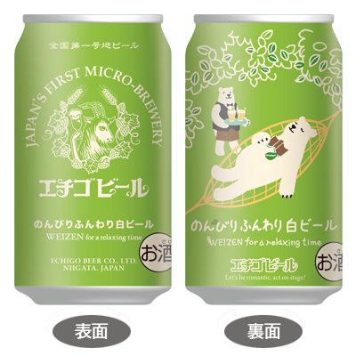

昨晩、「ビールが好きじゃない」「どれ飲んでもビールという感じがする」といった話を聞いて、「それ、2.5年前の私じゃん」と思ったので、そのへんのビール（ｱｻﾋｨｽｩﾊﾟｧﾄﾞｩﾙｧｧｧｧｲやプレモルなど、大半の居酒屋で「とりあえずビール」を唱えると出てくるビール）をしかめっ面しなくても飲めるようになるまでの試行錯誤について置いておく。    

## （余談）ビールを飲めるようになろうと思った動機
かつて、居酒屋などに行けば、とりあえずビールならぬ「とりあえずカシオレ」だった。しかし、そもそも私はジュースの類が好きではなく、食事と一緒に飲める甘いものはミルクティーに限り、そうでなければお茶か水を好んで飲むわけで。お酒だからといって、半分以上ジュースである甘い飲み物を前向きな選択肢として捉えられるわけではなく、あくまで消去法で「とりあえずカシオレ」だったのである。  
ところが2020年当時、属していた某コミュニティのメンバーにビール好きが多く、特に頻繁に関わるメンバーに占める割合が多いと感じていた。そこで、実務以外で共通の話題を持つことにより、うまいこと輪に入れないだろうかと考えた。そんな、何ともコミュニケーションが得意ではなさそうな思考がきっかけである。  
とはいえ、そういったきっかけで始まったものの、途中から「何なら飲めるんだ？」と好奇心で探索することになり、もう今となっては元のきっかけなど関係なく調査が続いている。  

## この記事の着地点
試行錯誤をすることにより、おいしいとまでは思わなくても、しかめっ面をせずに市販のビールが飲めるようになるところまで。  
2.5年経っても未だに、ものによっては苦いと思っているし、おいしいと思って飲めているものもそうでないものもあるので、「しかめっ面せずに」くらいの着地点である。  
また、味覚は人によって異なるため、これはあくまで一個人の探求記録である。

## フルーツビール → △やっぱりビールはビールでは？
まず、勧められたのがフルーツビールだった。フルーツビールというのは、その名の通り、醸造の途中で果物そのものやそのシロップを投入して作られるビールで、様々な種類が売られている。もともとカクテルを飲みがちだったということで勧めてもらったんだと思う。結局どれを飲んでも「やっぱりビールの味だよ〜〜〜」となってしまったので具体的な商品名は出さないが、10本は飲んだはず。  

もし挑戦するなら、皮の苦味なのかビールの苦味なのか分からないが、何ならそのへんのビールよりも苦く感じたので、柑橘系のフルーツビールだけは避けたほうがいい。また、同じ種類の果物を使っていても、香料の有無などで大きく印象が変わるので、一つ苦手なビールにあたってしまっても他のビールならおいしく飲めるという可能せもある。    

## 「水曜日のネコ」 →　△　そこまで苦くはないけどスパイシーなのがあんまり得意じゃないかも？
ほぼ同時並行で、ヤッホーブルーイングの「水曜日のネコ」をローソンでパケ買いするも撃沈。ただし、これは私がコリアンダーシードのスパイシーな感じをあまり好まないからというのもあり、苦味だけの問題ではなかった。まだ、「でもビールじゃん」の時代。

## 「僕ビール、君ビール」 →　△　やっぱり苦い。でもいい匂い
ついでに同社の「僕ビール、君ビール」を飲むも、苦く感じる。ただ、いい匂いだなと思ったことは覚えている（あと、パッケージかわいいよね）。  

## 「エルディンガー ヴァイスビア」 →　◎ ついに見つけた、しかめっ面せずに飲めるビール
フルーツビールを飲むも撃沈した話を某コミュニティの中に持ち込んだら、「自分もビール飲めなかったけどこれを飲んでからビールを飲めるようになった」という情報をもらい、買ってみたエルディンガーヴァイスビア。飲んだ時の感想は「水みたいに飲める、麦の味した炭酸水」。それおいしいの？って聞かれるとちょっと回答に困るものの、少なくとも苦いなとは思わなかったのが一つ進歩だった。  

当時はヨドバシで4本セット1,200円くらいで売ってて簡単に手に入ったんだけど、今調べたら売ってない……（´・ω・｀）  

## 白ビールって？
どうやらエルディンガー ヴァイスビアというのはヴァイツェンという種類のビールらしいと知った。ドイツ語で小麦を指すヴァイツェンは、ドイツ発祥の小麦を半分以上使用したビールである。また、この時点では撃沈していた「水曜日のネコ」。こちらはベルジャンホワイトという、小麦も使用したベルギー発祥のビールである。小麦を使ったビールを白ビールといい、そしてヴァイツェンとベルジャンホワイトはざっくり白ビールの二大巨頭だ。  

雑な認識にも程があるが、とりあえずヴァイツェンのほうがまろやかでマイルド。ベルジャンホワイトは、オレンジピールやコリアンダーシードが使われていることが多く、スパイシーでキレがあるのが特徴だと思っている。  

ここから、白ビールを見かけたらヴァイツェン中心にとりあえず買ってみて飲む日が続く。基本的にはどれも「飲める」という感想だった。でも「飲める」だけでも十分進歩している。あまりに本数を飲んだゆえ、どれがどれだったのかあまり記憶がなく、記憶があるビールだけをいくつか挙げる。  

### 「銀河高原ビール」  → △　なんか独特な匂いがする →　○　あれ？おいしい
コンビニでも手軽に入手できるヴァイツェン、「銀河高原ビール」。ヴァイツェンなら飲めるのでは？という仮説のもと買ってみたところ、ヴァイツェン酵母の特徴としてよく書かれている「バナナのような」匂いが際立った形か、ちょっと癖があって苦手だなと思っていた。この1.5年後あたりにお店で飲んだらおいしく飲めたのは缶じゃなかったからなのか、それとも時間が解決したからなのか不明なので、また試しに買ってみようと思う。  

[銀河高原ビール ブランドサイト](https://gingakogenbeer.com/)

### 「のんびりふんわり白ビール」 →　○　癖がなく飲みやすい、あとパッケージがかわいいw
近所の酒屋でひたすら白ビールっぽいものを買ったシリーズ。あまりに飲みすぎて記憶にないんだけど、記憶にないってことは特段癖がなく飲みやすかったんだと思う。あと、パッケージがかわいいからそれだけで買う理由になるw

<small>※ <a href="https://echigobeer.com/products.php" target="_blank">公式サイト</a>から引用</small>

### 「BLUE MOON」 →　○　パッケージ補正込みで好き
缶や瓶ではなくお店で飲んだんだけど、ロゴが好きでつい。たぶんビールじゃなくて情報を飲んでいる（味はベルジャンホワイトなので、絶対パッケージ補正入ってる）。一度日本撤退したけど、この春から帰ってくる＼(^o^)／

[全米No.1のクラフトビール｜BLUE MOON](https://bluemoonbrewing.jp/)

## 群馬の厨二病ビール
これは極個人的な事情だが、群馬に縁があるのもあって、ずいぶん前からTwitterでバズっているのを見かけて気になっていた太田のビールブランド「CHROA」。ヴァイツェンをある程度飲みまくったのち、そろそろ飲めるビールがあるのでは？と都内の今はなきアンテナショップで買ってみた。  

### 「CHROA TABOO GUILTY WHITE」 →　○　めちゃ飲めるじゃん
今はもう作ってないらしいアメリカンスタイル・ウィートエール、つまり白ビール。IBUという苦味を示す指標で7と書かれており、他と比較しても圧倒的に小さいので飲めるのでは？と買ってみたら、めちゃ飲めるじゃんという結果に。味の記憶がないあたり、たぶんあんまり癖がなく飲みやすいビールだったのだと思う。  

### 「CHROA VIVIANN」 → ◎　なにこれ、おいしい
このあともおいしく飲めるビールを探すべく、飲めそうなビールを見かけると買うことを繰り返しているが、ここから1年以上経っている現在もこのビールよりおいしいと思うビールに出会えていない。ちょっと苦味はありつつ、それ以上に甘く、それでいて重たさがない。これで初めて「飲める」じゃなくて「おいしい」を味わったけれど、だからといって万人に勧めるものでもなく、単純に好みの問題だと思う。なお、これはおそらく白ビールじゃないんだと思うんだけど、その割にかなり苦味が抑えられている。  

[CHROA VIVIANN | CHROA(クロア)アートクラフトビア](https://www.chroa.jp/items/27150992)

わざわざ太田のイオンに行くのは面倒なので、都内で売ってください……w

## 情報を飲む、というのはあると思う
BLUE MOONは昔働いていたオフィスの近くで頻繁に昼に通っていたお店がもうすぐ閉店というエモいタイミングで、しかもロゴが好みで飲んだところがあるし、CHROAは群馬だし説明文が厨二病だしVIVIANに至ってはキャラクターとして好きなうさぎだったりするわけで、案外情報を好んでいるビールについては情報を飲んでいる側面がある。無理にビールを飲もうとせず、気になるパッケージや観光した先で飲んでみるみたいな方法もあるのでは？  

## とかやってたら、ビールの苦味を感じなくなってきた
麻痺したのでは？ともいう。もしそうだとすると怖い話でもある。  
白ビール行脚をする前に飲んで撃沈した「僕ビール、君ビール」が今やおいしい（し、かわいいしいい匂い）。とはいえ、今でもおいしいと思って飲んでいるビールはかなり少なく、せいぜい「しかめっ面せずに」程度である。そして、「でもビールじゃん」だったのが少しだけ解像度上がって「ヴァイツェン」「ベルジャンホワイト」程度にはなったものの、それ以上の言語化がうまくいかない程度である（ベルジャンホワイト、味がわかりやすいんだよね）。    

## そのへんのビールで飲みやすいのは（個人的感想）
コンビニで買えるくらいの入手難易度のものに絞って、飲みやすいかも？と思っているビールを挙げる。  

- ｱｻﾋｨｽｩﾊﾟｧﾄﾞｩﾙｧｧｧｧｲ（アサヒ）……実はIBU低め。初期は苦いと思ってた覚えが
- ザ・プレミアム・モルツ（サントリー）……IBU不明だけどこないだお店で飲んだら飲みやすくない？と思った
- バドワイザー（米・アンハイザー・ブッシュ）……コンビニで見かけることも。結構飲みやすい。あとプルタブが赤くていいw
- ハイネケン（蘭・ハイネケン）……時々缶をコンビニで見かける。さっぱりしていて結構飲みやすい
- アサヒホワイトビール（アサヒ）……セブン限定。こないだ飲んだけど普通にベルジャンホワイト
- ヒューガルデン・ホワイト（白・ヒューガルデン）……最も有名なベルジャンホワイト。バーとか行くとあるかも
- 水曜日のネコ（ヤッホーブルーイング）……結構どこでも売ってる。こちらもベルジャンホワイト
- 僕ビール、君ビール（ヤッホーブルーイング）……ローソン限定。ホップの匂いが強い割に全然苦くない
- SPRING VALLEY シルクエール＜白＞（キリン）……お店で飲んだけどかなり飲みやすい。癖がない
- 青島ビール（中。Tsingtao Brewery Company Limited）……中華料理屋で見かける。匂いはビールだがあんまり苦くない
- シンハー・ビール（泰・ブンロート・ブリュワリー）……こちらもエスニック料理屋で見かける。東南アジア系ビールは全体的にあんまり苦くない
- （発泡酒だけど）金麦（サントリー）……飲んでみたら飲みやすくて驚いた。発泡酒だからという違いが分からない程度の味覚で、だけれど
- （新ジャンルだけど）ホワイトベルグ（サントリー）……ビールを飲めなかった頃にはビールじゃんと思っていたけど今飲むとだいたいベルジャンホワイト