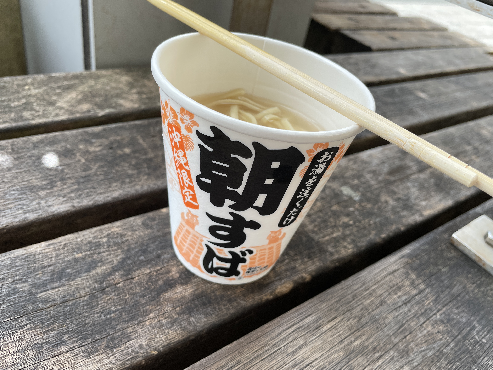
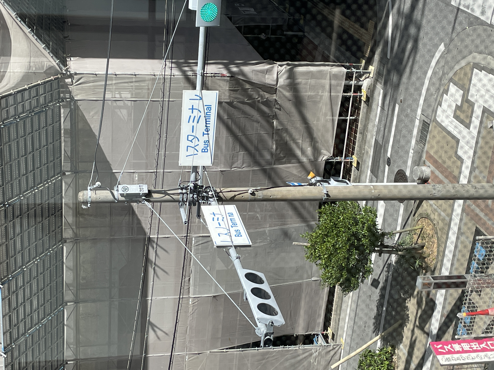
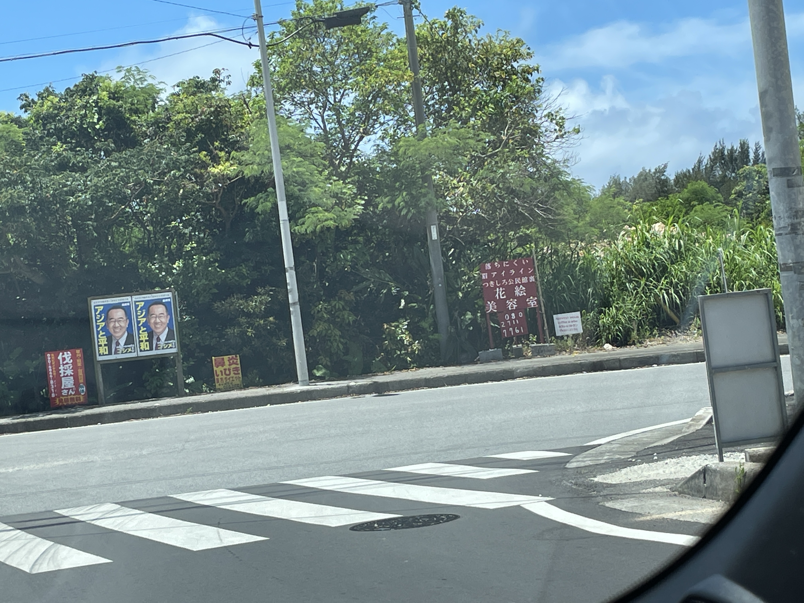
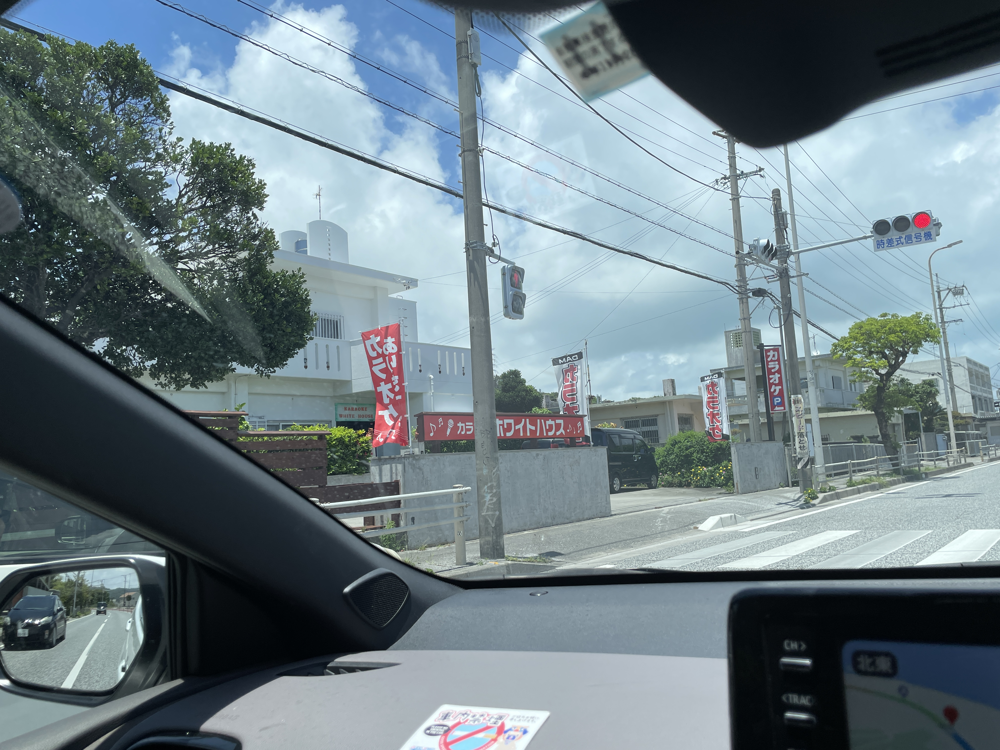
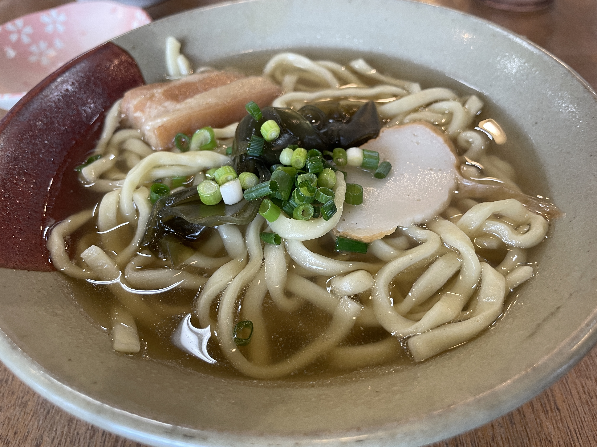
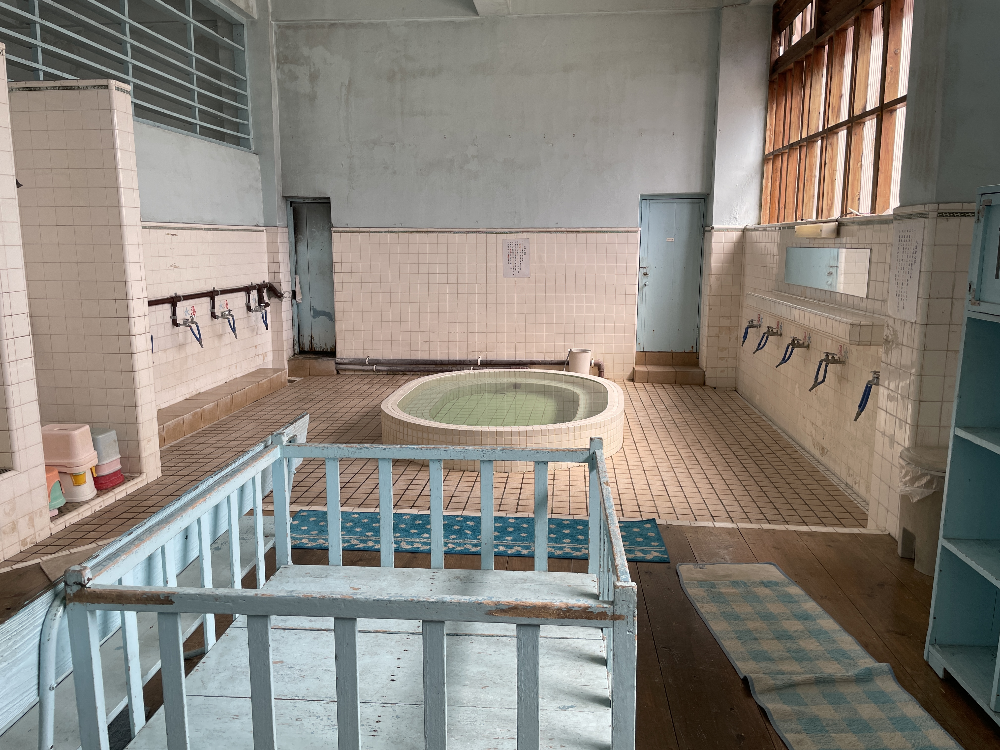
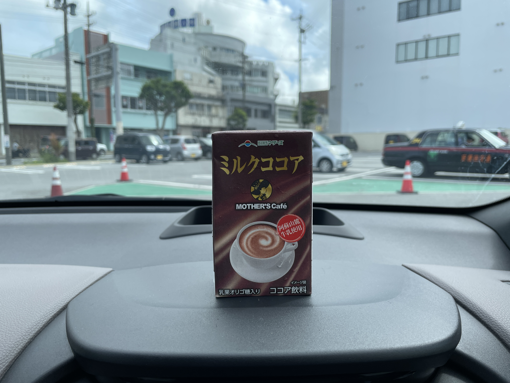
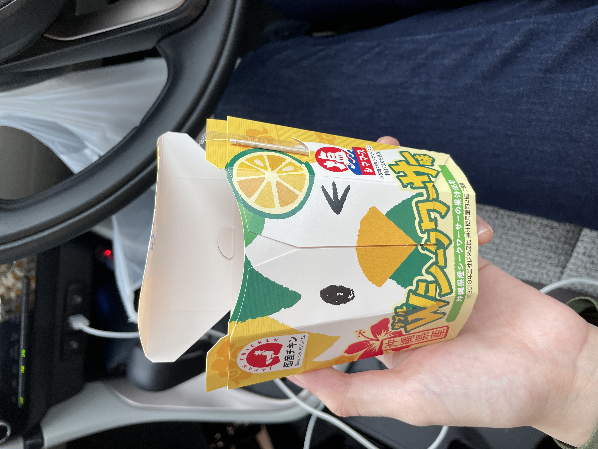
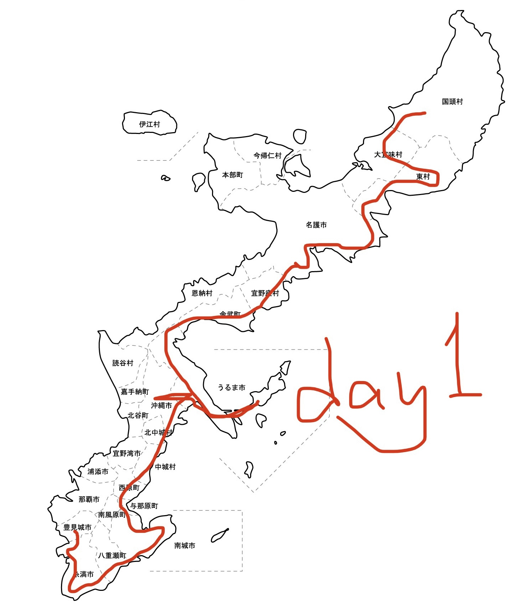

これは前回👇  
[沖縄一周放浪記（2023/6/26-6/29）day0: 東京→沖縄 | $cd ~/kuromimi](https://kuromimi.moemarusan.com/okinawa-2306/)

---

## day1: 車を借りて、そば食って、銭湯行って、橋渡って、だいたい半周くらいして（たぶん）

2:00過ぎに寝たにも関わらず、どうやら7:30前には起きられたらしい。布団の中でうだうだした記憶もないので、これが出先マジックである。  

身支度を済ませ、チェックアウトをし、近くにあったファミマで「沖縄ファミマの本気」と書かれていた「朝すば」を買う。前回3月に1人で行ったときは忙しく動き回る必要もなく、ゆっくりと朝寝坊をしていたので、朝ごはんを食べることもなく、この3ヶ月強狙っていた「朝すば」をようやく口にした。  

  

「朝すば」というのは面白い食べ物である。湯を注いで10秒待つだけで食べられる手軽さ。それでいて普通においしい（でもちょっとしょっぱい）。沖縄県民のすば（＝沖縄そば）への執着を感じる。  

運転し慣れたヤリスを低価格で借りられるということで、宿からバスを使わないと行けないお店で車を予約していた。しかし、もしゃもしゃと「朝すば」を啜っているうちに目の前で乗りたいバスに乗り損ね、同じバス停に次のバスが来るのは1時間後だというから、仕方なく那覇バスターミナルまで歩く。  

消えかけて“ノスノーミナ”になっている交差点を過ぎると、那覇バスターミナルが入っている建物に辿り着く。この建物を勝手にOPAビルと呼んでいたのだが、OPAがテナントになっているのは2Fの1フロアだけで、本当は「[カフーナ旭橋A街区](https://www.kafuna.jp/)」という建物らしい。　　

カフーナ旭橋にはA〜E街区があるそうだが、バスターミナルが入っているA街区しか見えていなかった。OPAよりも広く、3フロアに跨る県立図書館に今度は行ってみたい。街中に図書館がある街は好きだ。  

---

近くに来たバスの運転手に聞いて、案内された通りにバスに乗ったはずが、なぜか異なる方面に進み、そして那覇バスターミナル付近に帰ってきてしまった。そもそもGoogle先生が指し示していた乗り場は「旭橋・那覇バスターミナル」だったが、豊見城方面に行くには那覇バスターミナルではなく、旭橋というバス停に行かねばならなかったらしい。遠回りをしてしまったが、今度こそレンタカー屋さんを目指す。  

結局、9:00から予約していた車を借りられたのは10:00手前のことだった。  

今回の主目的は沖縄本島をだいたい一周することだ。宿を北のほうで予約していたので、南のほうへ海に向かって動き出す。沖縄県水産公社地方卸売市場あたりで、謎に3周してしまう。1回休み。さらに「美々ビーチ」という文字を見つけ、「そんなに繰り返すほど美しいなら」と行っちゃいそうになったが、あれで行っていたら糸満を一生抜けられなかったかもしれない。  

そのまま本島の南側を通って、八重瀬で休憩を挟む。前回の滞在からハマってしまったという、甘ったるいガーデンレモンティーを買う。とにかく甘い。  

近隣に「ぐしちゃん浜」というのがあった。ぐしちゃんとは誰なのか？  
気になって困ったので助手席にいる友人に調べてもらうと、ぐしちゃんとは「具志頭」という地名であった。決して、ご当地マスコット的な誰かではなかった。  

<small>（↑地面から生える伐採屋さん、鼻炎いびきも気になるが、落ちにくい眉アイラインが気になる。眉アイライン？）</small>

そのまま、時々外れながらも基本的には331号を通って東側から北上していく。  

道中で見かけたカラオケホワイトハウス。「確かに白いが、ここは日本だぞ」などと思いつつ撮った。調べたところ、歌が上手な夫婦が自宅の1Fをカラオケステージにしているらしい。おぉ、名前よりファンキー。 

---

運転していると食事を忘れかけるが、今回ばかりは友人と来ているのでそういうわけにもいかない。この時間を逃してしまえば昼ではなくなると、14:00前に再び沖縄そばを食べることにした。前回の滞在では変わり種ばかり食べていたので、今回はまず一般的なものを食べようと、[県内沖縄そばチェーン](http://www.gabusokasoba.com/)に入店する。  

昆布が乗っていて驚いた。おでんを思い出す味がした。1ヶ月経ってから書いているせいか、このそばに関する記憶がこれ以外にほとんどない。覚えていないということは、おいしかったんだと思う。  

パイナップルジュースが出る蛇口があるパイナップルパークの宣伝や、共用に加えて女性用トイレがあったがこのとき偶然手洗い場が故障中で使えないトラップが発動していたことや、駐車場が広くて停めやすかったことは覚えている。沖縄そばを食べに行ったのに、沖縄そばじゃないことばかり覚えて帰ってきた。  

---

次の目的地は海中道路だったが、「うるマルシェ」という誰が上手いこと言えと……という、洒落た道の駅のような場所を過ぎたあたりで思い出した。「そうだ、沖縄県内の銭湯ってもう1つしか残ってないらしい。行きでも帰りでもいいんだけど、行ってみない？」  

沖縄最後の公衆銭湯は沖縄市と、本島の中央部にあるため、今回の経路には含みにいかないと入らない。とりあえず調べてもらったところ、私たちが帰る木曜は定休だったので、行くなら今日しかない。ということで東方面に向かっていたが、急遽折り返して沖縄市へ向かうことにした。  

中乃湯に着くと、おばあたちがゆんたくしていた。さすがにそこに入り込む勇気はなく、入湯料を払ってそっと中に入る。

不思議な空間だった。脱衣所との仕切りがないのは、昔からの沖縄スタイルらしい。シャワーはなく、お湯と水の蛇口をホースが繋いでいる。湯と水の文字がだったか、青と赤の蛇口の色だったか記憶が曖昧だが、どちらかが逆だったんだと思う。暖かいお湯を出すのに苦戦して、水を浴びるか悩み始めた末に気付いて成功した。  

肝心の湯船はといえば、おそらく44−5℃くらいのかなり熱いお湯で、長くは入ってられなかったけど、長く入っていたような、時間の流れがゆるやかだった気がした。行けてよかった。  

風呂上がりにコーヒー牛乳をと近くのスーパーに寄るもカフェオレしかなく、カフェオレにするくらいならとココアにしたものの、カフェオレとコーヒー牛乳の違いは分かっていない。  

---

今度こそということで海中道路へ向かい、無事に通り過ぎて、コンビニで一休みして、また戻る。  

<small>（↑沖縄限定って書いてあったのでつい買ってしまったものの、近所のローソンで見かけたことがあるような気がしている。幻想か？）</small>

---

名護を過ぎる頃にはすっかり暗くなっていた。  
予約している宿は国頭村の比較的西側にあるらしい。Google mapがチェックイン時間スレスレの到着予想を出しているにもかかわらず、331号でそのまま西に向かえばいいのに、ついマイナーな道を走ろうとしてしまう。パトランプを光らせた黄色い車が途中で曲がっていった。先にはダムがあるらしい。真っ暗な中、ダムで何が起きていたのだろうか。  

宿に向かう前最後に、晩酌用のビールを買いにコンビニに寄ったら、ダムへ向かったはずの黄色い車が隣に停まった。ちんたらちんたら私が遠回りしていた間に、ダムからここへやってきたらしい。  

---

ひたすら峠を登り続けると宿に着いた。チェックイン時間限界の5分前のことだった。  

電波が届かない、虫が出る、掃除が行き届いていない箇所があるなどのレビューからちょっとサバイバルな宿を覚悟していたが、実際に借りるのは自宅の余っている部屋であり、人が住んでいるなら大丈夫だろうと思った。加えて、タオルや歯ブラシも用意されており、ここを見据えてタオルを持ってくるよう友人に伝えたが杞憂だった。元気な子どもたちにマイクラの解説を受けた。お子さんたちの人懐っこさは慣れかもしれない。  

金武のスーパーで買った諸々と、近隣のコンビニで買ったばかりのビールで晩酌をした。ゆし豆腐が美味すぎた。ちょっと古ぼけた畳に、スイッチではなく紐を引っ張って点ける電気、四角くてでかいちゃぶ台。いわゆる日本のおばあちゃんちの家みたいな部屋だった。ビールこそ飲んでいるけれど、小学生の夏休みを過ごしている気分になった。ただ、叱ってくれるおばあちゃんなどはいないため、だらしない小学生たちは、気がついたら寝こけていた……  

（たぶん続く）

---

### 沖縄本島一周: day1進捗

（これがスマホ手書きクオリティ…… 元データは[こちら](https://www.freemap.jp/itemFreeDlPage.php?b=okinawa&s=okinawa1)より）