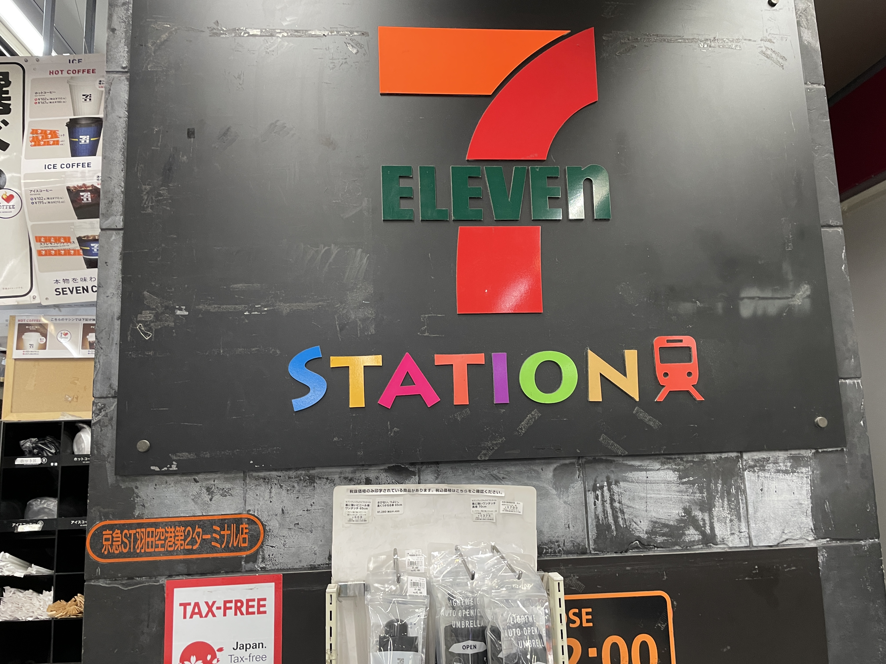
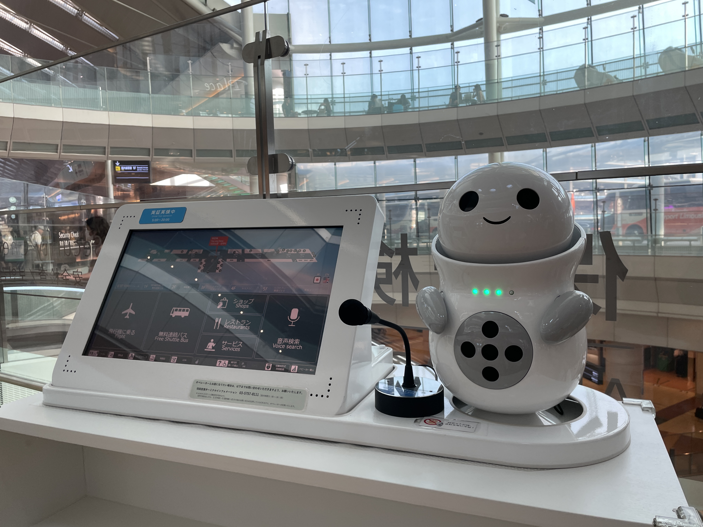
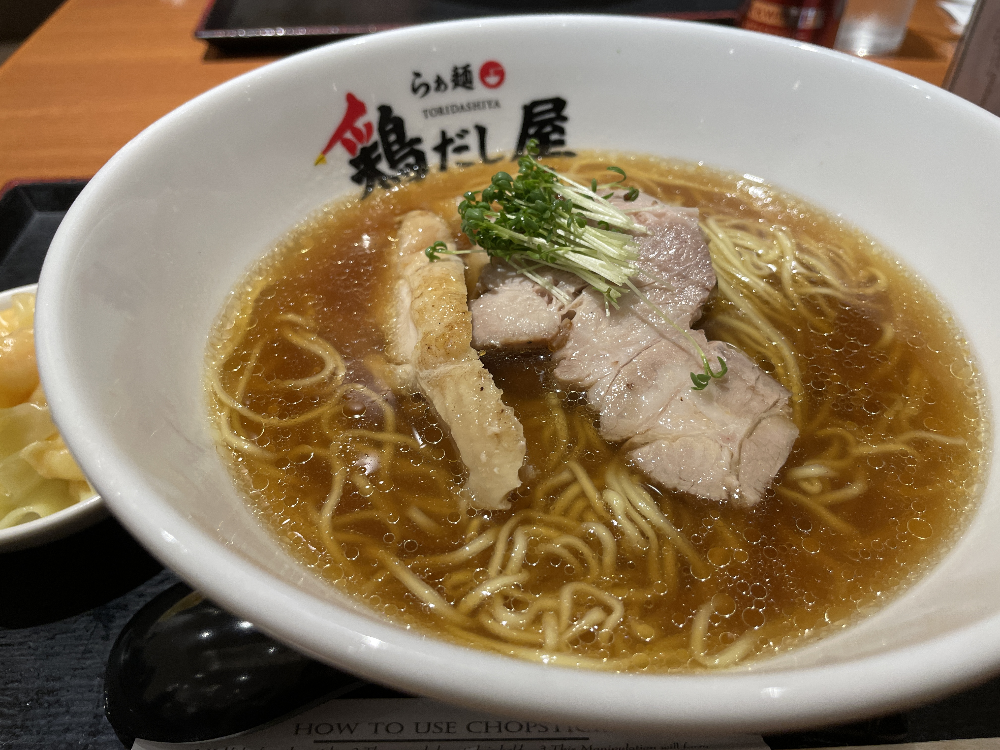
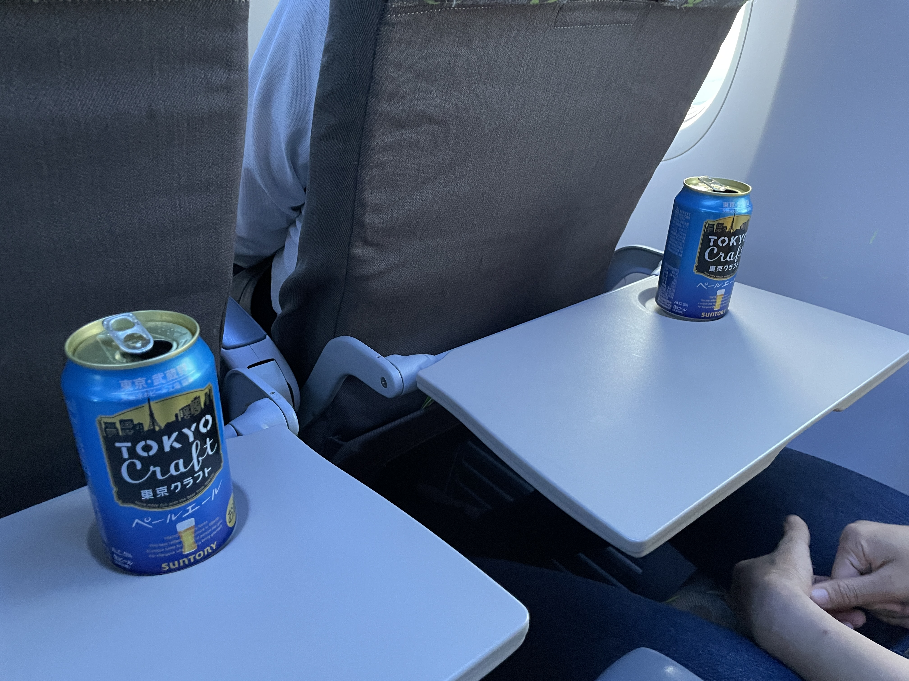
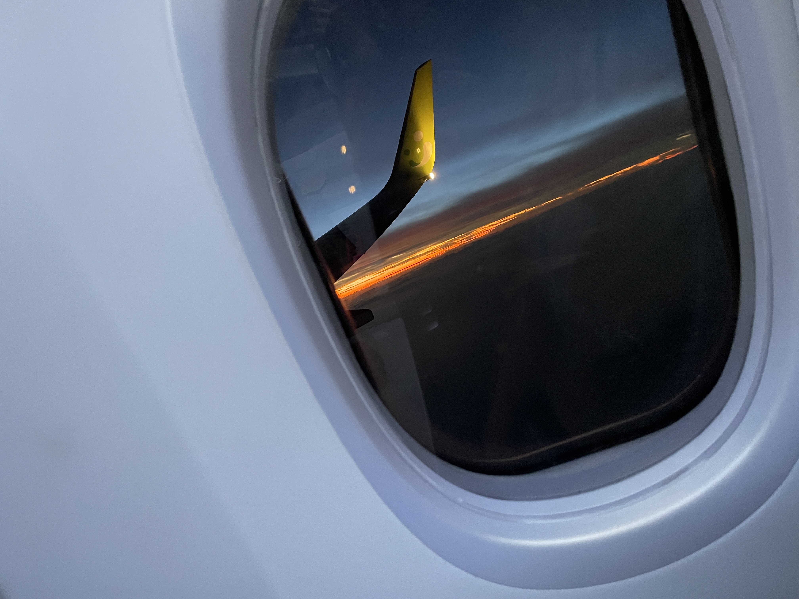
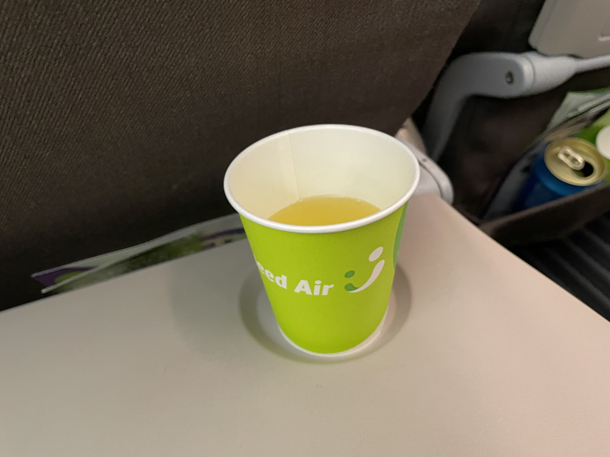
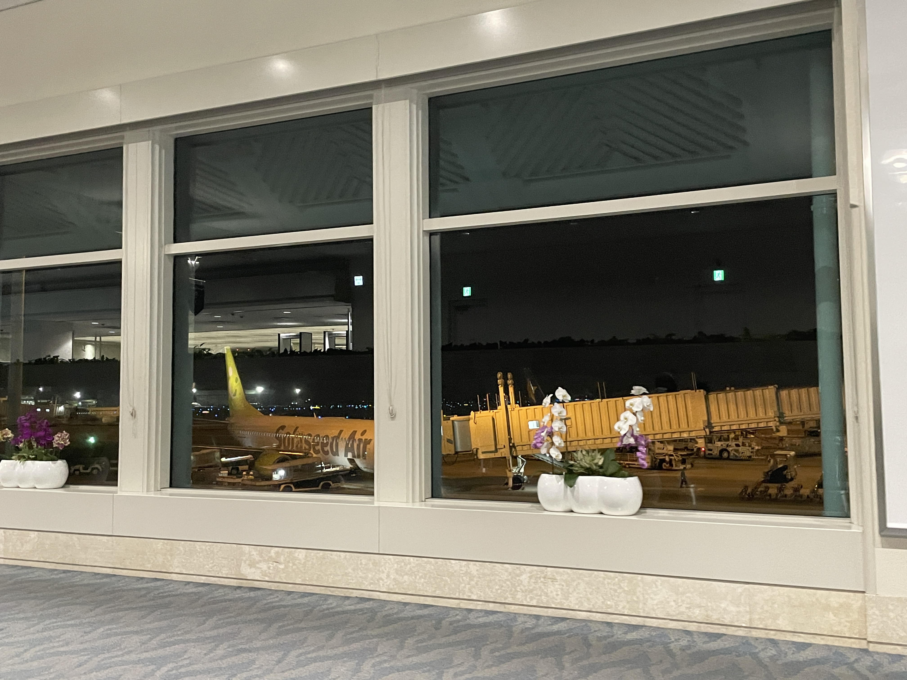
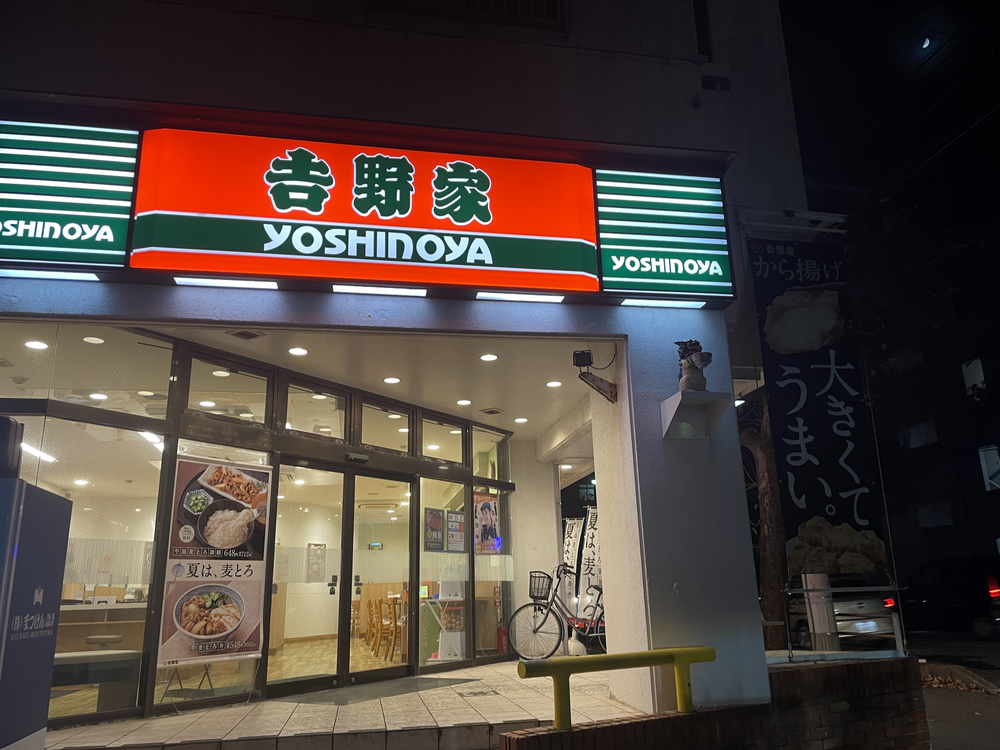
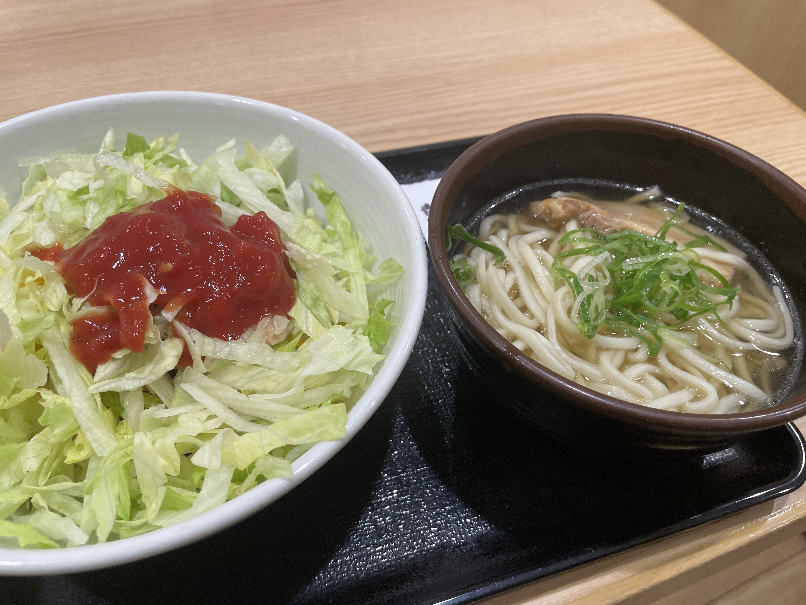
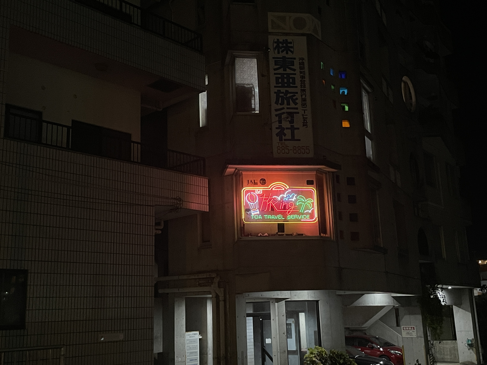

基本的にどっか行ったときのはTogetterにまとめているんだが、今回は非ついったらーと一緒であんまり呟かなかったため、ここに残すことにした。  

---

## day0: 働いて、ちょっぱやで準備して、飛行機に乗って、沖縄にいく

### 東京にて

前日が仕事の大事なイベントで、その後片付けがあったのもあり、15:00過ぎまで働いてから沖縄に行くことにした。いつだって当日に準備をし、足りなかったら現地調達でまぁいいかと思っているが、もちろん今回もそんな感じだった。持ってたはずの虫除けスプレーが見当たらず、仕方なく駅前のマツキヨで買った。切らしていたアンパンマンムヒパッチも買い足した。  

https://twitter.com/moemarusan/status/1673223637472796672

そんなことをしていたら想定より電車に乗るのが遅れてしまったので、渋谷から山手線に乗り、浜松町まで行かずに品川で京急に乗り換えて羽田へ向かった。久々に東京モノレールに乗って、いい歳にも関わらず、小さなおともだちが喜ぶ高い席に乗ろうと思っていたが、他人を待たせてまでやることではない。

京急の品川駅は非常に混んでいた。平日のこんな時間にずいぶんと出かける人が多いもんだなと思っていたら、蒲田・糀谷・大鳥居あたりで続々と降りて行き、羽田に着く頃には何人かが立っている程度であった。羽田空港行きに乗っても、誰もが飛ぶわけじゃないらしい。  

（↑電車マークがかわいくて撮ったんだけど、他の駅構内にあるセブンにもあるのかな）

18:10発那覇行きの便に乗る。空港に着く前に、オンラインでチェックインを済ませていたので、次は荷物の預け入れだろうと、普段使いのリュック1つで動きがちな自分としてはほとんど縁のないANAの自動預け入れ機と格闘するも、奴に我が60Lの赤いバックパックに着けたタグを読み取る気は、一つもなさそうだった。仕方がないので、人間がいるカウンターに向かう。  

（↑空港で待ち合わせるにあたり、友人に現在地として送った写真。かわいいが、これだけじゃどこにいるか分からないので機能していない）  

無事に荷物を預け入れたところで、空腹に気付いた我々は何か飲食店はないだろうかと物色する。少し歩いたところにあるうどん屋さんと悩みつつ、エスカレーターを上ってすぐ見つけたラーメン屋さんに入る。券売機で食券を買い、テーブルに座り、水を一口飲んだところで徐に友人が口を開いた。  

「保安検査場、何時に通ればいいんだっけ？」  

18:10発の飛行機に乗るためには、20分前、すなわち17:50には保安検査場を通過しなければならない。  

そして——  

『今、17:40じゃん。3分くらいで出てきてくれるといいんだけど』  
「やば」  
『まぁでもエスカレーター降りてすぐだし大丈夫じゃない？』  
「うどんまで行かなくてよかった」

これが先を読むことを放棄している者と、それに全てを預けた者による茶番である。  

空腹の胃に染み渡る醤油スープ、そして舌はにゃーにゃー悲鳴を上げていた。タイムリミットは5分、悠長にワンタンまで付けている場合ではなかった。  

普段は働いている時間にアルコールを嗜むことを個人的に貴族と呼んでいる。  
ところで、3月の沖縄からの帰りの飛行機の中で、「機内で酒を飲むと酔いやすいというのは本当か」を確かめてみたく飲んでみたものの、大して変わった感じもせず、降りるころにはすっかり醒めてしまい、哀しいかな、とにかく何も面白くなかった。  

そこで、ラーメンを食べたあとに再挑戦するためのお酒を買おうと思っていたら、前述の通りそれどころではなく、自業自得でしかないにも関わらず、「貴族になり損ねたか、けっ」などと、内心悪態をつきながら保安検査場を通過することとなった。  

しかし、そんな愚民にも救う神あり。搭乗口まで向かう間にちょうどよく見たことのないビールが売っていたので、2名の平民は無事に貴族へと相成った。こないだ、2人でオフィスのゴミ出しをしたのが効いたのかもしれない。  

今回、初めてソラシドエアに搭乗したのだが、離陸まで時間があったのか、機長は「政府専用機も操縦したことがあるベテラン」、副機長は「ゴルフにハマっており師匠を探している」、CAは「千葉出身で大好きな夢の国で現実逃避しがち」など、謎のスタッフ紹介が始まり、余計なものを好む人間はそれだけでまた乗ろうと思ってしまった。現実逃避しがちなCAはちょっと心配になった。  

（↑乗り慣れてなくてなんだか分からず、とりあえず撮ったトイレの中のボタン。お水持ってきて！じゃないよね……）    

いつも飛行機に乗る時は、朝早いか夜遅いので、黄昏時を機内で過ごすのはヘンテコな感じがした。外が暗くなるのとどっちが先だったか記憶が怪しいが、ビールを飲み終えてしばらくして、ドリンクサービスでアゴユズスープをいただいた。ソラシドエアにはこれまで乗ったことがなかったが、AIRDOとの統合のニュースを見かけた際、スープとスープの統合……などと訳のわからないことを考えていたことは覚えている。

楽しみにしていたこのスープは、お吸い物のようなやさしい味で、急いでラーメンをたいらげ、貴族になった身体を包み込んでくれるようだった。いや、マジでうまかったな、これ。

## 沖縄にて

割と遅く預けたからなのか、預けた60Lのバックパックはベビーカーの次くらいに出てきて、余裕ぶっこいて遠くのベンチで休んでいたせいで、走ることになってしまった。優先すべき手荷物じゃん、と友人が笑う。  

3ヶ月半前の私が大変よくうろついていたため、今回は那覇空港を潔く通り過ぎて目的地へ向かった。  

（↑いつも心から歓迎してくれる、心優しいゆいレール那覇空港駅）  

どこにでもあるようなものに行くのを好むので、今回の第一目的地は吉野家である。私は天邪鬼なので、吉野家で沖縄そばが食べたかった。  

吉野家 ひめゆり通り店は、ゆいレール安里駅（変換出ない）から徒歩6分ほどにある。どこにでもあるような吉野家だが、軒先のシーサーがここは沖縄だとひっそりと主張している。片や60Lのバックパック、片やスーツケースとファストフード店に行きそうにない姿だったが、まるで渋谷道玄坂上の松屋に行くような顔をして入店する。  

タコライスに沖縄そば。一瞬、レタスとご飯なんか！？と思ったが、中にチーズとミートが隠れていたタコライス。レタスも多く食べ応えがあり、見た目より量がある。対して沖縄そばは、風邪引いたときに食べたい感じのうどんで、麺がストレートだからなのか、非常に食べやすい。沖縄そば初心者にはやさしいが、オフィスの近所にある沖縄料理店で鍛えられた身としては、あのもそもそ感がなく少し寂しい。しかし、これら2つ食べても600円弱だから恐ろしい。  

吉野家からの帰り道に見かけ、旅ingって今じゃんとなった看板。令和になって流行り始めた、昭和のCityPopのような匂いがする。この近くにあった石敢當が大きくて、すげー魔除けするじゃんと思った（語彙力）。  

初日だし仕事帰りだし、何より翌日から運転なので、きちんと寝ようと思ってドミトリー好きなのに[個室のあるホテルのようなところ](https://yscabin-naha.com/)を予約していたが、大浴場から出てすぐのところに休憩所があり、しばらく読まないうちに最終巻が出ていた「ちはやふる」トラップに引っかかり、しばらく読んでないせいでストーリーを思い出せず、最終巻から遡って前5巻を読み進めていたら、1:30を過ぎていた。全く意味がない。  

部屋の鍵は先に寝るであろう朝型人間な友人が持っていたので、もしかして: 廊下で寝るしかない……？などと恐る恐る部屋に戻ると、部屋にあったスリッパをドアに挟んでくれていた。友人の機転に感謝しつつ、防犯的にアウトなので心から反省した。ごめんなさい。  

（たぶん続く）