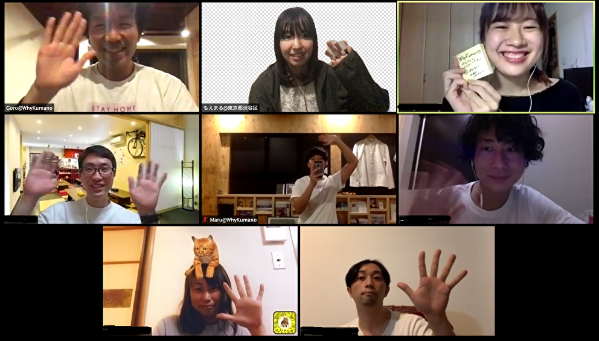
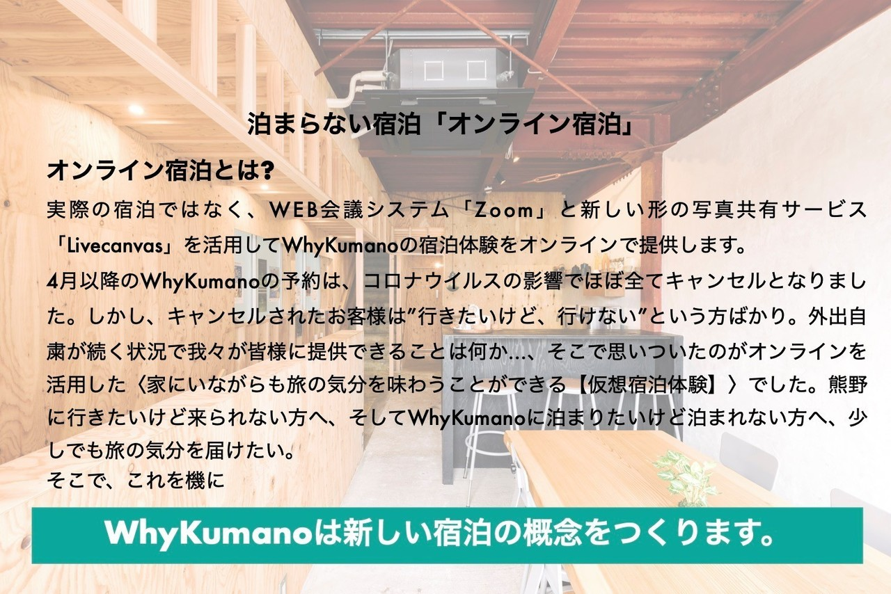
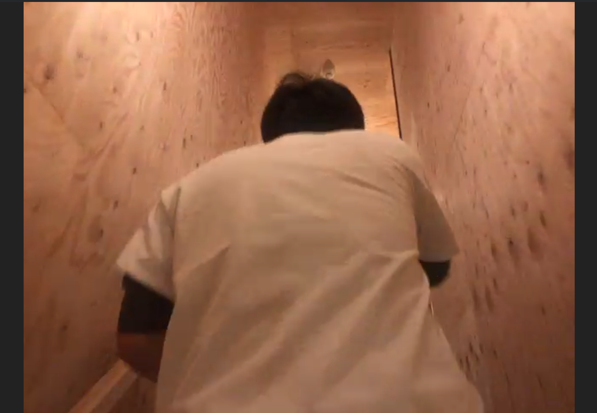
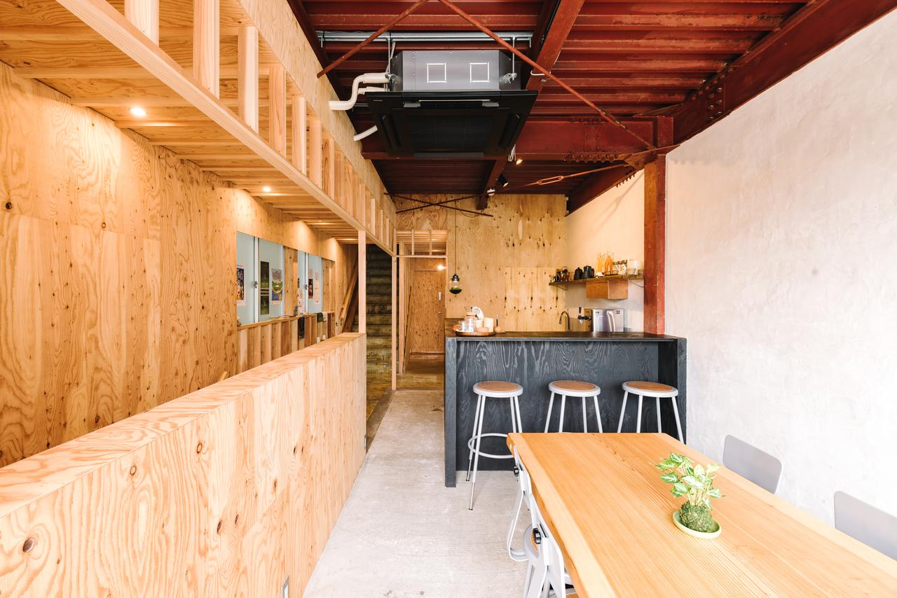

隙あれば放浪する人間にとって、休みにもかかわらず引きこもり続けるのは、正直しんどい。  
ましてや、他人と暮らすことを諦めた自分なので、この外出自粛生活は孤独である。  

そんな中、この記事を書き始めたつい10分前まで、「オンライン宿泊」という新たな試みに参加して、他の宿泊者と話していた。  
場所は、和歌山は熊野にある [WhyKumano](https://www.whykumano.com/) というゲストハウス。  
実はまだ宿泊途中で（チェックアウトしていないからね）、全てを体験しきったわけではないんだけど、とりあえず忘れないうちに書き残しておきたくて、勢いで書いている。とってもネタバレしているから、体験する気がある人はむしろ読まないほうがいい。   

  

（↑最後に撮った全体写真、左上がWhyKumanoのごろさん、真ん中がまるさん。写真をスクショではなく、スマホで撮ってるのがいいなぁってしんみり感じていた。ちなみに、各自表示される名前の `@` のあとに自分の現在地を設定している。もちろん、掲載等の許可取りは序盤にあった。）  

オンライン宿泊っていうのは、泊まらない宿泊のことらしい。とりあえず詳細は公式から引っ張ってきた下記の通り。  

  

## なんで参加した
ぴすん参加のときにも書いたけど、新しいもの is たのしい。  
そして、宿泊料の中に、リアル WhyKumanoで使えるワンドリンクチケットが付いているんだけど、それが実際に行って顔を合わせるきっかけになるという、afterコロナを見据えたコンセプト一端に希望を感じたので迷わず参加を決めた。……のはよかったんだけど、転職したばかりというのもあって、GWに入るまで精神的にここに飛び付ける余力がなかったので、ようやく参加できた。この試み自体は、1ヶ月前の4月上旬から始まっている。  

## 流れとか
私たちはまず、宿泊するにあたって、チェックインをしなくてはならない。そりゃあそうだ。  
ということで指定された方法（イカした方法だったが、オフレコらしいので気になるようだったら泊まってくれ）で宿泊料を支払ったあと、部屋までオーナーさんに案内していただく。ゲストハウス的な場所はいつも部屋までオーナーさんが案内してくれるんだよね。  

  

（↑これは、画面越しに共有された、階段を昇るオーナーさんの背中。）  
それを画面越しに体験する日が来るとは、さすがに想像の範疇だったんだけど、ゲスト視点になるように別のカメラで、案内するオーナーさんを共有してくれていたため、全く違和感がなかった。それは自分の目でリアルに受け取ったわけではないけれど、完全に自分の視界だった。  

案内が終わったところで、場所はWhyKumanoのラウンジスペースを想像してほしい。  

乾杯して、それぞれ自己紹介していく。今日は自分も含め東京の人が多かったけど、普段はもっとバラバラらしい。  
自己紹介終わったら、Google map上で熊野付近の紹介が始まった。めっちゃマグロ推しということと、同じ熊野の中なのに船で行くホテル＆温泉があることを知った。  
同じノリで、宿泊者の近所を見に行って、昔住んでたところの近くに住んでいる人がいたり（某ラーメンやさん推してしまった）、知らない地名が出てきたり、放浪する中で前を通ったことあるじゃんそこ！みたいな場所が出てきたり（笑）した。  
最後に、[Livecanvas](https://livecanvas.jp/) という写真共有サービスを使用して、各自が撮った写真を共有しながら、それにまつわる思い出を話していく。  

まぁまとめてしまえば、こんな短い文章になってしまうんだけど、あっという間に気がついたら消灯時刻（22:00）を大幅に過ぎていた。  
話の内容は濃かったんだけど、個人情報満載すぎるので、書けないのが惜しい。  

## とりあえずここまでの感想
そもそもの大前提として、人を尋ねる放浪が好きで、なんなら場所などはどうでもよく、近くにあった駅前の全国どこにでもあるようなチェーン店でもいい、という自分なので、この引きこもった日常の中で、参加しなければ会わなかっただろう人に会って話すのは、それがそれだけで面白かった。
この面白がり方は、もしかしたら主催者の希望の範疇から飛び出てしまうかもしれないけれど、主催者がゲストハウスのオーナーという属性であるがゆえ、旅に前向きな人が多くて、だからなのか分からないけど、初対面（しかもいきなりオンラインだ！）にもかかわらず、かなり話しやすかった。  

でも、チェックアウトをするタイミングで、あるいは今後の体験の中でもしかしたら考えが変わっていくのかもしれないけれど、今のところはやっぱりオフラインがいいなぁと思っているし、今回ここで会った人と放浪の中で、リアルに乾杯する機会が来ることを楽しみにしている自分がいる。  
そういう意味では、オフラインへ続くきっかけとしてのオンラインに可能性を感じた。  
それに、「オフラインで8人いたら2グループに分かれてしまうけれど、オンラインだからこそみんなで話せる」と、今日の話の中であった通り、5人以上の人が参加していて、ファシリして回せる人がいるのならば、オフラインのほうが話しやすいことに気付いたのは、大きな収穫だった。  

とはいえ、Google mapをみんなで眺めるとか、一つの写真をみんなで眺めるとか、対象がオンラインにある場合に参加者全員が平等に情報を受ける、というのはオンラインだからこそやれていて、Google mapがあったからこそさくっとローカルな話ができたのは間違いないので、オンラインはオンライン、オフラインはオフラインとして、それぞれの利点を考慮した上で、オフラインと同じものをオンラインで享受しようとは思わずに、これはこれ、それはそれと割り切って参加する意識を持てば、より楽しめると思われる。  

## 免責事項
※ 日付が変わるような時間帯に、テンションと勢いだけで書いた、あくまで個人の感想です。