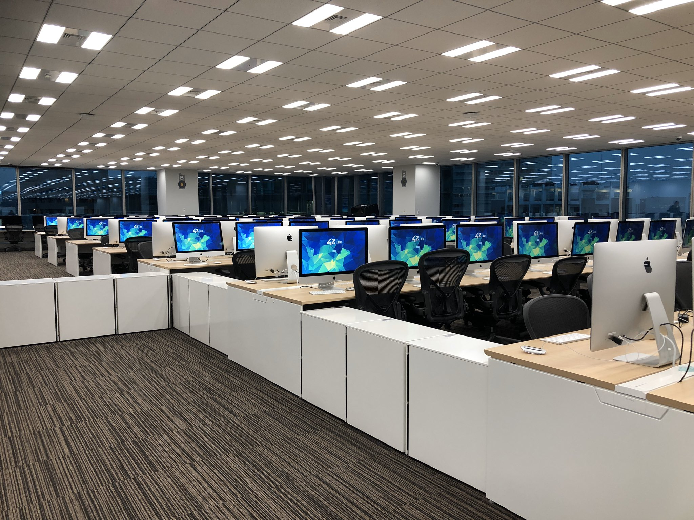
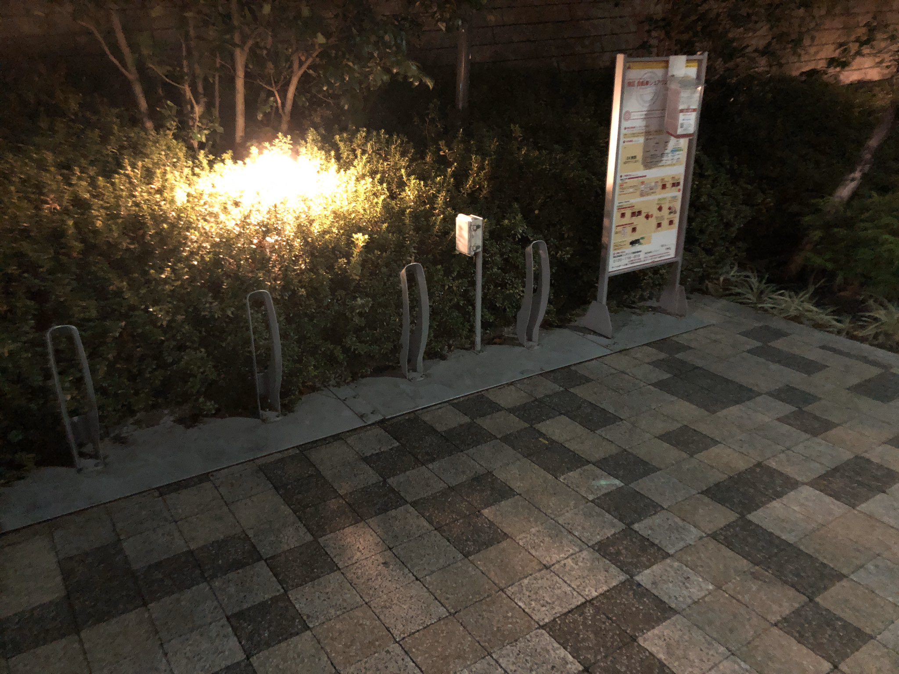

※ 長い  
※ noteに載せていたものを持ってきた

ええかっこしいでメンタル弱いので、結果が出るまで公開できなかった日記です。結果が出る前に振り返り記事を出せた全てのぴすん生に敬意を表します。一個人の単なる日記以上のことは書かないので、これからの受験生の参考にはならないです。​  

他の方と違って、たぶん「なんでこいつ通ってるんだ…？」って感じのコミットし具合だったのは事実ですが、私なりに犠牲にしたものもあるので、正直ここ2週間、そわそわしまくってました。この2週間をまともに生きるためには、ぴすんに参加できたこと自体が素晴らしい経験だったので結果なんてどうでもいい、と言い切れるだけの強さが必要だった。けれど、私にはそれがなかった。そういう強さを持ちたいものですね。  

ぴすんって書いてるのは語感が好きなくらいで、特に意味はないです。  

## 参加しようと思った理由
正直に書けば、プログラミングを学びたいという欲よりも、新しいものに参加したいという欲のほうがずっと強かった。  
ぴすんに限った話ではないが、まだカリキュラムが出来切っていないであろう段階で、一期生としてモルモットになるという状況に面白みを感じたと同時に、好き好んでモルモットになるような人に会ってみたかった。  
ついでに、かつての上司から「エンジニアに向いてるんじゃない？」と15回は言われていたのだが、その度に「ぜってーない」くらいの返答をしていたので、挑戦せずに向いていないと思い込んでいたところから、挑戦した上で向いていないと実感したいと考えたのもあるにはある。  

少なくとも、飛びついた理由はそうだったんだけど、のちに気付く。飽きっぽいがゆえに何一つまともに続けることができずに、ずっと何かから逃げ続け、にもかかわらず何かができる人を妬み羨望しているものだな、と。  
飛びついたときは考えていなかったけれど、実際自分が参加した理由の奥底には、「ひとかどの人間になんとかなれる最後のチャンス」と思ったのが間違いなくあった。何もできない自分が、何か少しでもできるようになる、本当のラストチャンスだな、と思った。こんな強制力の働く環境にあって、続けられなかったならば、もう後の人生は消化試合じゃないか。  
誰かを羨むだけ羨んで、何もできないコンプレックスを嘆く、けれど何かができるようになるまで続ける努力をしない、そこから何か一つでも変えるためのきっかけにするんだ、と。  

## オンラインゲームを受けた

11月半ば、たぶんプレス出てそんなしないうちに記念受験だと思って受けた。  
ロジカル思考には全くといっていいほど自信がないため、どうせ受からんだろうけど挑戦するだけならタダだしやってみよかと思った。それから2日後に通過のメールを受け取ったときの第一声は、「は？」。まぁそのくらい、自分の思考を信用していない。  
初期のころに受けたのもあり、1～3月、どの期も選び放題だったものの、上記の通りモルモットたりたいので、新年早々1月期に即参加を決めた。働きながらだと厳しい？無理？知らんがな全米が泣いた絶賛開き直りスタンス。だって公式サイトに働きながらでも云々って書いてるやんけ、と。  

## Registrationしに行った

12/21（土）、ヒルズで毎年行われている1年後に届く手紙企画で、友人に手紙なんか書いちゃったりする（照）直前、Resistrationとやらで初めて六本木グランドタワーへ足を踏み入れた。本人確認と顔写真の撮影、用は10分足らずで終わってしまったのだが、会場までの案内掲示とそこにあった大量のiMacに興奮したのを覚えている。

どうでもいいけど、クリスマス直前だったからなのか、1Fにあったキラキラモニュメントが綺麗だった。

## ぴすん初日

早速寝坊した（真顔）  
この日は泣きの1日有給を取得していたのでよかったけれど、会社にも間に合わないような時間に起きて、焦りもなく呑気にラーメンなんか食ってて、結局着いたのは14:00ごろだったらしい。当たり前だけど大勢が既に出席していた。  
ぴすん生が集うslackに既にいろいろと書いてあったおかげで、大して迷わず初期設定などは済んだものの、誤って2番目にやるはずの課題にいきなり手をつけてしまい、全く分からず困惑する。ちなみに、その後最初にやる課題の存在に気付き戻るも、やはり全く分からず困惑する。結局、時たまPythonistaな外部の友人に力を借りつつ、だいたいはslackに先に進んでいる人が書いてた情報を頼りに、そろりそろり進むことになった。  
まぁつまり、ほぼ0から始めると、「日本語は読めるけど、日本語が分からない」みたいな状況に陥る。22:40過ぎに「生産性がクソすぎるから帰る」と呟いた自分がいた。  

## ぴすん1週間目（～1/12）

2日目からは普通に会社員生活に戻っているため、仕事終わりにぴすんへ向かう。  
仕事終わりの時間に行くと、比較的人が多くて賑やかで、あぁ、ぴすんに来たなという実感が湧いた。相変わらず日本語は読めたが、日本語が分からなくて苦戦しまくっていた。  

（↑ 記念すべき１回目はお味噌汁だった）  
ごはん食べると眠くなるけど、食べないとそれはそれで空腹でのたうち回るハメになるなと考え、ぴすん期間中は具が多めのスープを作って持っていった。それとウィダーinゼリー、それから友人が大量にくれた（ありがたみ）野菜ジュースで生きていた。  

突如同期の方が、私の大好物たる午後のミルクティーを大量にフリードリンクとしてくれるという事件が起きた。ひたすら恐縮しつつ、めっちゃ飲んだ。あざます。このあともちょいちょい、つよいおとなの人がお菓子などの差し入れをくれることがあって、ありがたかった。個人的にはダンボール一箱分のうまい棒の狂い方が好きだった。  
​
1週目はまだ赤チャリ（docomoのレンタサイクル事業）で帰ることを諦めていなかったので、終電が無くなった1:00～2:00くらいのキリのいいタイミングで会場を出たのだが、もう二度と六本木で夜赤チャリを頼りにしようとは思わない。最初の1日はグランドタワーの麓のポートにも3台も十分に充電されている自転車があったが、あとの日は40%以上充電がある自転車が置いてあるポートまで最長30分歩くことになってしまった。この時間があるなら、終電で帰って家で作業したほうが効率いいなと気付いて（遅いよ）、2週目からは終電で帰ることにした。  

とにかく1週目は、前提知識不足によってまだ課題の意味がまったく分からない状況で、社会人ならではの出席時間数不足と相まって、進捗がクソすぎた。劣等感に襲われながら、でもよく考えてみると経験ほぼないし予習もしてないしできないの当たり前じゃない？って思ったり、自分の中で戦っていた。これはもはや、自分を正気に戻さないための戦いだった。「よく考えてみろよ？元の頭の出来が悪いだろ？理解力ないだろ？経験もないだろ？予習もしなかっただろ？どうやって同期に敵うんだ？無理じゃないか？」などと言う理性をどこかに閉じ込めるための戦いだった。  
​
チームで解く課題にも参加できるんだが、このときは同じチームの激つよな同期がガンガンコードを書いて、私はそれを説明できるようにするだけだった。そうやってなんとか対処した。同期でも強い人は3つくらい先の課題をやっていた。「だけ」とは言ったものの、他人が書いたコードをその通りに説明できるようにする、ってだけでも二重ループの構造が腹落ちしなくて辛かった。こんなに理解できないなんて本当に向いていないなと漏らしたら、その激つよな同期に「二重ループ、僕も最初は理解できなかったけど、書いているうちに慣れて理解できるようになってきました」って言われた。この一言が無ければ、もしかしたら1週目で、やっぱり向いていなかったんだなと自分で自分に結論を刺して、ドロップアウトしていたかもしれないから、やっぱり人との出会いは大事だと思う。  

## ぴすん2週目（～1/19）

1週目の反省から、会社帰りにぴすんへ向かって到着がだいたい20:00、0:00までやって終電で帰るという生活を送っていた。滞在時間はおおよそ1日4h。1日だけ残業が発生して1時間くらい遅れてしまった覚えがある。  

そういえばこの週はスープをよく窓際で食べていたのだが、六本木のそこそこ高層階から見える景色は高級レストランにも劣るまいと思っていた。  

少し慣れてきて、日本語が分かるようになってきたこの週。あくまで「なってきた」のであって「なった」わけではなく、チーム課題で同じチームだった激つよな同期や、かつてエンジニアだったらしい激つよな同期などにむちゃくちゃお世話になりながら、けれど1週目よりは一人でもくもく進められるようになってきた。  

腹落ちしないまま進めるのが気持ち悪すぎて、いわゆる苦Cを半分くらいやった。このへんからそういえばデバッグ方法を多少覚えた気がする（それだって、教えてもらったものだ）。  

このころはまだ、テストコードを自分で書かずに他人に依存していて、某激つよ同期氏のコードをそのままもらったら、あまりにそれが綺麗すぎて、強すぎて、リアルに涙を流して泣いた（隣に座っていた人の頭には間違いなく"？"が浮かんでいたが、誰がなんと思おうと、あの時私はあまりに感動していた）。同時に、とんでもなく悔しかった。なんで私には書けないんじゃ。そりゃ、書かないからじゃ。書かなけりゃいつまで経ったって書けるようになるわけがないじゃん。何悔しがってんだよ、まず書けよ。  

チーム課題は、やはり進捗が追い付いていなかったせいで、ほぼほぼ貢献できなかったものの、1週目と異なり関数1つくらいは書いた。逆に言えば、そのくらいしかできなかったので、チームで一番進捗が早かった同期には本当に頭が下がる想いだった。  

1/19には、冒頭の、私に「エンジニア向いてるんじゃない？」と15回くらい言った元上司が誘ってくれたので、11月から見たいと思っていた「フォードvsフェラーリ」という映画をヒルズにある映画館まで見に行った。それもあって、1/19は休日なのに出席時間が10h切るという事件が起きた反面、この映画自体が激アツで元気が出たのもあるし、なにより元上司にあんなに突っぱねたにも関わらず今、コーディングするのが楽しいって話ができたことが、本当によかった。  

## ぴすん3週目（～1/26）

毎月恒例のアレのせいで、体調が悪すぎてどうにもならなかったので、人生で初めて栄養ドリンクとやらを買った。密林で安く売っていた怪しいやつ。効くかどうかじゃねぇ、効かすんだ！という圧倒的精神論である。  

ここまでくると、日本語は読めて、日本語も分かって、解き方が分からねぇくらいになった。問題文の意味は分かるが、理論が腹落ちしていないせいで解けそうなのに解けないみたいなことがたくさんあって、その度にぴすん生が集うslackに投げたり、激つよなエンジニアの集まる某匿名掲示板に投げたりした。少し時間がかかってでも、きちんと理解して前に進まないと、あとで躓くなと身に染みた週だった。  

1/23から結局、他の社会人参加者に教えてもらった、退勤後すぐ帰宅して寝て、終電でぴすんへ行き、そのまま出社というスタイルに変更して、3.5h睡眠で、1日7h滞在が可能になった。正直、最初からそうすればよかったなと思っている。時間数がそのまま進捗と比例するわけではないけれど、それでも、何もわからなくてつらいが、少しずつ分かってきて楽しいに変化してきたのはちょうど3週目くらいからだった。  

真夜中に着いたらすぐ、寿司打をやるっていうルーチンワークだったのだけど、寝起きだからか激遅でいま見返しても泣きそう。実は会社帰りに行くよりもずっと頭は働いていたのだけれど、それでもたまに眠い時は、爆音でYouTubeにある80年代邦楽ヒットとか聴いてた。  

相手が選べるチーム課題が存在して、学生時代から2人組を作るのが苦手なぼっち属性たる自分は、心の中で大泣きした。おまけに、件の激つよ同期が実は来るもの拒まずだったことを後から知り、もう一回心の中で大泣きした。なんだよー、足引っ張るだろうからって遠慮したら自分とあんまり進捗変わらん人と組んでんのかーい。  
ちなみに、結局チーム組むところまではやったのだが、相手もまた社会人だったのもあって、時間が合わな過ぎたので、課題を解くのは諦めてしまった。それまでのチーム戦で進んで解いてくれた激つよな同期みたいに、自分ひとりでも解けばよかったなというのが、ひとつの心残りになっている。  

夜中にいる人はいつも決まってて、なんとなく一体感があったような気がする。夜行っていたときに同じタイミングで来ていた激つよな同期とは会わなくなった反面、夜中は夜中で猛者が集まっていて、夜中参加の新参者だったけれど、テストコードが書けないときや、想定していなかったセグメンテーション違反が起きたときなど、対処法をとても親切に教えてもらった。ずいぶん先に進んでいる人でも、ある意味自分の課題を進める時間を犠牲にして、丁寧に教えてくれたりするのは、本当にありがたかった。朝方、白んできた空の下に見えた東京タワーは美しかった。  

## ぴすん最終週（～1/31）

ぴすんも残り5日かと思うと、寂しくなってきた。
割とTwitterに呟いている内容からこの文章を書き出しているのだけれど、この週はツイート数が少なすぎて参考にならない。ツイートする時間さえ惜しいほどには、1秒1秒が貴重だったとも言える。  

最初のチーム課題で一緒のチームだった激つよな同期に、最終週、進捗が追い付くという奇跡が起きた。間違いなく、朝方までいた深夜の猛者の助力と、進捗を犠牲にしてでも理解することを諦めなかったことが功を奏したのだと思っている。とにかく手段問わず進めるべきか、ひとつひとつ理解して進めるべきかみたいな論争があったけれど、ぴすんには手段問わず進める方法がいくらでもある。コピペして課題を進めることもやろうと思えばできる。親切な上位層に頼み込めばなんとかなるものもある。けれど、やっぱり理解したやつが強いんじゃないの？。それが最終的な自分の結論だった。  

最後の最後は、かつて解いた課題をしっかり理解することに努めて、前のほうの課題の加点を狙いにいったのだが、ぴすん最後のレビューはケアレスミスで終わるという悲しい事件が起きた。最後までおっちょこちょいは治らなかったなと思うし、睡眠はやっぱり大事なんだよ間違いなく。  

ここまで、試験は平日に実施される関係で、有給が足りない社会人としては一切参加できなかったが、最終日だけは有給を取得してなんとか受験することができた。正直、有給取得の理由が理由なのであまり勧められたものではないし、きちんとした理由でありのままを話して有給を取得できる立場もない。職場での評価も悪化した。それでも、何かを犠牲にしないと、得られないものはやっぱりあるのだなと思うし、ぴすんの最終日には全ての犠牲にしたくなるだけの魔力があった。  

コミット時間は明らかに少なめだった。けれど、会社にいたときでさえ、脳内がC言語に侵食されているくらいには、精神も思考もぴすんに捧げていた。だからなのか、試験中の入館証の回収のときに、つい感極まって泣いてしまった。圧倒的に不審者である。  

最後の、そして私にとって初めての試験は、事前の同期からの助言で、ひとまず0点は免れた。集中力が途中で切れてしまったり、提出方式が試験独自のものであったりして、時間かけすぎだったと思う問題もあったものの、とはいえ最初の試験なりには悪くない成績だったと自分では思っている。  

## 今になって思うこと

ぴすんへの参加理由を「出会い厨」だと公言していた身として、何より一番よかったことは、言語を学べたことではなく、人との出会いだった。出会いの少なめな社会人になると名刺交換から始まる出会いのほうがどうしても多めになってしまうので、そういうリアルなステータスを何一つ見ずに話すのは、多種多様なバックグラウンドの人が集まっているぴすんを活かした尊い経験だった。  

また、本来ロングスリーパーで1日10時間くらい寝たいけれど、それでも短時間睡眠でいけたのは、自分の気力の強さだけではなく、場の空気に呑まれていたからに違いない。あれはなんとも文化祭の前日みたいな1ヶ月だったなと率直に思う。ロクな学生生活を送ってこなかったせいで、あぁ青春してんなって変な感想を持ってしまった。  

結局、ひとかどの人間になれたかといえば、飽きっぽい自分としては1ヶ月間1日も休まずに行けたのは快挙と言う他なく（この時点で、他の参加者よりそもそもできたのハードルが低かったのは間違いない）、進捗具合もコミット時間で割ればいいほうかもしれない可能性もあるものの、全然それには遠く及ばない状況である。  

確かに会社員として最低の評価と引き換えに、合格通知を受け取ったものの、私よりずっと強い人たちを差し置いてこの意識の低さと進捗とコミット具合で合格してしまったのはもはや運だけで受かったとしか言いようがない。ついでに言えば、ここまで来ても何一つC言語を理解できている気がしない。何一つ０から書けない。自分の理解力のなさにやっぱり泣くしかなくて、「続けないからできない」のではなく「続けようとも素のスペックがクソすぎて何もできるようにならない」んじゃないかって気がしている。  

もちろん、せっかくいただいた機会なので4月からも通う気ではあるものの、ぴすんよりもさらに出遅れ感が強いので、食らいつくだけの気概を持てるように、よく寝てよく食べて元気に生きる3月にしたいと思っているが、自分なりには全力は尽くしたものの、相対的に見てとりあえず何故自分がpassできてるのか（ありがたいけど）全く分からないし信用していないので、3月中に「誤送信だったごめんね」って連絡が来ないことを全力で祈っている。  