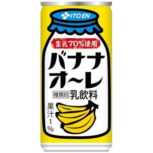
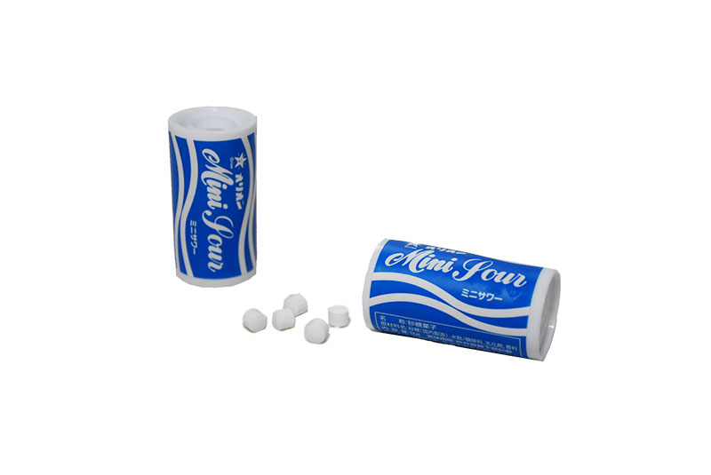

最近、運動不足な中で、ドラムを叩くなどの運動もどきをすることが稀にあり、翌日の筋肉痛を味わいたくないため、消極的にぷよていんを飲むことにした。むきむきまっそーになりたいわけではない以上、おいしくなかろうと我慢して飲むとか絶対に嫌なので、少なくとも飲むのがしんどいと思わないで済むぷよていんを探していた。味覚は人それぞれだけど、ジプシーをしまくったので感想を残しておく。たんぱく質含有量だのビタミン含有量だの、そんなものは知らん知らん。おいしいis正義。  

ぷよていんって書いてるのは語感が好きなくらいで、特に意味はないです（cf: ぴすん）  

## ザバス
国産プロテインブランド王者であるがゆえ、少し単価高め。  
トライアルセットは5回分で少し多めだけど、密林でも手に入る。  
残念なのは、スプーン3杯入れる必要があること。1杯で済むように大きいスプーンを入れてくれるといいんだけどなぁ  
グレープフルーツ味が最高すぎた。優勝。  

### ザバス ココア味
牛乳で割った。とてもしょっぱい。塩チョコクッキー。塩チョコクッキーですよこれ。  
ココア味と考えると塩分がかなり強く感じた。謎。それゆえに飲みにくかった。  
ちなみに、コンビニで売ってたカップのザバス ココア味は味薄めだったけど、飲みやすかった。あれは別物。  
ついでに、紙パック（200ml）のココア味は、味も濃くてだいたいココアの味なので、カップより紙パックのがいいかもしれない。あれも別物。  

### ザバス リッチショコラ味
牛乳で割った。ココア味よりはココア味だったけどやっぱりしょっぱい。謎。  
とはいえ、「プロテイン 飲みやすい」とかで検索すると勧められている率No.1（※もえまる調べ）なので、多くの人にとって飲みやすいものなのだと思う。  

### ザバスアクア グレープフルーツ味
優勝。  
スポーツドリンクでしかない。結構甘めではあるので、毎日飲むとなると他のと同様に飽きるかもしれないが、少なくとも一回飲んだだけだと、これが一番ぷよていんらしくなくて飲みやすいと思った。普通にジュース。ただのジュース。これを最初に知っていれば、ジプシーなんかしなかったのになァ。  
難点は、1kg4,200円ほどするという価格と、それから牛乳では割りたくないので、カルシウム不足の身にとってはついでに牛乳を摂取する、ができないことか。  
トライアルも売ってたのに後から気づいたので、250gのを買ってしまったが、これに関しては問題なかった😇  

……ちなみに、濃いめに作るとあれだけ甘かったはずのぷよていんの酸味がマシマシになってしまうのは後から知る話である。ハードなトレーニングをしているなら1杯足そう的なことが書いてあるが、足すなら水も足したほうがよき。適切な量で割りましょう（´・ω・｀）  

### ザバス ヨーグルト味
ヨーグルトといえばヨーグルトだけど、飲むヨーグルトを期待してはいけない。  
普通に飲めるけど、甘い。乳酸菌飲料というよりは、ヨーグルトアイスの味なので、もはや固めればいいんじゃないかっていう気がしてきた。アイスにならんかな、これ（寒いんだよなぁ）。  

## DNS
個人的に嬉しいのはブランドカラーが赤いことw  
トライアルは10回分でちと多い……と思ってたら、スポーツ用品店に1回分あった。密林ェ……    

### DNS プレミアムチョコレート味
以前、ジムに通いかけていたときに飲んでいたとか飲んでいないとか。そのときよりは飲みやすいと感じた。私が成長したのかもしれない（）  
牛乳で割ったけど、やっぱりしょっぱいと感じたので、単にチョコレート系のぷよていんと相性が合わないだけなのかもしれない。  

### DNS バナナオーレ風味
これはいける！！！準優勝！！！  
バナナオーレはバナナオーレでも、ミキサーでバナナと牛乳混ぜたやつじゃなくて、自販機で売られているような香料マシマシなやつ。  

本当にそれの味でしかないので、その手のものが飲めるなら、何の問題もなくおいしく飲めるはず。溶け残りも全くない。  

### DNS 抹茶味
これもチョコ系と同じように、なんだかしょっぱさを感じた。  
そして、この抹茶は個人的には好きじゃないほうの抹茶の味である。何っぽいって言えばいいんだろう。お菓子とかでもこっち側の抹茶味があんまり好きじゃないんだけど本当にそれの味なので、苦手な抹茶味に当たったことがない人だったらきっと飲みやすい。抹茶味をビビりながら引いてる人はやめておいたほうが安全。  

## Gold Standard
チョコ味しか試していないので、特徴らしい特徴は掴んでいない。
個人的に嬉しいのは、3kg以下であればハードケースっぽいところ。収納性高そうだし、きちんと閉められそう。  
トライアルセットは4回分で初心者に優しい。  

### Gold Standard ミルクチョコレート味
牛乳で割った。前述の3つよりは飲みやすいココア感。  
やっぱりちょっとしょっぱいにはしょっぱいけど、他よりは塩 < ココアだったように思える。  
推しのダンサーの写真に写っていたこともあり（ミーハーなヤツめ😇）、チョコ系でもし一つ選ぶなら、私はこれを選ぶかなぁ。  

## ビーレジェンド
ヘンテコな味とキャラクターコラボプロテインがよく売られている。  
おかげでスタンダードな味をひとつも試していない件。  
ビーレジェンドの最も素敵なところは、スプーンが外についてることだと思う。他のメーカーさんもそうしてほしい……  
基本的にはトライアルセットがあるんだけど、コラボ商品は1kgからしかないのが微妙。  

### ビーレジェンド ダンベル何キロ持てる？ ひびきのご褒美プリン風味
パケ買い。かわいい。かわいい。かわいいis正義。  
肝心の味は、思ってたよりは甘くないんだけど、カラメルソースの味がわざとらしすぎて、溢れるプッチンプリン感である。むしろ固めてプリンにしたほうがおいしい気がするのだよ。プッチンプリンが好きな人はぜひ、お試しあれ。  
あと、シェイカーに結構匂い残った事件。  

### ビーレジェンド ストリートファイターV（波動拳風味）
ガリガリ君ソーダの味がするらしいので買った。  
牛乳で割ってみると、ソーダのような乳酸菌飲料のような何か。口に入れたタイミングではそんなことないんだけど、後味というか匂いというかが、オリオンミニサワーのそれ。  

もともとソーダ味自体、適度に酸味もあるので甘くても紛れるというか、気分転換で飲むのにちょうどいい甘さかも。

## My Protein
海外から個人輸入する必要あり。  
ビーレジェンドと同じくらいにはフレーバーが多種多様なので、ジプシーするなら楽しいかも。  
トライアルは25gからなんだけど、25gのくせに500円以上する上に1,800円の送料がかかるので、初回ならおとなしく1kgの初回セットを買ったほうがいい。送料を鑑みると、ぷよていんの消費量が多くないとやってられないかもしれない。    
結構溶け残る上に、泡が立ちやすいので気になる人は気になりそう。  

### My Protein ミルクティー
以前、ジムに通いかけていたときに飲んでいたとか飲んでいないとか。ミルクティー好きなので飛びついたやつ。  
ミルクティーはミルクティーでも、粉のミルクティー感。以前飲んでいたときは水で割ってたからかもしれないが、牛乳臭くて少ししんどかった。  
今回、牛乳で飲んでみたらいい感じだった。まだ試してないしお行儀悪いけど、もしかしたら牛乳を少量加えてねりねりして食べるのが一番おいしい上に、水分量取らなくて済んでいいのかも。それに耐えられるくらいにはおいしいと思う。  
ちなみに、250gを注文したんだけどなぜかきちんと封ができずに、仕方なくこれだけ冷蔵庫に入れてる。困った。  

### My Protein 黒糖ミルクティー
なんだろう、デジャブ感……あっ、わかった！カラメルっぽいんだ！！！  
ということで、黒糖というよりカラメルっぽい味がする。ビーレジェンドのプリン味よりは幾分か甘さ控えめかもしれないが、黒糖ミルクティーというよりはカラメルwith牛乳味。いや、私が黒糖の味をあまりよく覚えていない説もあるな……？🤔  

### My Protein 抹茶ラテ
なんか味が薄い……？  
150mlほどの牛乳で割ったんだけど、ほぼ牛乳。謎。  
ということで、おいしいかどうかがよく分からない。なんか甘いのは分かる。後味は抹茶っていうかもうちょい青汁寄りな気もする。けど、「気がする」の域を出ない。なんだろうこれ🤔  

## おまけ: 牛乳の話
おなかがゴロゴロするので悩んでいたが、アカディという乳糖分解済みの牛乳を使うようになったらマシになった。  
セブンの通販で1本から買える神対応である。  
本当はWPIを買えばもっといいのは分かっているのだが、それを知らないうちに上記のようにジプシったので、これらを飲み切ったらWPIを試してみたい。  
（否、牛乳で割らない上にWPIなザバスアクア系のぷよていんを飲めばすべてが解決するんじゃないか説が濃厚であるが、しかしやっぱりカルシウムがry）