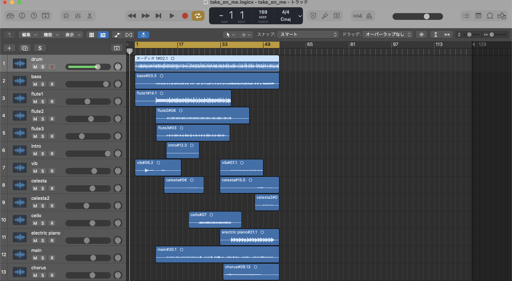

*2020/6/14*  

ずいぶん前に母から、1987年発売という私より10年くらい長く生きているYAMAHA製の元祖ショルキー“SHS-10”を譲り受けた。中学時代、クラス対抗校内合唱コンクールの練習中が一番活かせてたのでは？というくらい、せっかく譲り受けたというのに眠らせたままだったのだが、最近になって掘り起こしてみたら、音程は微妙だわ電池で駆動しないわ問題だらけで、きちんと起動しているのも時間の問題かと思った。  

MIDIキーボードとしても使える以上、内蔵音源の音程がイカれていても使い道はあるものの、とりあえず怪しくとも内蔵音源がまともに出るうちに、譲り受けておきながらさほど活用できていない罪悪感と隣り合わせになりつつ、私がというか、母がこの赤いショルキーを持っていたことの証明として何か音を残しておけないかな、という気になってきたので、とりあえず録音し始めてみたら、面白くなってきてしまい、勢いで全部録音してしまった次第である。  

---

*2022/4/28*

とあるデータを発掘すべく、バックアップ用外付けHDDを漁っていたら、本来探していたデータとは別に、13の録画ファイルと1つのLogic Proプロジェクトファイルを発掘してしまった。それらの作成日は約2年前の6月のことで、正直、そんなこともやってたなぁという曖昧な記憶しか残っていないのだが、その曖昧な記憶によれば、弾いただけでなく何か文章も書いた気がしており、探していたら下書きとして残っていたのが上記の文であった。  

今まで忘れていたくらいなので、このまま放置していてもHDDの容量を食うだけだなと思ったのと同時に、真夜中に録音していたが故に、もしかしたら奇妙なテンションだったかもしれないが、さすがにアウトプットを意識していないとも思い難いので、とりあえずなんとなく動画に仕立ててみた。収録時点での記憶がほぼないため、編集時の記録だけ残しておこうと思う。さもないと、2年後には「そんなこともやってたなぁ」になってしまうことが分かったので……😇  

<small>※ 動画と文、両方を平日の夜の同じ日に残そうとすると寝られないので、1日経ってしまったが</small>

`youtube:https://youtube.com/embed/8Wii5TpSREA`

---

## 収録のおはなし

思い出せた内容だけ書いておきたい。  

とりあえず、1コーラスだしいっかということでロクに譜面は書いておらず、バッキングのキーだけをノートに適当に書いて見ながら演奏したことだけは覚えている。この手の何かをするときは大半採譜から始まるので、個人的に譜面が残っていないのは珍しい話かもしれない。  
書きながら思い出したことに、部屋の片付けからの現実逃避だった可能性がある。なぜならば、実はもともとショルキーが縦になるように写っており、その周囲が片付いていなかったからだ。現実逃避はまぁよくやるけど、これはちょっと大掛かり（※当社比）な現実逃避だったなぁ。   
一部、作りながら音を足したようで、2パートほど録画を忘れたが音だけは残っているパートがあった。  

ちなみにそれはflute3とcelesta2で、flute3はintroのfluteの上で動いているやつ（A - B - C - A - Bのような）で、celesta2はサビ終わりのcelestaのオクターブ下で動いていたんだけど、もう今回はとにかくこの残されたファイルを肥やしにしないことだけを目的としたので、何も撮り直さず、なるべく手を加えずにそのまま出すことにした。

なお、サビの「Take」の部分はショルキーの音域外であった。無理やりオクターブ上げて対処したらしい。  
2年越しに聴いて思ったけど、ショルキーの内蔵音源に対して高を括り過ぎたかもしれない。特にWood Bass, Vibraphone, Celestaあたりの音源はとてもよい。薄っぺらいイメージしかなかったけど、意外と使えそう。  

## 音源編集
大半は2年前に終わっていたのようなので、微修正だけ。  
今回は、SHS-10の内蔵音源を残すためなのであまりいじらず、パートごとのバランス取っただけにとどめた。  

## 動画編集
これに無駄に時間をかけてしまった。いや、まぁ、ほら、漫画風にしたいじゃない、この曲ならね。  
まず前述通り、周囲が片付け途中だったり自分の膝が写っていたりコードを書いてたノートが写ってたりイヤホンが写っていたりしたので、一旦使いやすいように1920*1080サイズで横向きにトリミング。  

そして、一部のパートに関して「main」だの「chorus」だの、使った音の名前が分からない形で記録が残ってしまっていたため、実機でもう一回聴きなおして使った音を判別し始めた。そして、Premiere Pro上でいろいろやる技術をほぼ持ち合わせていないため、一旦枠などをIllustratorで調達して、Premiere Proに乗せていくことにした。いや、これが地味に時間かかった。そもそもどこで何枠必要なのか判別しておらず、一度に何パート鳴ってるんだか数えるところからだった。  

いろいろな下準備を2年前の私がサボってくれたおかげでまずそこに時間がかかり、そして漫画風の表現に慣れていないので表現を考えるのに時間がかかり、枠と背景をバラバラにしないとSHS-10をぐるぐる回すのに不便だっていうことに後から気づいて分離するなどに時間がかかり、音源だけ動画があると思って作った枠が動画がなくて多いことに後から気づいて減らすなどにも時間がかかり、というかSHS-1Oの線画を生成するのに一番時間がかかり、まぁ本当によく時間をかけてしまった。難しいね、動画編集。  

とにかく動かすのが面倒すぎるので、一つのパートは同じ位置に映り続けるように枠を作っていたんだけど、最初の想定が甘くて今思うとメインボーカル扱いになってる「JAZZ ORGAN」を真ん中にすればよかったのでは？としか思えないのだが、編集するのも面倒なので気がつかなかったことにしたい。  

Premiere Proをきちんと活用した場面なんて、初っ端のSHS-10を回転させてホワイトアウトさせたくらいかもしれない。  
ただ、いままで複数の動画ファイルをシーケンスに追加する際に、そうしないと追加できないと思っていたために別途QuickTimeでわざわざオーディオを抜いていたんだが、そんなことをしなくても今回は、Premiere Pro側でオーディオチャンネルを0にすれば追加そのものはできることが判明してよかった。

## 音に対する所感など
せっかくなので偏見で。  
- SYTLE 20 ROCK 'N' ROLL1: これしか単純な8ビートがないんだがバスドラどこいった
- 00 SYNTHESIZER: 薄っぺらいけどなんか80年代っぽい音がする気はする
- 01 JAZZ ORGAN: 比較的太いけど丸くて甘い音がするので、今回のボーカルはこれしかない
- 02 PIPE ORGAN: JAZZ ORGANと比較すると細くてトイピアノに近いが、コーラス扱いにはいい感じ
- 10 ELECTRIC PIANO: まさにトイピアノの音。エレピの音ではない
- 11 CELESTA: Vibよりもキーンとして重たい。特徴が強いので使いやすい
- 12 VIBRAPHONE: 80年代キラキラシンセとは遠いけど、一番それっぽい音はする
- 24 WOOD BASS: アタックがちょい強くてとてもすこだが、ウッドベースではない
- 40 FLUTE: もわーんとした感じにもってこいな感じがする。きっと他よりは実物に近いかもしれない