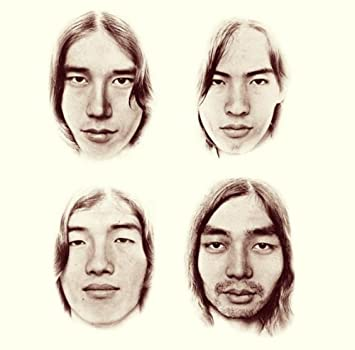
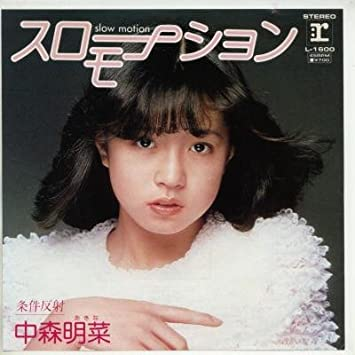
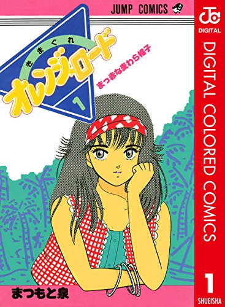
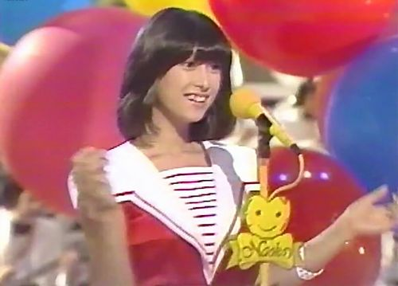
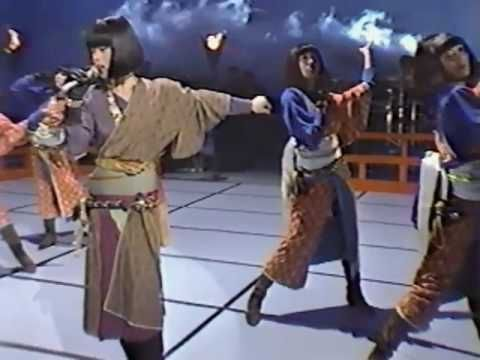
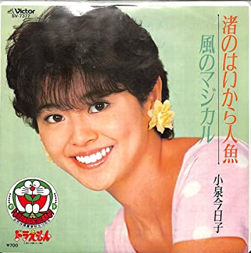
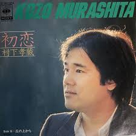
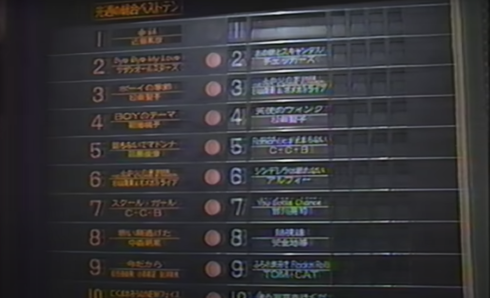
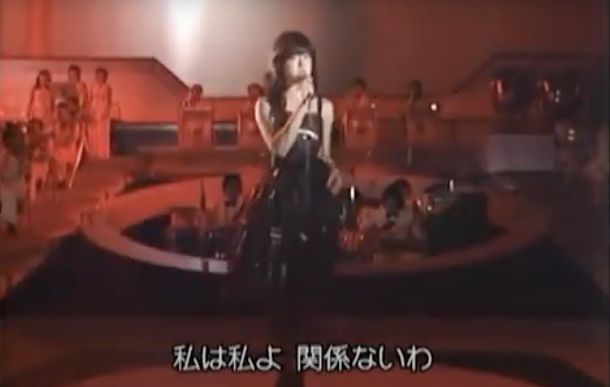
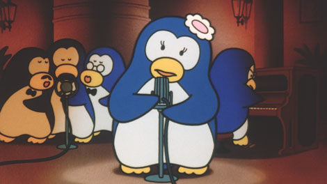

毎月こっそりお世話になっている某昭和歌謡セッションのホストの方から「絶対面白いと思う！」とおすすめされたので、全7巻を一気に通して読んでみた。80年代の文化が好きなんだけど、新しいものを好む友人の中で「ダサいやつ」になりたくなくて周囲には隠している、そんな男子高校生が、自分と同じようなものを好み、遠慮することなく語り合えるクラスメイトの女の子を「発見」してしまうところから始まるんだけど、感想としてはもうね、羨ましいしか出てこなかった。とても羨ましい。私にも薬師丸ちゃん降ってこないかしら？  

自分が好きなものを目の前で真正面からdisられるのはキツいし、好きなものを誰かと共有してみたくて、でもそんな相手が見つからない寂しさが身に覚えのある人は結構多いんじゃないだろうか。リアルタイムに80年代を生きていた人はもちろん、そうでなくてもある種の普遍的なテーマを扱っているので、ラブコメ好きにはぜひおすすめしたいものである。  

それはそれとして、もし同世代に勧めるとしたら元ネタが分かったほうがより楽しめる気がしたので、私がわかる範囲で、各話での元ネタや関連情報をまとめてみようと思う。そうしてどうか、漫画にハマったまま、このへんの時代の音楽を好きになって、私の薬師丸ちゃんになってくれたらいいんだけどなぁ🙇‍♂️🙇‍♂️🙇‍♂️

※ この先、基本的に敬称略です  
※ 考察を含みます（怪しい情報には`？`をつけてあります。あとは文体を見て察してください……）  
※ 私の興味関心の偏りによって記述量に差が出ていますがご了承ください……（やっぱり調べなくても余裕で書けることと、調べなきゃ知らないことがある、だって人間だもの）  
**※ ネタバレを一つも考慮していません**

---

## 「スローモーションをもう一度」について
### タイトル
#### スローモーション
- 82年にリリースされた、中森明菜のデビューシングル
- デビューシングルということで、まだ幼くあどけない明菜ちゃんの声が聴けるというね……

#### をもう一度
- 一般的な言葉なので元ネタが存在しない可能性が高いが、もしあるとすればC-C-Bのシングル表題曲「**Lucky Chanceをもう一度**」（85年）か？
	- 80年代を中心に放送されていたTBSの音楽番組「ザ・ベストテン」の記念すべき400週目に1位を獲得したため、富士山頂に曲名などが入ったゴールドプレートが飾られた（現在も、どこかの山小屋に埋まっているという噂はある）
	- 「をもう一度」と付く曲として他に、加藤和彦・北山修の「あの素晴しい愛をもう一度」や、バンバンの「『いちご白書』をもう一度」が有名だと思うが、いずれも70年代にリリースされているので除外
	- 本当にただの余談だけど、この曲の歌詞から、2015年にお亡くなりになったベースの英樹さんのお別れ会では、ピンクの薔薇が手向けられた。それと歌詞でいえば、「あとは二人 ほんの少し 勇気だせば」っていうのがあって、なんとなく主人公たちのじれったい感じにはお似合いな気もしている
	- が、最終話で「スローモーション」がタイトルに使われていることを鑑みるに、意味をそのまま取ったほうが正しい気がする

### 登場人物
#### 大滝洋樹（主人公）
- 大滝 → 作曲家・ミュージシャン・作家など **大瀧詠一** から
	- 元**はっぴいえんど** のギターボーカルとしても知られる。そしてはっぴいえんどは神々の集まりと言ってもきっと過言じゃないはず
	- 「風街ろまん」のジャケットはオマージュされているのをたまに見かける

- 洋樹 → 歌手 **高橋洋樹** から（どうだろ？）
	- 「摩訶不思議アドベンチャー！」（86年）がメジャーか
	- やたらドラゴンボール関連の曲を歌っているイメージがある

#### 薬師丸知世（主人公２）
- 薬師丸 → 女優・歌手 **薬師丸ひろ子** から
	- デビューシングル、「**セーラー服と機関銃**」（81年）は、主演を務めた映画「セーラー服と機関銃」の主題歌で、作詞作曲者が「スローモーション」と同じ
	- 2枚目のシングル、「**探偵物語**」（83年）は、主演を務めた映画「探偵物語」の主題歌で、大瀧詠一作曲
- 知世 →女優・歌手 **原田知世** から
	- デビューシングル、「**悲しいくらいほんとの話**」（82年）は、主演を務めたドラマ「セーラー服と機関銃」の主題歌で、こちらも作詞作曲者が「スローモーション」と同じ
	- 83年に実写映画化された「時をかける少女」の主演であり、主題歌（83年）を歌っていることでも有名（こちらは松任谷由美作詞作曲）
	- 「角川映画大型新人募集」特別賞受賞で芸能界入りし、**角川三人娘（薬師丸ひろ子・渡辺典子・原田知世）** の一人として、80年代の角川映画を担う存在だった
- 要は、映画「セーラー服と機関銃」の主演と、ドラマ「セーラー服と機関銃」の主演の名前を組み合わせているという

#### 大滝ゆう子（洋樹の母）
- 女優・歌手 **浅野ゆう子** から？
	- ドラマ「君の瞳をタイホする!」（88年）以降、「トレンディドラマの女王」と呼ばれるほどブレイクしていた

#### 薬師丸明子（知世の母）
- バラドル・歌手・女優 **松本明子** から？

#### 宇崎（行きつけのお店の店長）
- 歌手・作曲家など **宇崎竜童** から
	- 主に70年代に活動した **ダウン・タウン・ブギウギ・バンド** のボーカルとしても知られている（「港のヨーコ・ヨコハマ・ヨコスカ」がメジャー）
	- 薬師丸ひろ子主演・主題歌の「**紳士同盟**」（86年）の作曲（作詞は妻の阿木燿子）
	- 阿木・宇崎のコンビで、山口百恵へ「横須賀ストーリー」（76年）「夢先案内人」（77年）「プレイバックPart2」（78年）「さよならの向う側」（80年）などのヒット曲を提供している

#### そのこ（宇崎の孫）
- アイドル・歌手 **河合その子** から
	- 元おニャン子クラブの会員番号12番
	- 明菜ちゃんから「そのちゃん」と呼ばれて結構仲良かったみたいな記述をどっかで読んだことあった気がする

#### 松本（洋樹・知世の同級生）
- 作詞家・ミュージシャン **松本隆** から
	- 元**はっぴいえんど**のドラマーとしても知られている
	- 自身が青春時代を過ごした渋谷・青山・麻布あたりを「風街」と呼んでいる
	- 「**探偵物語**」（83年・大瀧詠一 作曲）など、薬師丸ひろ子へ数曲の詞を提供している

#### 小泉典子（洋樹のバイト先の先輩）
- 小泉 → 女優・歌手・アイドル **小泉今日子** から
	- 82年度デビューで、中森明菜と同期（花の82年組。他には松本伊代・堀ちえみ・三田寛子・石川秀美・シブガキ隊など）
- 典子 → 女優・歌手 **渡辺典子** から
	- 原田知世と同じタイミングの「角川映画大型新人募集」でグランプリを受賞し、薬師丸ひろ子・原田知世と一緒に**角川三人娘**と呼ばれた
	- 83年に映画化されヒットした「探偵物語（主演: 薬師丸ひろ子）」の84年ドラマ化で主演を務め、その主題歌「**花の色**」（84年）との両A面シングル曲「**少年ケニヤ**」（阿木燿子作詞・宇崎竜童作曲）で歌手デビュー

#### 仲井戸（知世の幼なじみ）
- ギタリスト・ボーカリスト **仲井戸麗市** から
	- ロックバンド**RCサクセション** のギタリスト 
	- ちなみに、RCのボーカル 忌野清志郎と大瀧詠一は、バンド「Tin Pan」のアルバム、「Tin Pan」（00年）収録の「ハンド・クラッピング・ルンバ 2000」で共演している。Tin Panのメンバーは、大瀧詠一と一緒に**はっぴいえんど**をやっていた細野晴臣・鈴木茂と、林立夫の3人で、リメイク元となる「**ハンド・クラッピング・ルンバ**」（75年）は大瀧詠一のアルバム「**NIAGARA MOON**」の収録曲

### ロゴ（というか表紙のタイトル？）
「スローモーション」と「もう一度」の間の直線の、内側に線が入ってる感じは、本家中森明菜の「スローモーション」から持ってきているに違いない  

「を」が星で囲まれているせいなのか、84〜87年にジャンプで連載されていた「きまぐれ☆オレンジロード」っぽさを個人的にはなんとなく感じるがどうだろ……

## 1巻 （第1話〜第7話） 
単行本の帯には「**君に、胸キュン。**」と記載されている。これはYellow Magic Orchestra（YMO）の、83年にリリースされたシングル表題曲のタイトルで、松本隆が作詞をしている（作曲はYMO）。おそらく、多数のアイドル曲に詞を提供している松本隆へ、「アイドルっぽさ」を出すために依頼したものだと推察している。当時は、カネボウ化粧品のCMソングとして起用されていた。  
余談すぎるが、マクロスFのランカ・リー「星間飛行」の歌詞が松本隆に依頼されたのも、確か同じような理由だったはず。文字通り、次元を超えたアイドル曲である。  

### 第1話 「少女A」 
※ 以降、単行本内の人物紹介に従って、「大滝くん」「薬師丸ちゃん」「宇崎さん」「そのこちゃん」「大滝くんのお母さん」と表記する  
- 「**少女A**」（82年）は、中森明菜のシングル表題曲
	- 売野雅勇 作詞・芹澤廣明 作曲
	- 「A」は明菜のAではなく、匿名の意味なので、イニシャルに合っていたのは偶然
- P5 「ナウい」「ヤング」そして「バカウケ」は80年代に流行って、今となっては死語な三銃士
- P5 「寒い夏」は、山下達郎のアルバム「僕の中の少年」（88年）収録の1曲「寒い夏」が由来？
	- 同アルバムに収録されている「踊ろよ、フィッシュ」は、何かとCMソングにもなっていてかなりメジャー
- P16 大滝くんの母、ゆう子が経営するカラオケスナック「スローダンス」は、南佳孝のシングル表題曲「二人のスロー・ダンス」（85年）由来？
	- 松本隆 作詞
	- もしそうだとすると、離婚寸前の夫婦を描いたドラマ「夫婦生活」の主題歌を、母子家庭となっている大滝家に当ててくるのはなんというか……
- P18 大滝くんの部屋には少なくとも雑誌「明星」「HotDog」「Rolling Stone」が存在する模様
	- 「明星」は「平凡」と並ぶ芸能雑誌で、92年から「Myojo」表記になっているので、大滝くんは80年代のものを手に入れているはず
	- 最近の「明星」はジャニーズ専門誌みたいになっているけど、昔の明星は大衆芸能雑誌という感じだった
	- 「平凡」と併せて、昭和歌謡バーのような場所に行くと大抵実物が置いてあったりする
	- 「HotDog」は、80年代〜バブル期くらいに発行されていた、男子大学生くらいがターゲットの恋愛情報誌
	- 「Rolling Stone」はアメリカの大衆向け政治雑誌で、日本版も70年代半ばにはあったが、少なくとも80年代には存在していなさそうなので、大滝くんはアメリカ版を手に入れたのか……？
- P20 「トッポイ」は、茨城だかの方言で不良っぽいみたいな使われ方をすると何かの漫画で読んだことがあるが、ここでは「イカしてる」「こなれてる」みたいな意味合いだと解釈している
- P35 薬師丸ちゃんの離れの部屋にある「Young Song '82 総集編」は、大滝くんの部屋にもあった「明星」に付録として付いてくる歌詞本
- P35 「Young Song」の左隣の椅子？の上にあるのが、かつてクラブとかに置いてあったジュークボックス（硬貨を入れて曲を選ぶと、自動で曲を流してくれる）のミニチュア
	- 本物はとてもじゃないけどそんな椅子の上に置けるような大きさではなさそうな気がする（実物は見たことないが）

### 第2話 「探偵物語」
- 既出だが、「**探偵物語**」（83年）は薬師丸ひろ子主演の映画「探偵物語」の主題歌で、本人歌唱
	- 松本隆 作詞・大瀧詠一 作曲
	- 「離れて 見つめないで」は、「探偵物語」の終わりの歌詞
- P61 松田優作は、79年にドラマ化され、主人公を演じた「探偵物語」の中で、大滝くんがかけているような丸いサングラスを着用していた
	- 薬師丸ひろ子主演の映画「探偵物語」（83年）とは同名であるものの、非常に紛らわしいことに、原作含め一切関係がない
	- が、松田優作は、83年の映画「探偵物語」にも出演していて、薬師丸ひろ子の相手役を演じている
- P79 ポケベルは、2019年9月末に個人向けサービスが終了になっているが、P5の大滝くんの台詞によれば平成時代の話なので、ギリギリまだ使えてる

### 第3話 「君は天然色」
- 「**君は天然色**」（81年）は、大瀧詠一のシングル表題曲で、同日にリリースされたアルバム「A LONG VACATION」収録曲
	- 当時、妹を亡くしてどん底に陥っていた松本隆による作詞で、「想い出はモノクローム」の歌詞は、そのときの街が色を失ったように見えていたという心情の投影と思われる
	- 度々CMソングに起用されているが、個人的にはサントリー金麦のイメージしかない……

### 第4話 「ドリーム ドリーム ドリーム」
- 「**ドリーム ドリーム ドリーム**」（83年）は、岩井小百合のデビューシングル
	- 岩井小百合は、横浜銀蠅の妹分的な形でデビューした（P116に注あり）
	- ちなみに、（同世代には通じやすそうな話として、）めちゃイケの数取団のときに流れる「男の勲章」を歌っている嶋大輔は、横浜銀蠅の弟分としてデビューしている
	- 横浜銀蠅は、80年代前半に活動した、リーゼントにサングラスとちょっといかつい感じのロックバンドで、「ツッパリHigh School Rock'n Roll」が有名。歌詞の意味が分からなすぎて、検索必須になってしまう曲よ……

### 第5話 「スケバン刑事」
- 「**スケバン刑事**」（85年）は、同名の漫画を原作とした、斉藤由貴主演のドラマ
	- だいたい作中で説明されているから略

### 第6話 「急いで！初恋」
- 「**急いで！初恋**」（82年）は、早見優のデビューシングル表題曲
	- 本人出演のシャンプー・リンスのCMに起用された
	- 中森明菜や小泉今日子とは、デビュー同期（花の82年組）

### 第7話 「さびしんぼう」
- 「**さびしんぼう**」（85年）は、大林宣彦監督による映画
	- 「転校生」・「時をかける少女」に続いて大林監督の「尾道三部作」と呼ばれている
	- 「時をかける少女」の主演は原田知世

## 2巻 （第8話〜第16話） 
単行本の帯には「**いまのキミはピカピカに光って。**」と記載されている。これは、斉藤哲夫のシングル表題曲（80年）のタイトルである。宮崎美子が出演したコニカミノルタのCMソングとして企画されていたため、元は糸井重里が手がけたコピーに、メロディがついたサビしかなかったが、話題になったためにあとからサビ以外も作られた。  

### 第8話 「スマイル・フォー・ミー」
- 「**スマイル・フォー・ミー**」（81年）は、河合奈保子のシングル表題曲
	- 「エスカレーション」（83年）に続いて、2番目にヒットした曲
	- この曲を歌うときはいつも、ハートがついたオリジナルマイク（赤・黄の2パターン）を使用していた（かわいい）

### 第9話 「スチュワーデス物語」
- 「**スチュワーデス物語**」（83年）は、同名の小説を原作とした、堀ちえみ主演のドラマ
	- JALのスチュワーデス（今で言うキャビンアテンダント）訓練生が成長していく話
	- 80年代でもCAは女性の憧れの職業のひとつだったらしい
	- P41 薬師丸ちゃんの台詞「しごいてください」も「スチュワーデス物語」主人公の松本千秋の台詞
	- P44 大滝くんのお母さんが「ヒロキ……」と言いながらゴム手袋を噛んで鳴らしているが、元ネタとなった新藤真理子（演: 片平なぎさ）の婚約者で、彼女が憎んでいる相手の村沢浩（演: 風間杜夫）の名前は「ヒロシ」である

`youtube:https://www.youtube.com/embed/RPJ-FNoUKu0`

### 第10話 「セーラー服を脱がさないで」
- 「**セーラー服を脱がさないで**」（85年）は、おニャン子クラブのデビューシングル表題曲
	- 新田恵利・中島美春・福永恵規・内海和子がフロントボーカル、あとはコーラスという編成
	- 4人のうち内海以外に歌の経験は一つもなく、そのこちゃんの名前の由来である河合その子は歌手志望で歌も上手かったが、既にソニー所属だったために、キャニオンから出るこの曲でコーラスに回されている
	- 少なくともアイドルに歌わせるにはとんでもないような歌詞なので、ずいぶんゆるい時代だったのかな？という気がしている

### 第11話 「愛してナイト」
- 「**愛してナイト**」（81年）は、多田かおるによる、かつて別冊マーガレット連載されていた漫画
	- 「愛してナイト」というタイトルは、「ヤングタウン」というラジオ（現在も放送中）の月曜日のあるコーナーの内容が元になっている
- P72  木から足を滑らせて落ちてしまった「ひできちゃん」、名前の由来は「愛してナイト」の登場人物である加藤橋蔵（本名: 英樹）
	- 髪が青くてくるくるパーマになっているキャラなので、もしかしたら木から落ちてしまったひできちゃんの髪も青いのかもしれない……
- P77 大滝くんの腕時計は、いわゆるチープカシオ **F-91W** モデル？（現在も販売中）
	- 89年販売開始、ギリギリ80年代……
- P82 「ジュリアーノ」は「愛してナイト」に登場する猫で、元ネタのほうも「ふみー」と「ぶみー」としか鳴かない

### 第12話 「スローなブギにしてくれ」
- 「**スローなブギにしてくれ**」（81年）は、同名の小説をベースとした浅野温子主演の映画
	- 主題歌は、南佳孝の「**スローなブギにしてくれ (I want you)**」。歌詞は松本隆提供
	- ここでこの曲が流れるなら、やっぱり「スローダンス」も南佳孝由来かもしれない……？

### 第13話 「ミ・アモーレ」
- 「**ミ・アモーレ〔Meu amor é･･･〕**」（85年）は、中森明菜のシングル表題曲
	- リオのカーニバルが舞台で、「ミ・アモーレ」はポルトガル語で「私の恋人」の意味
	- 歌詞でも「空に割れて飛ぶ花火」という一節があるけども、今回はお祭りに行くからこの曲なのかな？

### 第14話 「飾りじゃないのよ涙は」
- 「**飾りじゃないのよ涙は**」（84年）は、中森明菜のシングル表題曲
	- 「ミ・アモーレ」のひとつ前のシングルA面
	- 詞・曲ともに井上陽水によるもので、のちに井上陽水によるセルフカバー版も発売されている
	- サビのメロディーで「ラララ……」と続いて終わるタイプの曲、最近だとあんまりないよねと、この曲をカラオケで歌う度にいつも思うんだよなぁ……

### 第15話 「DESIRE」
- 「**DESIRE -情熱-**」（86年）は、中森明菜のシングル表題曲
	- レコードの解説文に「このレコードは可能な限り大音量でお聴き下さい」と書かれていた
	- この曲を歌う際はいつも、ボブ・ハイヒール・アレンジされた着物という独特な衣装を着ている（P154の大滝くんのスクラップ帳も参照）

- P151 大滝くんのお母さんが口ずさんでいる「……ぼうや、イライラするわ〜〜〜♪」は、中森明菜のシングル表題曲「十戒（1984）」（84年）のサビの終わりの一節
	- 「発破かけたげる さあカタつけてよ」（1番サビの頭）という気持ちなんだろうなぁ……
	- こんな大人な歌詞の曲をカッコよく歌い上げている明菜ちゃん、当時19歳って末恐ろしすぎる、マジでやばい
- P153 右下のコマの「は〜どっこい」は、DESIREの曲中「なんてね」と「寂しい」の間に、「はーどっこい」と合いの手を入れるのがなぜか定着しているため
- P154 中森明菜が「ぶんどった」二度目のレコード大賞、一度目は13話の「ミ・アモーレ」で2年連続の受賞となった
- P160 かつて、自分のお気に入りの曲を集めて編集したカセットテープを作る（カセットテープに録音する）という文化があった
	- 音が入ってしまうのでエアコンは消され、息を潜めて静かにして録音をしていたらしい
	- そのうち派生し、好きな女の子に自分で作ったカセットテープを送るという文化もできた（母がリアルに受け取ったカセットテープを見せてもらったことがあるんだが、ちょっと重いなぁと思った……音楽がデータの時代だからかな……）

### 第16話 「渚のはいから人形」
- 「**渚のはいから人形**」（84年）は、小泉今日子のシングル曲
	- この曲がヒットしたことで、小泉今日子は紅白に初出場となった
- 「渚のはいから人形」のジャケットで小泉今日子が着ている服がピンクの水玉なので、薬師丸ちゃんの水着もピンクの水玉なのかな？

## 3巻 （第17〜25話）
単行本の帯には「恋、はじめまして」と記載されている。これは岡田有希子のシングル表題曲「**-Dreaming Girl- 恋、はじめまして**」（84年）からの引用である。詞・曲ともに竹内まりやによるもので、のちにセルフカバー版が発売されている。当時、グリコのチョコレートのCMに起用された。また、この曲でレコード大賞最優秀新人賞をはじめ、新人賞を総なめにした。 
ちなみに、オーディション番組「スター誕生！」へ出場した際、中森明菜の「スローモーション」を歌い、合格したことで芸能界入りをしている。  

### 第17話 「たとえばこんなラヴ・ソング」
- 「**たとえばこんなラヴ・ソング**」（80年）は、RCサクセションのシングル「トランジスタ・ラジオ」のB面
- P13 仲井戸が着ている「軽罪」のTシャツは、RCサクセションのファンクラブ会報「**軽罪新聞**」が元ネタ
- P14 仲井戸の台詞「裏手の森でチョコレートあげたやん!!」は、仲井戸の名前の由来であるRCサクセションのギター仲井戸麗市（チャボ）と忌野清志郎（キヨシロー）の出会いのエピソードが元になっている
	- 18話で登場する通り、かつて渋谷に存在したライブハウス「青い森」で、キヨシローがチャボからチョコレートをもらったのが二人の交友のきっかけ

### 第18話 「君が僕を知ってる」
- 「**君が僕を知ってる**」（80年）は、RCサクセションのシングル「雨上がりの夜空に」のB面

### 第19話・20話 「センチメンタル・ジャーニー」
- 「**センチメンタル・ジャーニー**」（81年）は、松本伊代のデビューシングル表題曲
	- （同世代だと）十六茶のCMで、新垣結衣が「伊代はまだ16だから〜」の部分の替え歌をしていたことで、なんか聴いたことある！となりそうな気がする
	- この曲で、翌82年のレコード大賞新人賞を受賞
	- 81年当時は、歌詞の通り本当に16歳だった
	- 大滝くんや薬師丸ちゃんは高校1年生なので、時期によっては16歳のはずである
- 第19話 タイトルページの薬師丸ちゃんのポーズは、「センチメンタル・ジャーニー」で「16だから〜」って歌ってるときの振り付け

### 第21話 「モニカ」
- 「**モニカ**」（84年）は、吉川晃司のデビューシングル表題曲
	- サビの「モーニカ」のあとに「モーニカ」と合いの手を入れるのが定番
	- P100からの、足を振り上げる・バク転をするなどの大滝くんのダンスは、吉川晃司が歌番組に出ていたときによくやっていたパフォーマンス

### 第22話 「あきすとぜねこ」
- **あきすとぜねこ**は、60年代に流行のち一度落ち着くも、80年代に再流行した恋占いの遊び
	- 内容については、P108に記載の通りなので略
- P111 宇崎さんの台詞「少女人形にならないように」は、伊藤つかさのデビューシングル表題曲「**少女人形**」（81年）が元ネタ？
	- 「勇気を出して 好きと言いたい」の歌詞がこの先の展開の予告になっている感じはある

### 第23話 「ポチャッコ」
- 作中で触れられているため、特になし
- ポチャッコ、かわいいよね（唐突な個人の感想）

### 第24話 「My Revolution」
- 「**My Revolution**」（86年）は、渡辺美里のシングル表題曲で最大のヒット曲
	- 川村真澄が「ひとりでも強くやっていける女の子」をイメージして作詞したという
	- 小室哲哉作曲（TMNデビュー後だが、Get Wild以前なのでまだそこまで有名じゃない）

### 第25話 「技ありっ！」
- 「**技ありっ！**」（86年）は、うしろゆびさされ組のシングル表題曲
	- アニメ「ハイスクール！奇面組」のOP
	- うしろゆびさされ組は、高井麻巳子（のち、秋元康の妻）・岩井由紀子からなる、おニャン子クラブ内のユニット

## 4巻 （第26〜33話）
単行本の帯には「**Romanticが止まらない。**」と記載されている。これは、C-C-Bの85年にリリースされたシングル表題曲のタイトルで、ドラマ「毎度おさわがせします」の主題歌に起用されていた。実はこれが売れなかったら、もしかしたらC-C-Bは解散していたかもしれないという、運命の1曲である。松本隆作詞・筒美京平作曲という、ゴールデンコンビと呼ばれた2人が手掛けており、85年のレコード大賞では金賞を受賞している（ちなみに、この年の大賞は中森明菜の「ミ・アモーレ」で、「毎度おさわがせします」でデビューした中山美穂は「C」で最優秀新人賞を受賞している）。  
あえて同世代向けに書くならば、スマスマで稲垣吾郎扮する「C-C-B吾郎」が真似していたのが、ちょうどこの曲を演奏しているときのドラムの笠浩二であるが、翌年「元気なブロークンハート」をリリースするタイミングで、髪色を黒に戻している。  

### 第26話 「秋からのSummer Time」
- 「**秋からのSummer Time**」（87年）は、仁藤優子のシングル表題曲
	- 芸能界入りのきっかけとなったホリプロスカウトキャラバンでは、中森明菜の「少女A」を歌った
	- P18「アニメで聴ーた！」と大滝くんが言ってるアニメは、「ダーティペア」（85年）のOVA版（87年）で、EDに起用されている
	- 「波の音が聞きたいから車を止めて」という歌詞があるので、話の扉で車に乗っていると思われる

### 第27話 「さてんのに〜ちゃん」
- **さてんのに〜ちゃん** については作中に書いてあるとおり
	- 喫煙している**さてんのに〜ちゃん**を見かけたことがあるが、調理中に喫煙っていうのがなんとも時代を感じる
	- 「サ店」という表記もよく見かける（が死語か？）
- P35 中森明菜の「**POSSIBILITY**」（84年）に収録されているシングルA面曲は「**サザン・ウインド**」「**十戒（1984）**（15話参照）」。
	- 「サザン・ウインド」は、バンド「**安全地帯**」のボーカルでもある、玉置浩二が作曲を担当している

### 第28話 「なんてったってアイドル」
- 「**なんてったってアイドル**」（85年）は、小泉今日子のシングル表題曲
	- やたらめったらバラエティ番組等で使われているので聴いたことも多いはず
	- タイトルの「なんてったって」は、実は公募で選ばれた（しかも、阪大の教授によるもの）

### 第29話「あんみつ姫」
- 「**あんみつ姫**」（83年）は、50年代に連載されていた漫画を原作にした、小泉今日子主演のドラマ。
- P80の「ず」は、濁点と一画目の交差を見るに、きっと変体少女文字ってやつなのだろう（知らんけど）

### 第30話「悲しきNight & Day」
- 「**悲しきNight & Day**」（81年）は、竹内まりやのシングル「イチゴの誘惑」のカップリング曲
	- 「他の女の子にも声かけてるはずね」と、俯く薬師丸ちゃんとあまりに状況が合いすぎて雄叫びをあげるしかない
- P89「この髪型と、この髪型。」前者は中森明菜風、後者は「**迷宮のアンドローラ**」（84年）あたりの小泉今日子風か？
- P98 そういえば、桑田佳祐の「**波乗りジョニー**」のジャケットも鈴木英人だったような気がする（夏が似合うなぁ）

### 第31話「快盗ルビイ」
- 「**怪盗ルビイ**」（88年）は、小泉今日子主演の同名の映画の主題歌
	- そして大瀧詠一作曲である
	- のちに、大瀧詠一とのデュエットバージョンもリリースされた

### 第32話「ナツメロ」
- 「**ナツメロ**」（88年）は、小泉今日子のアルバムのタイトル
	- 全曲カバー曲で構成されている
	- 1曲目の「学園天国」はドラマ「愛し合ってるかい!」主題歌となり、のちにシングルカットされた

### 第33話「メビウスの恋人」
- 「**メビウスの恋人**」（87年）は、後ろ髪ひかれ隊のシングル表題曲
	- 後ろ髪ひかれ隊は、おニャン子クラブの派生ユニットと言ってもいいのだろうけど、おニャン子解散後も1年弱活動を継続していた
- どんよりしていた回だけど、ここでメビウスの恋人を聴いてみると、未来が明るく見えるというマジック（個人の感想です）

## 5巻 （第34〜42話）
単行本の帯には「好きだよと言えずに初恋は。」とある。これは、村下孝蔵のシングル表題曲「**初恋**」の歌詞から引用したものである。村下孝蔵最大のヒット曲なので、村下孝蔵を聴いたことがないと思っている人でも、実はテレビのBGMなどで聴いたことがある可能性が高いに違いない。実際に、自身の初恋の相手だった女性をモデルに書かれたあたり、本当に甘酸っぱい感じがするねぇ。リリース当初のジャケットは本人の横顔写真だったが、のちに切り絵に改められた。そしてその切り絵の女の子が現在、熊本県は水俣にある「初恋通り」のキャラクターになっているらしい。  

### 第34話「ザナドゥ」
- 「**ザナドゥ**」（80年）は、ミュージカル映画。だいたい作中で触れられているので省略
- P11 そのあとのコマを見るに「ザナドゥ」を知らなそうなのに、大滝くんがローラースケートを見て嬉しそうな顔をしているのは、**光GENJI**を想像したからではないだろうか？
- P12 音楽を流しているのは、AIWA「**CS-TW80**」というラジカセ。世にも奇妙な（？）留守番電話機能がついていたらしく、作中でもにょもにょと潰れている部分については、「RUSUBAN TELEPHONE」と書いてあるらしい

### 第35話「翔んだカップル」
- 「**翔んだカップル**」（80年）は、同名の漫画を原作にした映画
	- そして、**薬師丸ひろ子**の初主演映画で、制作会社キティ・フィルムは相米慎二監督・薬師丸ひろ子主演第二弾としてこのあと、「**セーラー服と機関銃**」の制作を決めることになる

### 第36話「微熱少年」
- 「**微熱少年**」（85年）は松本隆の小説、およびそれを原作とした映画（87年）
	- 自らの少年時代の経験を基にしたという、自叙伝的な小説となっている
	- 映画化にあたって、松本と親交のあるミュージシャンがなぜか多く出演している（私の好きな米米CLUBも出演しているらしい）
	- 主題歌であるREBECCAの「**MONOTONE BOY**」も含め、劇中歌の作詞も松本が手掛けている。REBECCAの曲はボーカルのNOKKO作詞が多いので、これは珍しい。この曲は、同年に発売されたREBECCAのアルバムには収録されずに、微熱少年のオムニバスアルバムに収録されている。

### 第37話「オールスター紅白大運動会」・第38話「呼び捨てにしないで」
- 作中で説明があったため、特になし

### 第39話「バスケットケース」
- 「**バスケットケース**」（82年）は、フランク・ヘネンロッター監督のホラー映画
	- 内容についてはP118参照、それ以上の情報はホラー苦手なので調べられなかったw

### 第40話「セカンド・ラブ」
- 「**セカンド・ラブ**」（82年）は中森明菜のシングル表題曲
	- 実は、「少女A」「DESIRE」を抑えて、中森明菜の曲で最もセールス的に売れた曲だったりする
	- 「スローモーション」と同じ作詞作曲家による、ザ・歌謡曲って感じのバラード曲（個人の感想）
	- P142 歌詞から、「あなたのセーター 袖口つまんで うつむくだけなんて」

### 第41話「セブンシリードワーフ」
- 「**セブンシリードワーフ**」は、79年生まれのサンリオのキャラクター
	-  7人のこびとって感じのキャラクター、P152の薬師丸ちゃんが使っている鍵付き日記の表紙
	- しかし、平成も後期の世の中でこの鍵付き日記を手に入れるには中古しかなかったのではないだろうか……
- P163 薬師丸ちゃんの文字、これこそ変体少女文字ってやつではないか……！

### 第42話「台風クラブ」
- 「**台風クラブ**」（85年）は、相米慎二監督の映画
	- BARBEE BOYSの「**暗闇でDANCE**」・「**翔んでみせろ**」が挿入歌として使われている

## 6巻 （第43〜52話）
単行本の帯には「**抱きしめてTONIGHT**」と記載されている。これは、田原俊彦のシングル表題曲のタイトルで、自身が主演したドラマ「教師びんびん物語」の主題歌にもなっていた。

### 第43話「ホワット・ア・フィーリング」
- 「**What a feeling 〜フラッシュダンス**」（83年）は、麻倉未稀のシングル表題曲
	- P17で触れられている通りなので省略

### 第44話「インフェルノ」
- タイトルについては作中で説明があったため、特になし
- P37 「バラエティ」（77年〜86年）は、角川書店が発行していた月刊雑誌で、角川映画に関する記事が占める割合が多かった

### 第45話「ジュリアに傷心」
- 「**ジュリアに傷心**」（84年）は、チェッカーズのシングル表題曲で、最大のヒット曲
	- 傷心は「ハートブレイク」と読んでしまうのだ……
	- 詞は売野雅勇、曲は芹澤廣明の提供で、これは中森明菜の「少女A」と同じ組み合わせ
- ということで、P43 扉絵の大滝くん・薬師丸ちゃんがチェック柄の服を着ているのは、チェッカーズだから
- P47 「シャイニング」（80年）は、スティーブン・キングの小説を原作にスタンリー・キューブリックによって映画化されたホラー映画
- P57 作中でも触れられている通り、チェッカーズ時代のリードボーカル・藤井フミヤの髪型は前髪の一部分だけ長いことが多かった

### 第46話「ザ・ベストテン」
- 「**ザ・ベストテン**」（78〜89年）は、かつてTBS系で放送されていた音楽番組
	- レコードのセールス枚数、有線やラジオのリクエストチャートと、はがきによる視聴者投票を組み合わせた独自のランキング上位10曲を発表し、ランキングに入った歌手が歌を披露する
	- 発表の時のランキングボートは、昔の駅の発車標みたいにパタパタする。先週のランキングと今週のランキングが並んでいる形で、司会が「先週の○位は△△でした。今週の第○位」みたいな掛け声をして、今週のランキングが発表される
	
- P75 実際のステージは写真の通りだけれど、必ずしも全てがこのステージで歌われているわけではない
	

### 第47話「時をかける少女」
- 「**時をかける少女**」（83年）は、同名の小説を原作とした、原田知世主演の映画
	- 第7話で出てきた「さびしんぼう」同様、大林宣彦監督による作品
	- 併映は、第2話で出てきた薬師丸ひろ子主演の映画「探偵物語」

### 第48話「体育館は踊る」
- 「**体育館は踊る**」（87年）は、斉藤由貴のアルバム「風夢」に収録されている曲

### 第49話「紳士同盟」
- 「**紳士同盟**」（86年）は、薬師丸ひろ子のシングル表題曲で、同名の小説を原作とした本人主演の映画の主題歌でもある
	- 宇崎竜童作曲
	- 映画「紳士同盟」の併映が、小泉今日子主演映画（ボクの女に手を出すな）なの、ちょっと意味深じゃないですかね（そんなことない）

### 第50話「いまのキミはピカピカに光って」
- 2巻単行本帯で書いたので省略

### 第51話「SAUDADE」
- サウダージ自体はポルトガル語で郷愁・憧憬などだけど、80年代な元ネタとしてはどうだろうか……？
- フュージョンなので可能性は低そうだけど、高中正義のシングル表題曲・アルバムタイトル（82年）
	- 読み方は「サダージ」
	- マツダ「ファミリア」のCMソングとして起用された

### 第52話「Get Wild」
- 「**Get Wild**」（87年）は、TM NETWORKのシングル表題曲
	- アニメ「シティハンター」の第一期エンディングテーマ
	- 物語が終わっていきなりEDに入るのではなく、終わりに近くなるとイントロが流れる→主人公の冴羽獠が決め台詞を言う→Aメロが流れると同時にエンディング映像に移るというこのEDへの入り方が、画期的すぎて鳥肌立った（ってリアルタイムにアニメを見ていた人が言ってた）
	- あまりにアレンジをされすぎて、1枚全部がGet Wildというアルバムがある（「GET WILD SONG MAFIA」全4枚組・36曲全部「Get Wild」）
	- P187 シティーハンターの中で、獠が暴走して依頼人の女の子に手を出そうとするときに、止めるために相棒の槇村香が獠に主にくらわすのが「100tハンマー」

## 7巻 （第53〜最終話・第0話）
単行本の帯には「**甘い記憶Sweet Memories**」と記載されている。これは、松田聖子の曲「**SWEET MEMORIES**」の歌詞からの引用。元はシングルB面曲だったが、登場人物が全員ペンギンという全編アニメーションなサントリーのCMで起用されており、その結果として後からレコードの売り上げが上がったために、両A面として再発売されることになったという。そのペンギンも人気が集まった結果として、サントリーが映画化を決めて、のちにアニメ映画化されている。そんな状況だったために、当時はグッズがよく売られていたらしい。  

  
<small>↑ これなぁ（パピプペンギンズっていう名前らしい。見たことはあったけど名前初めて知った……）。</small>

### 第53話「夏の扉」
- 「**夏の扉**」（81年）は、松田聖子のシングル表題曲
	- デビューからこの曲まで詞を提供してきた三浦徳子作詞の最後のシングルで、この前にリリースされたシングル「チェリーブラッサム」から作曲は財津和夫が起用されている
	- このあとにリリースされたシングル「白いパラソル」から作詞は松本隆が担当するようになるが、松本は以前から松田聖子の声は自分の詞に合うと思っていたらしく、「白いパラソル」より手前にリリースされたアルバム「Silhouette」の1曲がテスト起用されて、それ以降シングルでも作詞に起用され続けた（ってどっかで読んだ覚えがある）
	- この曲でこの年の紅白歌合戦に出場したときには、翌年の「赤いスイートピー」のためのイメチェンで、「聖子ちゃんカット」から髪をばっさりショートカットにしていたために、意図は異なるものの歌詞通り「髪を切った私」になっていたという……
	- こう見ると、薬師丸ちゃんのお母さんが出てくるタイミングは必ず松田聖子の曲が使われている

### 第54話「風立ちぬ」
- 「**風立ちぬ**」（81年）は、松田聖子のシングル表題曲
	- ということで、ここまでは「聖子ちゃんカット」でTV出演していた
- P25 歌詞から見ると「“ためらい”のヴェール」を超えないと開かないので、イメージ的には「あの部屋にひとり引きこもっていた薬師丸ちゃんを、大滝くんがためらいながらも勇気を出して外へ連れ出してくれて」みたいな感じかしら？

### 第55話「My Birthday」
- 「**My Birthday**」（79〜06年）は、ティーンズ向け占い月刊雑誌
	- 星占いやらタロット占いやら心理テストやらおまじないやらそのあたりの広い範囲での占いを扱っていたらしい（母談）
	- ティーンズ誌では珍しく創刊より、モデルではなくイラストが表紙を飾っていた
	- しかし月刊40万部も占い雑誌が売れる世界線がまったく想像つかない……

### 第56話「RHAPSODY」
- 「**RHAPSODY**」（80年）は、RCサクセションのライブアルバム
	- 80年4月のライブでの一部の曲をそのまま収録
	- ライブの全貌は、2005年にリリースされた「RHAPSODY NAKED」に収録されている

### 第57話「ハウスマヌカン」
- 作中で説明があるので省略

### 第58話「時間の国のアリス」
- 「**時間の国のアリス**」（84年）は、松田聖子のシングル表題曲
- P104で見ている映画はもしかしたら、同じシングルのもう片方のA面曲「夏服のイヴ」が主題歌になっている、松田聖子主演の同名の映画なのかもしれない（見たことないから分からないけど）
- P105 「聖子ちゃんの娘さん」は神田沙也加

### 第59話「元気を出して」
- 「**元気を出して**」（84年）は、薬師丸ひろ子のシングル表題曲
	- 竹内まりや作詞作曲で、竹内セルフカバー版では薬師丸ひろ子がコーラスとして参加している

### 第60話「愛し合ってるかい？」
- RCサクセションのボーカル 忌野清志郎がライブの終盤に観客へ呼びかけていたお決まりのセリフ
- P142 「金が欲しくて働いて眠るだけ」はRCの「いい事ばかりはありゃしない」の歌詞

### 第61話「じぶん、新発見」
- 「じぶん、新発見」（80年）は、糸井重里による西武百貨店の広告キャンペーンのキャッチコピー
- P163 大滝くんが見ている映画「SO WHAT」は、大友克洋による漫画「GOOD WEATHER」を原作に映画化されたもので、主人公の名前はこれまた「ヒロシ」だという……

### 第62話「SWEET MEMORIES」
- 7巻単行本帯で書いたので省略

### 最終話「スローモーション」
- これも初っ端書いているので略

### 第0話 プロローグ〈序幕〉
- 「**プロローグ〈序幕〉**」（82年）は、中森明菜の1枚目のアルバム
- P232 スター誕生！本戦へ1回目・2回目に出場した際は、どちらも容姿が年齢より大人びているがゆえに落とされていた
	- 3回目の挑戦時に歌った山口百恵の「夢先案内人」は宇崎竜童作曲で、なんとなくよくできてるなと……

## 蛇足
検索せずとも書けたのは全体の4割程度。まだまだ知らないことがありすぎる……  
（読めばどのあたりには興味があって、どのあたりは知らずに調べたのか非常に分かりやすいなと思いながら書いてた）  