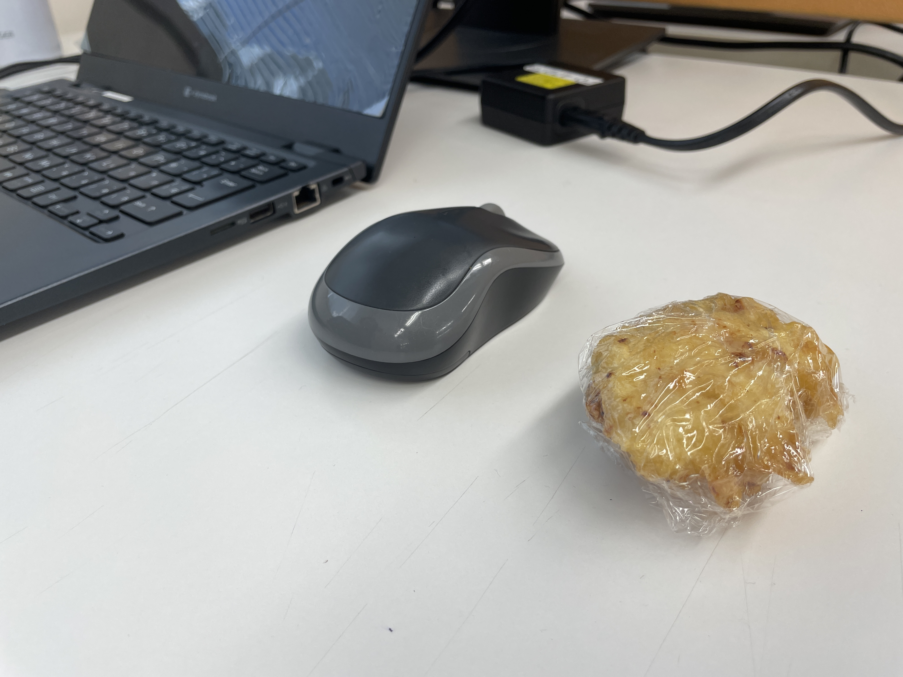

とても偏食で、とても食べるのが遅い子どもだった。  

野菜以外は好きになれず、比較的小柄で食べる量も少なく、今でこそ改善されているが物を飲み込むのが遅い私は、いつまで経っても昼休みが始まらない居残り給食の常連で、先生と私しかいない教室で、ドッジボールをしているであろう声をBGMに、一生食べ終わらない給食と格闘しながら、昼休みの30分を耐えればもしかしたら食べないで済むのではないかと狡い考えを横目に現実逃避をかまし、その度に「ぼーっとしなくていいから早く食べよう？」と苦々しい顔で声をかけてくる先生の顔が未だ思い出される。  

それでいてご飯を残すのは嫌いで、食べ物を残した日は今でも悪夢を見るので、できれば残したくはない、しかし食べなければならないプレッシャーからは解放されたい、食べられないものは食べられないのだと泣きながら逃げ道を考えていた。  

あるいは、母の口癖は「みんなで食べるとおいしいよね」であり、居残り給食に苦戦していた当時の私も、その日あったことを話しながら食卓を囲むのは好きであった。しかし、自分は一人で部屋にこもって酒を飲みながらせいぜい食べてもコンビニで買ったおつまみだという父は、その様子が気に食わなかったらしい。時々食卓に現れては、早く食えと怒鳴られるのだった。  

おおよそこういう背景のもと、私は今でも何かを食べるときに精神的なエネルギーを必要とする。食べることが好きだという友人を心から尊敬する。それは動物としてたいへん正しいと思う。生きようというエネルギーとほぼ同義ではないか。そう考えると、生きたくないのかもしれないなと時々思う。  

---

さて、オフィスの近所はうどん屋さんが多くあるのだが、その中でも最近できた夜は和食居酒屋となる某店の昼は比較的穴場で、とりあえず遠出したくないな〜うどん食べたいな〜という気分の時に重宝している。しかし、昼のランチメニューのほとんどは温かいうどんなので、暑い日の選択肢は「とりちく天ぶっかけうどん」一択である。暦上は秋であるが一向に涼しくなる気配のない先日も同僚と一緒に行き、「とりちく天ぶっかけうどん」を注文した。  

この「とりちく天ぶっかけうどん」、その名の通りとり天とちくわ天がついてくるぶっかけうどんなわけだが、それがたいへんボリューミーで、業務を控える昼に食べれば午後には睡魔が襲う。とり天かちくわ天か、天秤にかけるならば圧倒的にちくわ天なので、とり天を抜いてもらい、量を抑えることにしようと思ったが、店員さんの「メインが無くなっちゃうよ……」と呟く顔があまりに（´・ω・｀）だったので、私のメインはちくわなのだと言い張らずに、一旦すべていただくことにした。  

---

しかし、「まぁいいじゃん、一旦もらっとけば」と言った同僚たちも最終的には「思ってたより多かった」と言うほどにやはり量が多く、3つ付いてきたとり天を2つ食べ終わったところで、同僚たちを待たせていたのもあるし、午後の仕事に影響が出そうなので諦めようかなと思った。そこで、私にはその度胸がなかったが、同僚が先の店員さんにラップをいただけないか聞いてくれ、そうしてオフィスはすぐそこであり、今日中に絶対に食べるとの約束のもとでラップをいただけることになった。  

「よくがんばりましたね」  

ラップを持ってきた店員さんが声をかけてくれた瞬間、なぜか全然食べ終わらずに昼休みに残されていた自分が救われた気がした。どうしてそんなに遅いのか、なぜ食べないのか、食べればいいじゃないか、あなただけですよと、まぁいろいろな声がけを受けてきたなと思うが、ご飯をきちんと食べるのは当たり前で、一般的に頑張ることではないんだろう、そんなことを言われたことがなくて、一瞬泣きそうになった。  

そんな昼休みの小噺でありました。  

これはとり天と同僚のマウス。なんかかわいい。