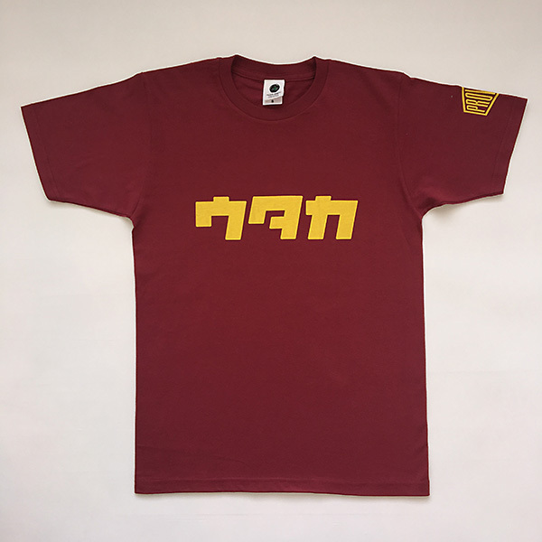

どうでもいい長文が書きたくなったので、どうでもいい長文を書く。  
これを万が一読む人がいたら、きっとウツノミヤ人に擬態できるに違いない（そんなことない）。  
---
高校時代、地元の駅から宇都宮線に乗って、JR宇都宮駅でバスに乗り換えて通学していた。JR宇都宮駅発着のバスは東武宇都宮駅前まで、基本的に宇都宮の大通りを通る。駅前から大通りが伸びていて、なんとなく高めのビルが建っていたり、飲食店やショッピングモールが並んでいたりするのは、地方都市あるあるかと思うが、ご多分に漏れず宇都宮の街中についてもそんな造りになっている。  

宇都宮駅と東武宇都宮駅は、私の足では徒歩で30分くらいの距離だが、前述の通りバスが走っていて、山手線くらいの頻度では来る。大通りとはいえ、全てが栄えているわけでもなく、実際のところJR宇都宮駅周辺よりも、県庁や旧PARCO・ドンキからも近い東武宇都宮駅周辺のほうがよっぽど栄えているのが、強いていえば宇都宮の街中の、一つの特徴かもしれない。  

トチギマーケットという、なんともシンプルな名前の雑貨屋さんがあった。ひっそり宇都宮市民だった中学生の頃からたまに行ってたけれど、大通りが通学経路になった高校時代、東武の近くにある上野文具（うえぶん！）と併せて、週に1度は通っていた。トチマと呼んでいたそのお店は、地方都市宇都宮の大通りに面しているにはあまりにお洒落すぎた。無愛想なお姉さんがいつもMacを開いて何かを作っているのもよかった。壁に飾られている絵もなんだかよく分からなくて最高だった。文房具オタクといっても過言でなかった当時の私からすれば、輸入文具が置いてあったのも、国内のちょっとお高めなノートが置いてあったのも、心地がよかった。レモン牛乳とか田中正造とか、なぜか国道123号線とか、着るのに勇気がいるTシャツが置いてあったのも面白かった。雑貨屋さんに通っていたつもりが、もしかしたらそのお洒落な空間に足を踏み入れることで、田舎の冴えない学生たる私は、少し背伸びをしていた気もしている。  

「どうでもいい文章を書こう」と思ったときに、脳裏にトチマが浮かんだのは、単にFacebookページをフォローしていて、偶然このタイミングで情報が流れてきたからにすぎないのだが、久々にトチマのページを見ていたら、「謎の３文字シリーズ」という謎のTシャツがリリースされていて、それがなんとも栃木での生活を思い起こさせるものだったがゆえ、これについて書いてしまうことにした。随分前振りが長かったが、以降はそういう話である。  

それから先に書いておくと、私が栃木を離れたあと、「インパ」じゃないほうの「FKD」方面へ、新たに「ニッポンマーケット」というこれまたシンプルな名称の店舗がオープンしていて、雑貨屋さん機能はそちらへ移ってしまったようだが、「トチギマーケット」なのに、栃木っぽいステッカーとかTシャツとか置いてあるのに、空気が栃木っぽくない不思議な空間なので、もし宇都宮へ行く機会があれば、それが雑貨屋さん巡りが好きな方であればなおのこと、全力でおすすめしましょう。よく並んでいるみんみん本店からも、一度にあれこれ餃子の食べ比べができる来らっせからも近いです。  

## カタカナでウジョって見るとなんか気持ち悪い
きっと学校名を省略するのは栃木だけではないのだと思っている。少なくともお隣、群馬でも同じ傾向があることを一応併記しつつ。  
「謎の３文字シリーズ」で今置いてあるのは、ほぼ宇都宮市内の県立高校の略称である。ちなみに、地方都市あるあるかもしれないが、普通科であれば（あるいは、スポーツや音楽など何か特色を求めていなければ）県立校崇拝が強く、私立は滑り止めとされることが多い。そして、偏差値が高いと言われる県立高のうち、男女別学が続いている高校が多いのが栃木の、あるいは群馬や埼玉も含めて、関東内陸県の特徴かもしれない。  

<small>[トチマ公式オンラインショップ](https://www.tochigi.market/items/7107074)より引用</small>

もうね、宇高という響きが懐かしい。宇都宮高校。滝の原に存在する、赤煉瓦がお洒落な（個人の感想です）男子高で、この対岸に存在するのが「宇女」、つまり宇都宮女子高、母校なのでコメントは避けましょうw  

こういう感じでなんとなく省略するのが地元民である。でも宇都宮北高は「キタコー」だったし（トチマで「ウキタ」Tシャツが売られていることから、この呼び方は私の周りだけなのかもしれない）、宇都宮東高は「ヒガシ」「ウトーコー」だったので、例外はある（元男子高だったが、附属中が設立されるにあたって、私の一つ上の代から共学になって、市内ではかなり先進的な学校のイメージだった）。宇都宮南高が「ウナン」だったのは例外の中の例外か。宇高が「ウタカ」なのは、宇都宮工業高、通称「ウコー」との混乱を避けるためだろう。宇都宮商業は「ウショー」、こっちは分かりやすい。ついでに宇都宮大学は「ウダイ」である。そして附属中は「ウダイフチュウ」であった。  

## でかい買い物はインパかベルモか、そして映画を見るときも
これが分かると、ウツノミヤ人との交流に使えるかもしれない……  
地方都市によく存在するという、でかいイオンは宇都宮には存在しない。代わりに存在するのが、「インパ」と「ベルモ」である。  

### インパはでかいぞ

「インパ」は「インターパーク」の略で、その名の通り、宇都宮上三川IC近くに存在し、商業施設が集まる一大地帯になっている。マジでなんでもある。インパに行けば安心。買い物もできるし、遊べる。映画館ある。ゲーセンもあるし、ホームセンターもある。飲食店も百均も、電機屋もある。しかも、インパの何がいいって、無料送迎バスがJR宇都宮駅から出ている。そして、この一帯をだいたい回ってくれるのである。車がないと生きていけない地方都市に対して、免許のない子どもはバスを使う他ないわけであり、学生時代はよくこの送迎バスにお世話になった。最高。映画を見るときは、ここのMOVIXばっかりだった。  

どでかいインパの中で、一番最初にオープンしたのが「FKD」である。ビレッジ・スタジアムとこれまたでかい商業施設がインパに存在するのだが、どうやらそれらも「FKD」が運営しているらしい。そもそも「FKD」とはなんぞやと言えば、「福田屋百貨店」という地元のデパートなのだが、「Y」はどこへ行ったのだろうか。もはや「福田屋」と呼んだことなど一度もなく、どちらが正式名称なのか分からない状態である。この「FKD」は県内に2店舗あって、そのうちの一つがこのインパ、もう一つはJR宇都宮駅から見て北側に、昔から存在していて、どうやら黒磯方面へ宇都宮線に乗ると看板が見えるらしい。  

そういえば、インパにはこれまたでかいホームセンター、ジョイフル本田もある。少なくとも栃木と茨城の民はジョイフルといえば、想起するのはジョイフル本田であって、ファミレスではないだろう。それゆえ、上京して「ジョイ本」と略されているのを聞いたときに、ソレハナンデスカと少し困惑したのを思い出した。

### ベルモはイオンポジションか
場所的には「宇大」のそば、駅より東に存在する「ベルモール」、通称「ベルモ」は、地方都市に存在するイオンを想像すれば、だいたいそんな感じのショッピングモールである。ただし、イオンではなくイトーヨーカドーがテナントとして出店している。こちらのほうが、インパよりは宇都宮駅に近く、また、宇大と近いがゆえに、バスには困らない。また、ベルモにはTOHOシネマズが存在しており、インパで映画を見ない人はおそらくベルモで映画を見ているに違いない。  

正直、インパの民だったのでベルモについては、ほぼ思い入れがなく書けることもないのだが、きっと書いておかなきゃいけないのは、カリヨンのことだろう。1Fの中心部にでかい時計台があって、時報のように毎時0分に、時計台に設置されている鐘が一斉に鳴り出す。だから「ベル」モールなのである。  

## （おまけ）地元のチェーン店の話
これはもはや、特定の一人に向けて書いているようなものだがw、ついでなので地元のチェーン店についても記しておく。  
かましん・たいらや・オータニが三大ご当地スーパーかしら（勝手に言ってる）。  
飲食店だと、私が知ってる範囲では、フラガ（フライングガーデン）と火山、そして宇都宮市内であれば正嗣とみんみん。フラガは、静岡のさわやかをもう少しファミレス寄りにした感じ。「爆弾ハンバーグ」っていうおすすめメニューを看板に使っているせいで、店名が爆弾ハンバーグだと思っている人もいるんじゃないだろうか。火山は、石焼らーめん屋さん。正嗣とみんみんは言わずと知れた餃子チェーンだけども、少なくとも我が家は主に箱で30個とか焼いたやつをテイクアウトしてきていた。並んでまで食べているのは観光客の方が中心な気がするけれどどうだろう。