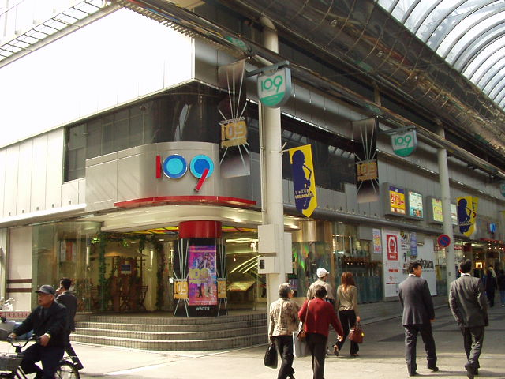
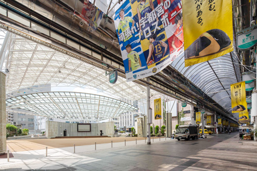
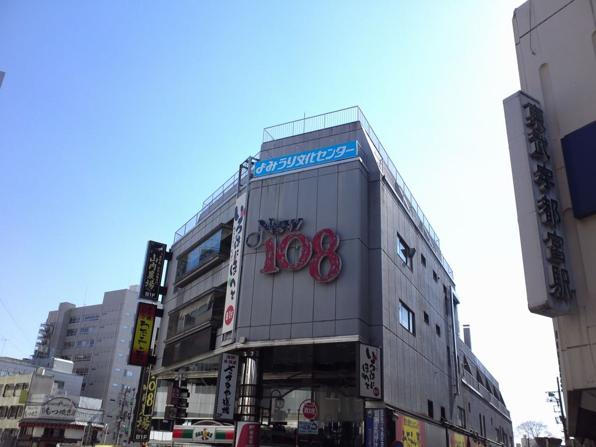

今でこそ渋谷に住んでおり、SHIBUYA 109がそれなりに近所にあるわけなんだけれど、ふと、ほぼ地元: 宇都宮に109があったようななかったようなとぼんやりとした記憶を彷徨い、あるいは、でかでかと書かれた108の文字にも見覚えがあり、もしかしてこれは108と混在した記憶なのではないかという疑念を抱え————  

これは、街中の長崎屋がドンキになってから十数年経ち、ララスクエアがいつの間にかトナリエになり、PARCOはすっかり閉店し、JRの駅東口に謎の商業施設がオープンしてもうすぐ1年経とうという令和5年に、私の記憶は一体どこからきたのか、109は本当にあったんだろうかという自らの記憶への不信感を晴らすべく、インターネッツの海を彷徨った記録である。  

---

結論はタイトルの通りだが、本当にあったらしい。場所については、だいたい東武宇都宮〜馬場町のどっかだろうというざっくりとした記憶しか残っていなかったが、そのざっくりの中には入っており、現在のオリオンスクエアだそうだ。なお、私が馬場町と呼んでいた交差点は、正確には「馬場通り一丁目」らしい。  

>栃木県宇都宮市江野町、オリオン通り内、2001年（平成13年）10月開業、（旧:山崎百貨店 → 緑屋 → ）ams宇都宮の閉店後、ビル所有者の東急不動産が出店。  
>21世紀最初に出店した109であった。開業時は2日で来店者が5万人を突破し、3日で売り上げが1億円を超えるなど好調であったが、開業2年目にはすでに閑散としており、周辺の宇都宮パルコや郊外型大型ショッピングセンターとの競合もあって、売上げの不振が続き、2005年（平成17年）7月をもってわずか3年9ヶ月で閉鎖となった。久繁哲之介は撤退要因として「市民ニーズを把握していないこと」と「マスコミと専門家の『過剰な報道』」の2点を指摘した。前者について詳しく要因を見ると、テナントを埋めるために100円ショップを入れるなどファッションと無関係な店舗を誘致して109ブランドを失墜させたこと、店員の資質が欠けていたこと、周囲に若者から好まれるような類似コンセプトの店がなく立地が不適切であったこと、湘南新宿ラインに乗れば宇都宮から直接SHIBUYA109へ行けることが挙げられる。建物は取り壊され、跡地はオリオンスクエアとして、ジャズコンサートなどのイベントに利用されている。

<small>—— <a href="https://ja.wikipedia.org/wiki/109_%28%E5%95%86%E6%A5%AD%E6%96%BD%E8%A8%AD%29" target="_blank">Wikipedia</a>より引用</small>

Wikipediaによれば宇都宮だけでなく、全国各所に109があったらしい。知らなんだ。大阪・鹿児島に至っては現存してやがる。  

  

<small>—— <a href="https://twitter.com/tamagazou/status/1200775649268387841" target="_blank" style="width: 100%;">こちらのTweet</a>より引用</small>  

そういえば現オリオンスクエアも開放感あるように思えて、オリオン通りのアーケードによる圧迫感はこの109時代のままである。通りと広場はなんとなく区切られている。  

  

<small>—— <a href="https://orion-square.com/" target="_blank" style="width: 100%;">公式サイト</a>より引用</small>  

---

さて、今度はでかでかと書かれた108の文字についてである。このタイミングで調べたら関東自動車に吸収合併されたらしい、かつて存在していた東野バス（＝東野交通）の語呂合わせで108なのだろうが、当時の自分は「宇都宮には109がないから、仕方なくパクってしまったのか」などと失礼なことを思っていたのだった。  

そんなでかでかと書かれた108はどこにあったかというと、こちらはもっと西かと思っていたら東武の横手、オリオン通りの一本南側の道沿いにある、1Fに気が付けばファミマになっていたサンクスのあるビルの壁面であった。

  

<small>—— <a href="https://twitter.com/kingsuguru96/status/1328700487441424385" target="_blank" style="width: 100%;">こちらのTweet</a>より引用</small>  

私の記憶がある限り、ここは既に居酒屋ビルであり、当時酒を飲める歳でもなかった自分が近寄ることはなかったが、開店時点ではファッションビルだったらしい。PARCOも無き今、宇都宮にファッションビルは馴染まなかったのかもしれない。  

このビルは見ての通り、ニュー108ビルという名称だったようだが、今では東武宮園町ビルというらしい。東野交通は今や関東自動車であるが、かつては東武傘下であった。さてこのビルがどういう時系列を辿ったのか、それはそれで気になるが、パッと調べた限りでは出てこない。  

---

そういえばもっと街中に百貨店がなかったっけ？と、調べながら朧げな記憶をひっくり返す。なんかオレンジ色だったことだけは覚えている。  

上野百貨店の跡地は、今でいう表参道スクエア（これまた東京にありそうな名称つけやがった）であるが、表参道スクエアの開業は2007年夏ということで、頻繁に宇都宮に行く機会もなかった時代なので、きっと幼い頃連れられて宇都宮の街中に行ったときの記憶なのだろう。と思ったら新館跡地である「シティータワー宇都宮」の着工が2008年冬なので、工事用に足場などが組まれたオレンジ色の建物という記憶は実在するようだ。  

上野百貨店に関しては[後世に残すために作られた異常に詳しい謎のページ](http://www.1530radio.com/miya/ueno_dept/index.html)を発見した。  

なお、多くの百貨店の進出により上野百貨店は倒産に至ったようだが、調べたところ、FKDとして親しまれている福田屋百貨店（百貨店という名のショッピングモールである）はかつて大通り、県庁前付近にあったらしく、さらにドンキに変わってからも十数年経った長崎屋より前、そこには西武百貨店があったらしい。上野百貨店が大通りから逃れようとして進出しようとした駅前ビルには、ロビンソン百貨店が入っていたが（うっすら記憶にある）、今やララスクエアを過ぎてトナリエとなっている。街は変わる。  

<iframe src="https://www.google.com/maps/d/u/0/embed?mid=189c1rUBDjc0WlmPfmAR1mJeRvdVVnHM&ehbc=2E312F" width="640" height="480"></iframe>